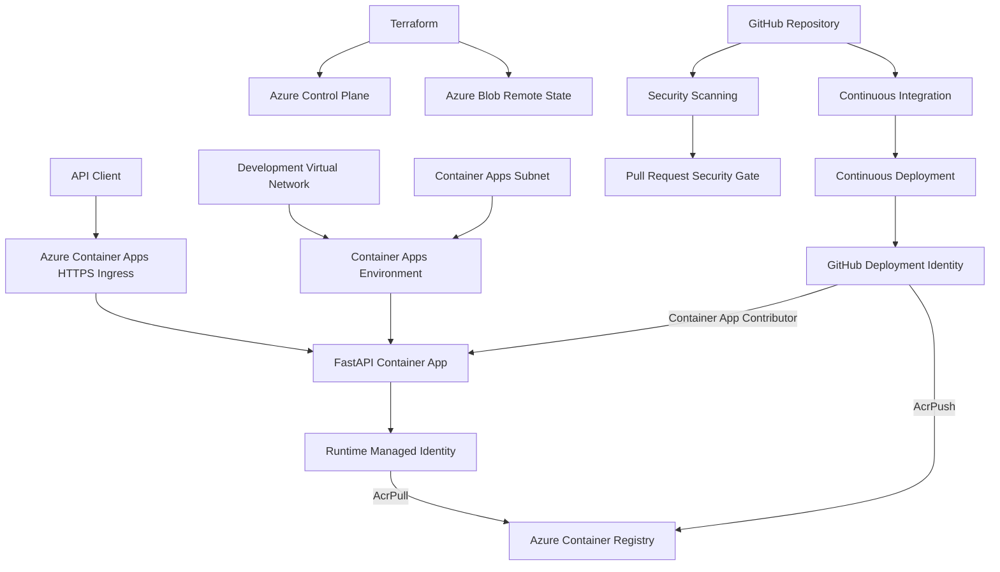
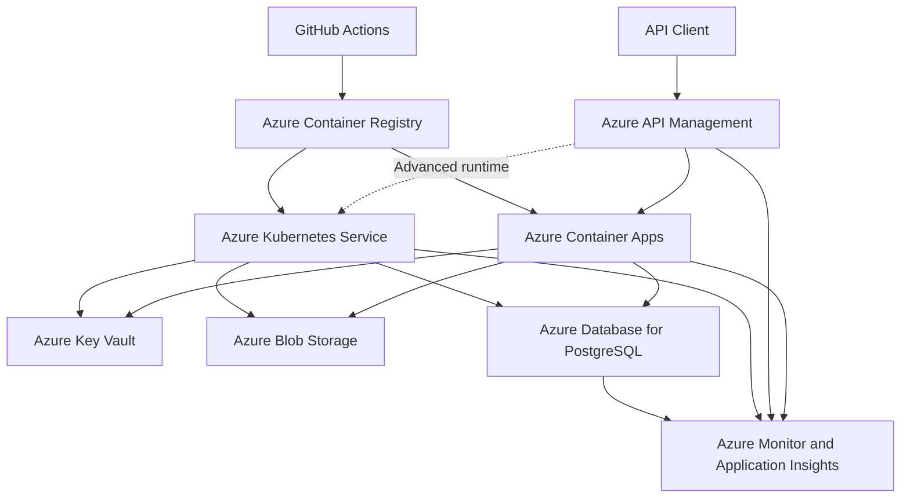
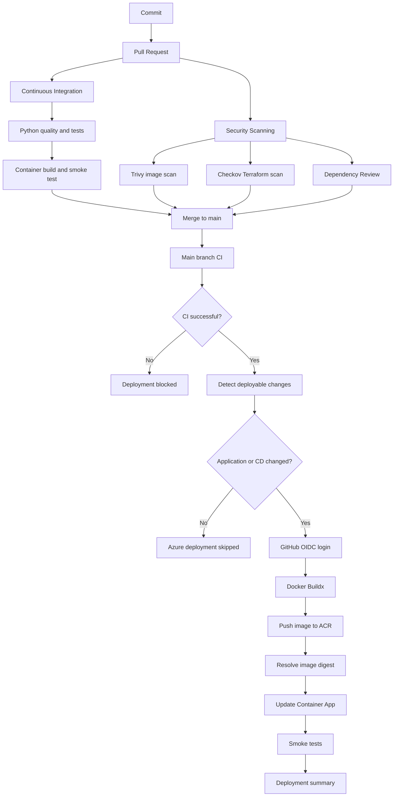

# Azure Enterprise Platform Lab

[](https://github.com/Morgein/azure-enterprise-platform-lab/actions/workflows/ci.yml)
[](https://github.com/Morgein/azure-enterprise-platform-lab/actions/workflows/cd.yml)
[](https://github.com/Morgein/azure-enterprise-platform-lab/actions/workflows/terraform-ci.yml)
[](https://github.com/Morgein/azure-enterprise-platform-lab/actions/workflows/security.yml)

A production-oriented Azure Platform Engineering project built incrementally from cloud and DevOps fundamentals to advanced identity, API management, observability, Kubernetes, GitOps, reliability, disaster recovery, and FinOps practices.

The project deploys a tested FastAPI service to Azure Container Apps through Terraform and a secretless GitHub Actions Continuous Deployment pipeline.

> **Status:** In development  
> **Roadmap completion:** Approximately 45%  
> **Primary environment:** Development  
> **Primary region:** Poland Central  
> **Cloud subscription:** Azure for Students  
> **Current focus:** Security evidence, governance, and workload identity

---

## Table of contents

- [Project overview](#project-overview)
- [Current status](#current-status)
- [Implemented platform](#implemented-platform)
- [Architecture](#architecture)
- [Application request flow](#application-request-flow)
- [Continuous delivery flow](#continuous-delivery-flow)
- [Infrastructure](#infrastructure)
- [Application](#application)
- [Container platform](#container-platform)
- [Identity and security](#identity-and-security)
- [CI/CD](#cicd)
- [Terraform strategy](#terraform-strategy)
- [Networking](#networking)
- [Cost controls](#cost-controls)
- [Testing strategy](#testing-strategy)
- [Evidence](#evidence)
- [Repository structure](#repository-structure)
- [Roadmap](#roadmap)
- [Local development](#local-development)
- [Terraform workflow](#terraform-workflow)
- [Deployment workflow](#deployment-workflow)
- [Security rules](#security-rules)
- [Known limitations](#known-limitations)
- [Next implementation targets](#next-implementation-targets)

---

## Project overview

Azure Enterprise Platform Lab demonstrates how a cloud application platform can be:

- designed;
- provisioned;
- secured;
- tested;
- containerized;
- delivered;
- monitored;
- scaled;
- troubleshot;
- recovered;
- governed;
- operated within a limited budget.

The repository is not a collection of unrelated exercises. Each phase extends the same application and Azure platform.

The current implementation includes:

- a Python FastAPI service;
- automated tests and static analysis;
- a hardened Docker image;
- GitHub Actions Continuous Integration;
- Terraform remote state;
- a segmented Azure Virtual Network;
- Azure Container Registry;
- Azure Container Apps;
- managed identities;
- GitHub OpenID Connect federation;
- automatic deployment after successful CI;
- immutable image tags and digest-based deployment;
- post-deployment smoke tests;
- Trivy container vulnerability and secret scanning;
- Checkov Terraform security scanning;
- GitHub Dependency Review;
- SARIF integration with GitHub Code Scanning;
- scheduled security re-evaluation;
- sanitized deployment evidence.

Later phases extend the platform with:

- Azure Key Vault;
- Azure Blob Storage;
- Azure Database for PostgreSQL;
- Azure API Management;
- Application Insights;
- OpenTelemetry;
- Azure Kubernetes Service;
- Helm;
- GitOps;
- progressive delivery;
- reliability engineering;
- disaster recovery;
- FinOps controls.

---

## Current status

The official roadmap contains fourteen phases numbered from `0` to `13`.

| Phase | Area | Progress |
|---|---|---:|
| 0 | Repository and safety foundation | 100% |
| 1 | FastAPI application, tests, Docker, and CI | 100% |
| 2 | Terraform bootstrap and remote state | 100% |
| 3 | Governance and cost controls | 50% |
| 4 | Development Network Foundation | 100% |
| 5 | Azure Container Registry and Container Apps | 90% |
| 6 | Identity, Key Vault, Storage, and PostgreSQL | 0% |
| 7 | Azure API Management | 0% |
| 8 | GitHub Actions, OIDC, application delivery, and security scanning | 90% |
| 9 | Observability and SRE | 0% |
| 10 | Azure Kubernetes Service and Helm | 0% |
| 11 | GitOps and progressive delivery | 0% |
| 12 | Reliability, disaster recovery, and FinOps | 0% |
| 13 | Final validation and project defense | 0% |

Approximate completion:

```text
(100 + 100 + 100 + 50 + 100 + 90 + 90) / 14 = 45.0%
```

The project is therefore considered approximately **45% complete**.

This percentage measures the complete advanced roadmap. The deployable Azure Platform Foundation itself is approximately **80% complete**.

---

## Implemented platform

### Repository foundation

- public GitHub repository;
- feature-branch workflow;
- Pull Request review process;
- GitHub CLI workflow;
- protected author email;
- documented repository structure;
- `.gitignore` protection;
- environment separation;
- Architecture Decision Records;
- cost-control documentation;
- deployment evidence structure.

### Application foundation

- Python 3.13;
- FastAPI;
- Uvicorn;
- versioned API routes;
- liveness endpoint;
- readiness endpoint;
- service information endpoint;
- typed response models;
- correlation ID middleware;
- environment-based configuration;
- more than 97% measured test coverage;
- Ruff formatting;
- Ruff static analysis;
- Pytest test suite.

### Container foundation

- multi-stage Docker build;
- Python slim runtime image;
- isolated virtual environment;
- non-root runtime user;
- explicit file ownership;
- container health check;
- bounded runtime configuration;
- hardened CI container execution;
- immutable image tags;
- digest-based deployment;
- BuildKit provenance;
- Software Bill of Materials generation.

### Terraform foundation

- Terraform version constraints;
- AzureRM provider constraints;
- provider dependency lock files;
- reusable Terraform modules;
- environment-specific root modules;
- dedicated backend bootstrap;
- Azure Blob remote state;
- Blob lease-based state locking;
- state versioning;
- soft-delete recovery;
- Microsoft Entra backend authentication;
- partial backend configuration;
- CI formatting and validation;
- no Terraform state committed to Git.

### Azure platform foundation

- development Resource Group;
- Virtual Network;
- six segmented subnets;
- six Network Security Groups;
- subnet-to-NSG associations;
- Container Apps subnet delegation;
- Azure Container Registry;
- Container Apps Environment;
- Azure Container App;
- runtime managed identity;
- deployment managed identity;
- GitHub Federated Identity Credential;
- resource-scoped Azure RBAC;
- scale-to-zero configuration;
- public HTTPS ingress;
- deployment smoke testing.

### Security scanning foundation

- dedicated GitHub Actions security workflow;
- Trivy container vulnerability scanning;
- Trivy container secret scanning;
- operating-system and application dependency scanning;
- blocking HIGH and CRITICAL vulnerability policy;
- Checkov Terraform security scanning;
- blocking Terraform policy gate;
- GitHub Dependency Review;
- HIGH severity dependency-change policy;
- SARIF integration with GitHub Code Scanning;
- scheduled weekly security scanning;
- path-aware workflow execution;
- immutable third-party action references;
- least-privilege workflow permissions;
- reviewed resource-level Checkov Policy Exceptions;
- documented compensating security controls.

---

## Architecture

### Current deployed architecture



### Target architecture



---

## Application request flow

The current request flow is:

```text
Client
  → Azure Container Apps public HTTPS ingress
  → active Container Apps revision
  → FastAPI application
  → correlation ID middleware
  → versioned API endpoint
  → JSON response
```

Available endpoints:

| Endpoint | Purpose |
|---|---|
| `/health/live` | Liveness verification |
| `/health/ready` | Readiness verification |
| `/api/v1/info` | Service and environment information |
| `/docs` | Swagger UI |
| `/openapi.json` | OpenAPI specification |

The future request flow places Azure API Management in front of the application.

---

## Continuous delivery flow



A deployment is successful only when:

- Continuous Integration passes;
- Security Scanning passes;
- the verified commit is checked out;
- OIDC authentication succeeds;
- the image is pushed successfully;
- a digest is returned;
- Container Apps accepts the update;
- liveness passes;
- readiness passes;
- service information returns the expected environment;
- the deployment workflow completes successfully.

---

## Infrastructure

The development Terraform state currently manages approximately twenty-nine Azure resources.

### Resource organization

```text
Resource Group:
rg-aeplab-platform-dev

Region:
Poland Central
```

### Main Terraform modules

| Module | Purpose |
|---|---|
| `network` | VNet, subnets, NSGs, and associations |
| `container_registry` | Azure Container Registry |
| `container_apps` | Container Apps Environment, application, and runtime identity |
| `github_oidc` | GitHub deployment identity, federation, and delivery RBAC |

---

## Application

The application source is located in:

```text
application/
```

Package:

```text
azure_platform_api
```

Application characteristics:

- configuration through environment variables;
- no embedded Azure credentials;
- deterministic health responses;
- correlation ID propagation;
- typed API responses;
- automated tests;
- local execution;
- container execution;
- Azure Container Apps execution.

---

## Container platform

### Azure Container Registry

```text
Registry:
acraeplabexampledev

Login server:
acraeplabexampledev.azurecr.io

Repository:
azure-platform-api

SKU:
Basic
```

Security controls:

- Admin user disabled;
- anonymous pull disabled;
- Microsoft Entra authentication;
- deployment identity uses `AcrPush`;
- runtime identity uses `AcrPull`;
- GitHub stores no registry password;
- images use commit-based tags;
- deployments use image digests;
- container images are scanned by Trivy.

### Azure Container Apps

```text
Environment:
cae-aeplab-platform-dev

Application:
ca-azure-platform-api-dev

Runtime identity:
id-azure-platform-api-dev
```

Configuration:

| Setting | Value |
|---|---|
| Environment type | Workload profiles |
| Workload profile | Consumption |
| CPU | 0.25 |
| Memory | 0.5 Gi |
| Minimum replicas | 0 |
| Maximum replicas | 1 |
| Target port | 8000 |
| Ingress | External HTTPS |
| Runtime environment | `APP_ENV=dev` |
| Registry authentication | Managed Identity |

---

## Identity and security

### Runtime identity

```text
id-azure-platform-api-dev
```

Role:

```text
AcrPull
```

Scope:

```text
Development Azure Container Registry
```

### GitHub deployment identity

```text
id-github-actions-deploy-dev
```

Roles:

| Role | Scope |
|---|---|
| `AcrPush` | Development Azure Container Registry |
| `Contributor` | Development Container App |

The deployment identity does not receive subscription-wide Contributor access.

### Federated Identity Credential

```text
fic-github-actions-dev
```

Issuer:

```text
https://token.actions.githubusercontent.com
```

Audience:

```text
api://AzureADTokenExchange
```

Immutable subject:

```text
repo:Morgein@104425675/azure-enterprise-platform-lab@1302301100:environment:development
```

The trust is restricted to the GitHub Environment:

```text
development
```

No Azure client secret is stored in GitHub.

---

## CI/CD

### Continuous Integration

File:

```text
.github/workflows/ci.yml
```

Triggers:

- Pull Request to `main`;
- push to `main`;
- manual execution.

Jobs:

1. `Python Quality and Tests`
2. `Container Build and Smoke Test`

### Terraform Validation

File:

```text
.github/workflows/terraform-ci.yml
```

Validates:

- recursive Terraform formatting;
- bootstrap root module;
- development root module;
- provider lock files;
- backend-aware initialization;
- configuration without applying infrastructure.

### Continuous Deployment

File:

```text
.github/workflows/cd.yml
```

Triggers:

- manual `workflow_dispatch`;
- automatic `workflow_run` after successful CI.

Jobs:

1. `Detect deployable changes`
2. `Build and deploy to Development`

Deployment behavior:

- documentation-only changes skip Azure deployment;
- application changes trigger deployment;
- CD workflow changes trigger deployment;
- failed CI blocks deployment;
- the exact verified commit is deployed;
- the image uses `sha-<commit>`;
- Container Apps receives an immutable digest;
- smoke tests validate the result.

### Security Scanning

File:

```text
.github/workflows/security.yml
```

Triggers:

- relevant Pull Requests targeting `main`;
- relevant pushes to `main`;
- weekly scheduled execution;
- manual `workflow_dispatch`.

Jobs:

1. `Trivy Container Image Scan`
2. `Checkov Terraform Security Scan`
3. `Dependency Review`

Security behavior:

- the real application container image is built before scanning;
- Trivy scans operating-system and application dependencies;
- Trivy scans the image for embedded secrets;
- fixable HIGH and CRITICAL vulnerabilities fail the workflow;
- Checkov scans all Terraform configuration under `infrastructure/`;
- unresolved Terraform policy violations fail the workflow;
- reviewed exceptions are scoped to exact Terraform resources;
- Pull Request dependency changes are reviewed;
- HIGH severity dependency findings fail the workflow;
- Trivy and Checkov results are uploaded using SARIF;
- all third-party actions are pinned to immutable commit SHAs;
- the workflow cannot deploy or modify Azure resources.

---

## Terraform strategy

Terraform owns infrastructure configuration.

GitHub Actions owns the currently deployed application image.

The Container App module uses:

```hcl
lifecycle {
  ignore_changes = [
    template[0].container[0].image,
  ]
}
```

This avoids conflict between:

- Terraform infrastructure reconciliation;
- GitHub Actions application delivery.

Remote state uses:

- Azure Storage Account;
- private Blob Container;
- Microsoft Entra ID authentication;
- shared-key access disabled;
- Blob lease state locking;
- versioning and recovery controls;
- separate development state key.

---

## Networking

### Virtual Network

```text
vnet-aeplab-platform-dev
10.20.0.0/16
```

### Subnets

| Purpose | Name | CIDR |
|---|---|---|
| Container Apps | `snet-container-apps-dev` | `10.20.0.0/23` |
| API Management | `snet-api-management-dev` | `10.20.2.0/24` |
| Application | `snet-application-dev` | `10.20.3.0/24` |
| Data | `snet-data-dev` | `10.20.4.0/24` |
| Private Endpoints | `snet-private-endpoints-dev` | `10.20.5.0/24` |
| Management | `snet-management-dev` | `10.20.6.0/24` |

Every subnet has a dedicated Network Security Group.

The Container Apps subnet is delegated to:

```text
Microsoft.App/environments
```

Detailed documentation:

- [Development Network Architecture](docs/architecture/development-network.md)
- [Development Network Evidence](docs/evidence/development-network-foundation.md)

---

## Cost controls

The project uses a limited Azure for Students credit balance.

Implemented controls:

- Poland Central deployment;
- allowed-region validation;
- ACR Basic tier;
- Container Apps Consumption;
- scale-to-zero;
- maximum one replica;
- CPU limited to 0.25;
- memory limited to 0.5 Gi;
- no permanent AKS cluster yet;
- no permanent PostgreSQL instance yet;
- no APIM deployment before cost review;
- path-aware Continuous Deployment;
- path-aware Security Scanning;
- no deployment after failed CI;
- remote-state recovery instead of duplicate infrastructure;
- common `CostProfile=StudentLab` tags;
- no client-secret rotation service;
- documentation and reference designs for expensive phases;
- controlled deployment and cleanup windows.

Resources that may generate charges must be reviewed through Azure Cost Management.

---

## Testing strategy

### Application tests

```bash
python -m pytest
```

Coverage validation:

```bash
python -m pytest \
  --cov=azure_platform_api \
  --cov-report=term-missing
```

### Formatting

```bash
ruff format --check .
```

### Static analysis

```bash
ruff check .
```

### Container validation

- Docker image build;
- non-root configuration inspection;
- hardened runtime execution;
- container health check;
- API smoke tests;
- correlation ID validation.

### Terraform validation

```bash
terraform fmt -check -recursive
terraform validate
terraform plan
```

### Deployment validation

- OIDC login;
- ACR push;
- digest creation;
- Container App update;
- liveness test;
- readiness test;
- information endpoint test;
- GitHub Actions Deployment Summary.

### Security validation

- Trivy container vulnerability scanning;
- Trivy container secret scanning;
- Checkov Terraform policy scanning;
- GitHub Dependency Review;
- SARIF validation and upload;
- explicit Checkov policy-gate enforcement;
- resource-level Policy Exception review;
- scheduled vulnerability re-evaluation.

---

## Evidence

### Foundation evidence

- [Development Network Foundation](docs/evidence/development-network-foundation.md)
- [Container Platform Foundation](docs/evidence/container-platform-foundation.md)
- [Continuous Deployment Foundation](docs/evidence/continuous-deployment-foundation.md)
- [Security Scanning Foundation](docs/evidence/security-scanning-foundation.md)

### Evidence principles

Evidence must:

- contain no access tokens;
- contain no passwords;
- contain no backend credentials;
- hide subscription IDs where appropriate;
- avoid personal email addresses;
- link claims to commands, plans, Portal views, or workflow runs;
- document both successful and failed troubleshooting scenarios.

---

## Repository structure

```text
.
├── .github/
│   └── workflows/
│       ├── ci.yml
│       ├── cd.yml
│       ├── security.yml
│       └── terraform-ci.yml
├── application/
│   ├── src/
│   │   └── azure_platform_api/
│   ├── tests/
│   ├── Dockerfile
│   ├── pyproject.toml
│   └── .dockerignore
├── infrastructure/
│   ├── bootstrap/
│   ├── environments/
│   │   ├── dev/
│   │   ├── staging/
│   │   └── production/
│   └── modules/
│       ├── network/
│       ├── container_registry/
│       ├── container_apps/
│       └── github_oidc/
├── apim/
│   ├── apis/
│   └── policies/
├── kubernetes/
│   ├── base/
│   └── overlays/
├── helm/
├── monitoring/
│   └── kql/
├── docs/
│   ├── adr/
│   ├── architecture/
│   ├── evidence/
│   └── runbooks/
├── scripts/
├── tests/
├── README.md
└── LICENSE
```

---

## Roadmap

| Phase | Scope | Status |
|---|---|---|
| 0 | Repository and safety foundation | Completed |
| 1 | FastAPI, tests, Docker, and CI | Completed |
| 2 | Terraform bootstrap and remote state | Completed |
| 3 | Governance and cost controls | In progress |
| 4 | Development Network Foundation | Completed |
| 5 | Azure Container Registry and Container Apps | Evidence finalization |
| 6 | Identity, Key Vault, Storage, and PostgreSQL | Planned |
| 7 | Azure API Management | Planned |
| 8 | GitHub Actions, OIDC, delivery, and security scanning | In progress |
| 9 | Observability and SRE | Planned |
| 10 | Azure Kubernetes Service and Helm | Planned |
| 11 | GitOps and progressive delivery | Planned |
| 12 | Reliability, disaster recovery, and FinOps | Planned |
| 13 | Final validation and project defense | Planned |

---

## Local development

Enter the application directory:

```bash
cd application
```

Create a virtual environment:

```bash
python3 -m venv .venv
```

Activate it:

```bash
source .venv/bin/activate
```

Install dependencies:

```bash
python -m pip install --upgrade pip
python -m pip install --editable ".[dev]"
```

Run tests:

```bash
python -m pytest
```

Run the application:

```bash
python -m uvicorn azure_platform_api.main:app --reload
```

Open:

```text
http://127.0.0.1:8000/docs
```

Build the container:

```bash
docker build \
  --tag azure-platform-api:local \
  .
```

Run the container:

```bash
docker run \
  --rm \
  --publish 8000:8000 \
  --env APP_ENV=local \
  azure-platform-api:local
```

---

## Terraform workflow

Initialize development configuration:

```bash
terraform \
  -chdir=infrastructure/environments/dev \
  init \
  -backend-config=backend.hcl \
  -input=false
```

Validate:

```bash
terraform \
  -chdir=infrastructure/environments/dev \
  validate
```

Create a plan:

```bash
terraform \
  -chdir=infrastructure/environments/dev \
  plan \
  -input=false \
  -var-file=terraform.tfvars
```

Check drift:

```bash
terraform \
  -chdir=infrastructure/environments/dev \
  plan \
  -detailed-exitcode \
  -input=false \
  -var-file=terraform.tfvars
```

Detailed exit codes:

| Code | Meaning |
|---:|---|
| 0 | No changes |
| 1 | Terraform error |
| 2 | Infrastructure changes detected |

Local files such as `backend.hcl` and `terraform.tfvars` must not be committed.

---

## Deployment workflow

Manual deployment:

```bash
gh workflow run cd.yml --ref main
```

List deployments:

```bash
gh run list \
  --workflow cd.yml \
  --limit 5
```

Watch the latest deployment:

```bash
CD_RUN_ID="$(
  gh run list \
    --workflow cd.yml \
    --limit 1 \
    --json databaseId \
    --jq '.[0].databaseId'
)"

gh run watch "${CD_RUN_ID}" --exit-status
```

Inspect failures:

```bash
gh run view "${CD_RUN_ID}" --log-failed
```

Automatic deployment occurs after a successful main-branch Continuous Integration run when deployable files changed.

---

## Security rules

The project follows these rules:

- never commit secrets;
- never commit Terraform state;
- never commit real `terraform.tfvars`;
- never commit sensitive backend configuration;
- use GitHub Environments for deployment configuration;
- use OIDC instead of Azure client secrets;
- use Managed Identity instead of registry passwords;
- keep ACR Admin disabled;
- scope Azure RBAC to specific resources;
- separate runtime and deployment identities;
- deploy image digests;
- pin third-party GitHub Actions to immutable commit SHAs;
- run applications as non-root;
- validate all Pull Requests;
- scan container images for vulnerabilities and secrets;
- scan Terraform configuration with Checkov;
- review dependency changes before merge;
- keep security policy gates blocking;
- document every accepted security exception;
- scope Checkov exceptions to exact resources;
- upload supported findings through SARIF;
- run scheduled security re-evaluation;
- sanitize screenshots and documentation;
- review Terraform plans before apply;
- use feature branches and Pull Requests;
- do not broaden Azure roles without a documented failure and review.

---

## Known limitations

The current platform is a development baseline.

Not yet implemented:

- production GitHub Environment;
- required production reviewers;
- Notation-based signed container images;
- signature verification before deployment;
- Python Static Application Security Testing;
- formal Policy Exception expiration dates;
- Azure Key Vault;
- workload identity-based Blob Storage access;
- private endpoints;
- PostgreSQL application integration;
- Azure API Management;
- Application Insights;
- OpenTelemetry;
- centralized alerting;
- formal SLOs;
- protected Terraform apply;
- scheduled Terraform drift detection;
- automated rollback;
- Container Apps traffic splitting evidence;
- staging deployment;
- production deployment;
- AKS;
- Helm;
- GitOps;
- disaster recovery tests.

---

## Next implementation targets

Immediate targets:

1. finalize the Security Scanning evidence Pull Request;
2. merge the validated security workflow into `main`;
3. complete governance and Azure budget evidence;
4. add Key Vault and workload secret access;
5. add identity-based Azure Blob Storage access;
6. evaluate Notation-based container image signing;
7. add Python Static Application Security Testing;
8. add scheduled Terraform drift detection.

Next Azure platform phase:

1. create a reusable Key Vault module;
2. create an application Managed Identity access model;
3. store application configuration without static credentials;
4. create Azure Blob Storage;
5. test identity-based Blob operations;
6. evaluate PostgreSQL cost and regional availability;
7. deploy PostgreSQL only during a controlled laboratory window;
8. place Azure API Management in front of the application;
9. import the FastAPI OpenAPI specification;
10. implement authentication, throttling, quotas, and policy-as-code.

---

## Project completion criteria

The project is complete only when:

- every roadmap phase has a final status;
- infrastructure is reproducible;
- Terraform state is protected;
- application tests pass;
- security scans are reviewed;
- CI/CD works without Azure client secrets;
- APIM policies are tested;
- observability receives metrics, logs, and traces;
- AKS and Helm are demonstrated;
- GitOps reconciliation is demonstrated;
- rollback is tested;
- backup and restore are tested;
- cost controls are verified;
- temporary resources are removed;
- every major project claim has sanitized evidence;
- the complete architecture can be explained and defended.