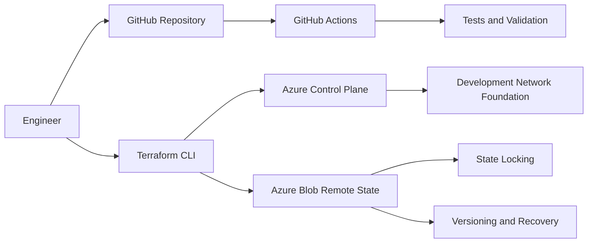
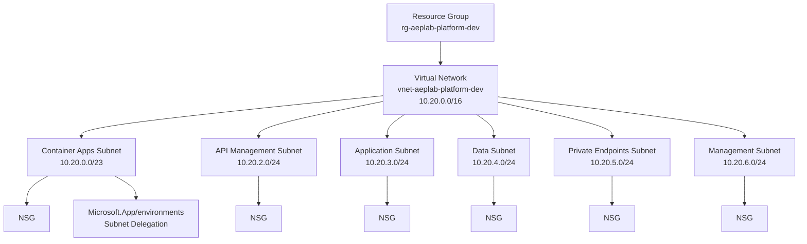
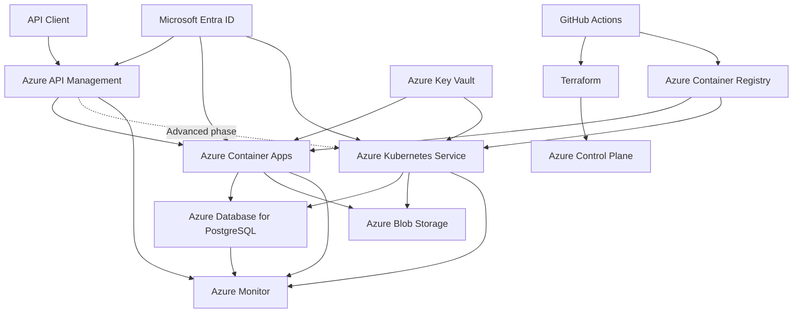
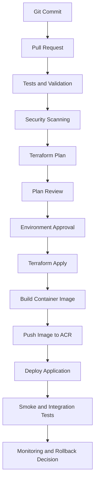

# Azure Enterprise Platform Lab

[](https://github.com/Morgein/azure-enterprise-platform-lab/actions/workflows/ci.yml)
[](https://github.com/Morgein/azure-enterprise-platform-lab/actions/workflows/terraform-ci.yml)

A production-oriented Azure Platform Engineering project built incrementally from cloud fundamentals to advanced Azure, DevOps, security, Kubernetes, observability, reliability, and FinOps practices.

The project uses a real Azure for Students subscription with strict cost controls. Infrastructure is provisioned primarily through Terraform, application validation is automated with GitHub Actions, and every completed implementation phase includes documentation, deployment evidence, troubleshooting, and cost review.

> **Status:** In development  
> **Roadmap completion:** Approximately 34%  
> **Completed baseline:** Repository, FastAPI, Docker, CI, Terraform bootstrap, Azure remote state, and Development Network Foundation  
> **Current phase:** Azure Container Registry and Azure Container Apps baseline  
> **Primary region:** Poland Central

---

## Table of contents

- [Project overview](#project-overview)
- [Project progress](#project-progress)
- [Current implementation](#current-implementation)
- [Engineering objectives](#engineering-objectives)
- [Architecture](#architecture)
- [Deployed development network](#deployed-development-network)
- [Request flow](#request-flow)
- [Deployment flow](#deployment-flow)
- [Technology stack](#technology-stack)
- [Implementation roadmap](#implementation-roadmap)
- [Repository structure](#repository-structure)
- [Infrastructure strategy](#infrastructure-strategy)
- [Environment strategy](#environment-strategy)
- [Networking strategy](#networking-strategy)
- [Identity and security](#identity-and-security)
- [API management](#api-management)
- [Containers and Kubernetes](#containers-and-kubernetes)
- [CI/CD strategy](#cicd-strategy)
- [Observability and SRE](#observability-and-sre)
- [Reliability and disaster recovery](#reliability-and-disaster-recovery)
- [Cost-control strategy](#cost-control-strategy)
- [Testing strategy](#testing-strategy)
- [Troubleshooting scenarios](#troubleshooting-scenarios)
- [Evidence and documentation](#evidence-and-documentation)
- [Provisioning rules](#provisioning-rules)
- [Security rules](#security-rules)
- [Local development](#local-development)
- [Project completion criteria](#project-completion-criteria)
- [Current work](#current-work)

---

## Project overview

Azure Enterprise Platform Lab is a complete Cloud Engineering and DevOps learning environment that demonstrates how an application platform can be designed, provisioned, secured, delivered, monitored, scaled, troubleshot, and recovered on Microsoft Azure.

This repository is not a collection of unrelated Azure exercises. All services are introduced as components of one connected enterprise-style platform.

The implementation starts with a cost-controlled application baseline based on:

- Python and FastAPI;
- Docker;
- GitHub Actions;
- Terraform;
- Azure Virtual Network;
- Azure Container Registry;
- Azure Container Apps;
- Azure API Management.

Advanced phases extend the same platform with:

- managed identities;
- Azure Key Vault;
- Azure Database for PostgreSQL;
- Azure Blob Storage;
- private networking;
- Azure Kubernetes Service;
- Helm;
- GitOps;
- progressive delivery;
- OpenTelemetry;
- distributed tracing;
- reliability testing;
- backup and disaster recovery;
- FinOps controls.

Because the project uses a limited Azure for Students credit balance, expensive resources are deployed only during controlled laboratory windows.

Architectures that are too expensive to operate continuously are represented through:

- validated Terraform configurations;
- saved Terraform plans;
- architecture diagrams;
- Architecture Decision Records;
- security analysis;
- cost estimates;
- deployment runbooks;
- documented limitations.

---

## Project progress

The official roadmap currently contains fourteen phases numbered from `0` to `13`.

The current estimated completion is calculated from completed and partially implemented phases:

| Phase | Area | Progress |
|---|---|---:|
| 0 | Repository and project foundation | 100% |
| 1 | FastAPI application and container baseline | 100% |
| 2 | Terraform bootstrap and remote state | 100% |
| 3 | Governance and cost controls | 35% |
| 4 | Development Network Foundation | 100% |
| 5 | Azure Container Registry and Container Apps | 0% |
| 6 | Identity, Key Vault, Storage, and PostgreSQL | 0% |
| 7 | Azure API Management | 0% |
| 8 | CI/CD and GitHub OIDC | 40% |
| 9 | Observability and SRE | 0% |
| 10 | Azure Kubernetes Service | 0% |
| 11 | GitOps and progressive delivery | 0% |
| 12 | Reliability, disaster recovery, and FinOps | 0% |
| 13 | Final validation and project defense | 0% |

Approximate roadmap completion:

```text
(100 + 100 + 100 + 35 + 100 + 40) / 14 = 33.9%
```

Therefore, the project is currently considered approximately **34% complete**.

This percentage measures roadmap completion, not only the number of files or deployed Azure resources. Advanced phases such as AKS, GitOps, APIM, observability, and disaster recovery represent a significant portion of the remaining engineering work.

---

## Current implementation

The repository currently contains a tested application, hardened container workflow, automated CI validation, secure Terraform backend, and a deployed Development Network Foundation.

### Delivered repository baseline

- public GitHub repository;
- documented repository structure;
- protected Git workflow through feature branches and Pull Requests;
- commit and Pull Request validation;
- `.gitignore` protection for secrets and Terraform state;
- environment separation;
- architecture documentation;
- cost-control rules;
- provisioning and security rules.

### Delivered application baseline

- Python FastAPI application;
- versioned API routing;
- liveness endpoint;
- readiness endpoint;
- service-information endpoint;
- correlation-ID middleware;
- typed response models;
- structured application configuration;
- Pytest test suite;
- more than 97% measured test coverage;
- Ruff formatting;
- Ruff static analysis.

### Delivered container baseline

- multi-stage Docker build;
- small Python slim runtime image;
- isolated virtual environment;
- non-root runtime user;
- controlled file ownership;
- container health check;
- explicit Uvicorn startup command;
- local build validation;
- local runtime smoke testing.

### Delivered Continuous Integration baseline

- Pull Request and main-branch workflow triggers;
- Python dependency installation;
- formatting validation;
- static analysis;
- automated tests;
- coverage enforcement;
- Docker image build;
- container runtime smoke test;
- recursive Terraform formatting validation;
- matrix-based Terraform validation;
- bootstrap root-module validation;
- development root-module validation;
- read-only provider lock-file enforcement;
- CI validation without Azure credentials.

### Delivered Terraform backend foundation

- pinned Terraform version constraints;
- pinned AzureRM provider constraints;
- dedicated bootstrap root module;
- Terraform backend Resource Group;
- Standard LRS Storage Account;
- private Blob Container;
- Blob versioning;
- soft-delete recovery controls;
- shared-key access disabled;
- Microsoft Entra ID authentication;
- least-privilege role assignment;
- partial AzureRM backend configuration;
- development state stored under `dev/terraform.tfstate`;
- Azure Blob lease-based state locking;
- remote-state recovery procedures;
- backend-aware CI validation.

### Delivered Development Network Foundation

- reusable Terraform network module;
- development Resource Group;
- Virtual Network with a `/16` address space;
- six segmented subnets;
- six Network Security Groups;
- six subnet-to-NSG associations;
- Azure Container Apps subnet delegation;
- deterministic naming;
- common project tags;
- sanitized Terraform outputs;
- remote Terraform state;
- successful Terraform validation;
- reviewed Terraform plan;
- successful Azure deployment;
- post-deployment Portal verification;
- drift detection with detailed exit code `0`;
- sanitized deployment evidence.

### Current control-plane flow



### Current platform state



The next implementation phase introduces Azure Container Registry and Azure Container Apps while preserving strict cost controls.

---

## Engineering objectives

The project is designed to demonstrate the following Cloud Engineer, DevOps Engineer, Platform Engineer, and SRE capabilities:

- Azure resource organization;
- Infrastructure as Code;
- reusable Terraform modules;
- Terraform remote state;
- Terraform state locking;
- Azure networking;
- network segmentation;
- identity-first security;
- Microsoft Entra ID;
- Azure RBAC;
- managed identities;
- workload identity;
- Azure Key Vault;
- container image engineering;
- Azure Container Registry;
- Azure Container Apps;
- Azure API Management;
- Azure Database for PostgreSQL;
- Azure Blob Storage;
- GitHub Actions;
- OpenID Connect federation;
- Azure Kubernetes Service;
- Helm;
- GitOps;
- progressive delivery;
- Azure Monitor;
- Application Insights;
- OpenTelemetry;
- Kusto Query Language;
- SLI and SLO design;
- error budgets;
- load testing;
- scaling;
- incident response;
- troubleshooting;
- backup and restore;
- disaster recovery;
- cloud cost control;
- FinOps.

---

## Architecture

The final target architecture is implemented through multiple cost-controlled phases.



### Architecture layers

| Layer | Responsibilities |
|---|---|
| Edge and API | API publishing, authentication, throttling, versioning, transformations, and routing |
| Application | FastAPI application, business logic, health endpoints, and telemetry |
| Container platform | Container Apps baseline and AKS advanced runtime |
| Data | PostgreSQL, Blob Storage, backup, and recovery |
| Identity | Entra ID, RBAC, managed identities, workload identity, and OIDC |
| Security | Key Vault, private access, policy, scanning, and least privilege |
| Networking | VNet, subnets, NSGs, delegation, DNS, routes, and private endpoints |
| Delivery | GitHub Actions, Terraform, Docker, ACR, Helm, and GitOps |
| Observability | Azure Monitor, Application Insights, OpenTelemetry, and KQL |
| Reliability | Health probes, autoscaling, rollback, backup, restore, and recovery |
| Governance | Naming, tags, budgets, policies, ownership, and cleanup |

---

## Deployed development network

The Development Network Foundation has been deployed in `Poland Central`.

### Resource Group

```text
rg-aeplab-platform-dev
```

### Virtual Network

```text
Name:          vnet-aeplab-platform-dev
Address space: 10.20.0.0/16
Region:        Poland Central
```

### Subnet address plan

| Purpose | Azure name | CIDR | NSG | Delegation |
|---|---|---|---|---|
| Container Apps | `snet-container-apps-dev` | `10.20.0.0/23` | `nsg-container-apps-dev` | `Microsoft.App/environments` |
| API Management | `snet-api-management-dev` | `10.20.2.0/24` | `nsg-api-management-dev` | None |
| Application | `snet-application-dev` | `10.20.3.0/24` | `nsg-application-dev` | None |
| Data | `snet-data-dev` | `10.20.4.0/24` | `nsg-data-dev` | None |
| Private Endpoints | `snet-private-endpoints-dev` | `10.20.5.0/24` | `nsg-private-endpoints-dev` | None |
| Management | `snet-management-dev` | `10.20.6.0/24` | `nsg-management-dev` | None |

### Deployed Terraform resources

The development Terraform state currently contains twenty managed resources:

- one Resource Group;
- one Virtual Network;
- six Subnets;
- six Network Security Groups;
- six Subnet-to-NSG associations.

### Network documentation

- [Development Network Architecture](docs/architecture/development-network.md)
- [Development Network Deployment Evidence](docs/evidence/development-network-foundation.md)

### Network validation results

- Terraform initialization succeeded;
- Terraform validation succeeded;
- Terraform plan reported `20 to add, 0 to change, 0 to destroy`;
- Terraform apply completed successfully;
- Terraform state contains all twenty expected resources;
- Azure Portal shows all six subnets;
- all six Network Security Groups exist;
- NSGs are associated with their expected subnets;
- Container Apps delegation is configured;
- post-deployment Terraform plan reports no changes;
- Terraform detailed exit code is `0`.

---

## Request flow

The planned API request flow is:

1. A client sends an HTTPS request to Azure API Management.
2. API Management validates the request.
3. APIM applies authentication, rate limits, quotas, transformations, routing, and logging policies.
4. The request is forwarded to the active application backend.
5. The initial backend runs in Azure Container Apps.
6. During the advanced phase, the same application image is deployed to AKS.
7. The application authenticates to Azure services through managed identity or workload identity.
8. Secrets and certificates are retrieved from Azure Key Vault.
9. Relational data is stored in Azure Database for PostgreSQL.
10. Objects and application files are stored in Azure Blob Storage.
11. Metrics, logs, traces, and dependencies are sent to the observability platform.
12. The response returns through APIM with a correlation ID.

---

## Deployment flow

The target delivery flow is:



A deployment is successful only when:

- infrastructure deployment succeeds;
- the expected application version is running;
- health checks pass;
- smoke tests pass;
- required authentication works;
- required dependencies are reachable;
- monitoring receives telemetry;
- no unexpected critical security issue is introduced;
- deployment evidence is preserved;
- the cost impact is reviewed.

---

## Technology stack

| Category | Technologies |
|---|---|
| Cloud platform | Microsoft Azure |
| Infrastructure as Code | Terraform, AzureRM provider |
| Native Azure IaC comparison | Bicep |
| Application | Python, FastAPI |
| Application server | Uvicorn |
| Application testing | Pytest |
| Static analysis | Ruff |
| Containers | Docker |
| Container registry | Azure Container Registry |
| Serverless containers | Azure Container Apps |
| Kubernetes | Azure Kubernetes Service |
| Kubernetes packaging | Helm |
| GitOps | Argo CD or Flux |
| API gateway | Azure API Management |
| Identity | Microsoft Entra ID |
| Workload authentication | Managed identity, workload identity, OIDC |
| Secrets | Azure Key Vault |
| Relational database | Azure Database for PostgreSQL |
| Object storage | Azure Blob Storage |
| CI/CD | GitHub Actions |
| Monitoring | Azure Monitor |
| Application monitoring | Application Insights |
| Telemetry | OpenTelemetry |
| Query language | Kusto Query Language |
| Security scanning | Trivy and Checkov |
| Load testing | k6 |
| Documentation | Markdown, Mermaid, ADRs, runbooks, and evidence |

The final tool selection may be refined through Architecture Decision Records.

---

## Implementation roadmap

| Phase | Scope | Status |
|---|---|---|
| 0 | Repository, tooling, Git configuration, documentation, safety, and cost controls | Completed |
| 1 | FastAPI application, tests, health endpoints, and Docker image | Completed |
| 2 | Terraform fundamentals, backend bootstrap, remote state, and state locking | Completed |
| 3 | Naming, tags, budgets, policy, ownership, and governance | In progress |
| 4 | Development VNet, CIDR design, subnets, NSGs, delegation, and deployment evidence | Completed |
| 5 | Azure Container Registry and Azure Container Apps baseline | Next |
| 6 | Managed identity, Key Vault, Storage, and PostgreSQL | Planned |
| 7 | Azure API Management, OpenAPI, policies, security, and throttling | Planned |
| 8 | GitHub Actions, OIDC, Terraform pipelines, and application delivery | In progress |
| 9 | Azure Monitor, Application Insights, OpenTelemetry, alerts, and KQL | Planned |
| 10 | AKS, Helm, Kubernetes security, autoscaling, and persistent storage | Planned |
| 11 | GitOps, progressive delivery, rollback, and drift detection | Planned |
| 12 | Load testing, reliability, backup, restore, incident response, and FinOps | Planned |
| 13 | Final validation, architecture review, project defense, and cleanup | Planned |

### Phase status definitions

- `Planned` — the phase has not started.
- `In progress` — implementation or validation is active.
- `Completed` — implementation, testing, documentation, evidence, and verification are complete.
- `Next` — the phase is the next approved implementation target.
- `Reference design` — the architecture is documented and validated without permanent deployment because of cost or subscription limitations.

---

## Repository structure

```text
.
├── .github/
│   └── workflows/
│       ├── ci.yml
│       └── terraform-ci.yml
├── apim/
│   ├── apis/
│   │   └── OpenAPI specifications
│   └── policies/
│       └── Azure API Management policies
├── application/
│   ├── Dockerfile
│   ├── pyproject.toml
│   ├── src/
│   │   └── azure_platform_api/
│   └── tests/
│       └── FastAPI and middleware tests
├── docs/
│   ├── adr/
│   │   └── Architecture Decision Records
│   ├── architecture/
│   │   └── Architecture diagrams and design documents
│   ├── evidence/
│   │   ├── screenshots/
│   │   │   └── development-network/
│   │   └── Sanitized deployment evidence
│   └── runbooks/
│       └── Operational and troubleshooting procedures
├── helm/
│   └── Application Helm charts
├── infrastructure/
│   ├── bootstrap/
│   │   └── Terraform backend bootstrap
│   ├── environments/
│   │   ├── dev/
│   │   ├── staging/
│   │   └── production/
│   └── modules/
│       ├── network/
│       └── Future reusable Terraform modules
├── kubernetes/
│   ├── base/
│   └── overlays/
│       ├── dev/
│       ├── staging/
│       └── production/
├── monitoring/
│   └── kql/
│       └── KQL queries and alert definitions
├── scripts/
│   └── Safe helper and validation scripts
└── tests/
    ├── integration/
    └── smoke/
```

Empty directories may contain temporary `.gitkeep` files. These files are removed when real implementation files are added.

---

## Infrastructure strategy

Terraform is the primary provisioning tool.

Infrastructure code is separated into:

- reusable Terraform modules;
- environment-specific root modules;
- backend bootstrap configuration;
- environment-specific variable values;
- versioned provider lock files.

### Implemented reusable modules

The network module currently manages:

- Virtual Network;
- Subnets;
- Subnet Delegation;
- Network Security Groups;
- optional NSG rules;
- Subnet-to-NSG associations;
- sanitized outputs.

### Planned reusable modules

Future modules include:

- resource naming;
- governance;
- private DNS;
- private endpoints;
- storage accounts;
- Azure Container Registry;
- Azure Container Apps;
- managed identities;
- Azure Key Vault;
- PostgreSQL;
- Azure API Management;
- monitoring;
- Azure Kubernetes Service;
- role assignments.

### Terraform workflow

The standard workflow is:

```text
terraform fmt
terraform init
terraform validate
terraform plan
review
terraform apply
verify
drift check
cost review
```

No infrastructure change is complete until the deployed state has been validated.

### Terraform state

The development environment uses a dedicated Azure Storage backend.

The backend was created by the separate bootstrap root module and is accessed through Microsoft Entra ID rather than Storage Account keys.

Backend protections include:

- private Blob Container;
- encryption at rest;
- Blob versioning;
- soft-delete recovery;
- shared-key access disabled;
- Entra ID authentication;
- least-privilege RBAC;
- separate state keys;
- state locking;
- no state files committed to Git.

The bootstrap state remains local and protected because it manages the remote-state infrastructure itself.

The development environment state is stored remotely under:

```text
dev/terraform.tfstate
```

Terraform state may contain sensitive values and must be treated as protected data.

---

## Environment strategy

The project contains three logical environments.

### Development

The development environment is the primary real deployment environment.

It uses:

- low-cost service tiers;
- short retention periods;
- small scaling boundaries;
- scale-to-zero where supported;
- manual or automated cleanup;
- active troubleshooting;
- real deployment evidence.

### Staging

The staging environment represents production-like validation.

It is deployed only when required for:

- release validation;
- migration testing;
- API compatibility testing;
- progressive delivery;
- rollback testing;
- disaster-recovery exercises.

### Production

The production directory represents the intended production architecture.

It may include configurations that are too expensive to operate continuously under an Azure for Students subscription.

Production configurations may be validated through:

- Terraform formatting;
- Terraform validation;
- Terraform plans;
- security scanning;
- architecture review;
- cost estimation;
- documented limitations.

Each environment uses separate configuration, state, deployment permissions, and approval controls.

---

## Networking strategy

The initial Development Network Foundation is deployed and verified.

### Implemented network capabilities

- deterministic CIDR planning;
- reusable Terraform network module;
- development Virtual Network;
- six purpose-specific subnets;
- six Network Security Groups;
- six subnet-to-NSG associations;
- Container Apps environment delegation;
- centralized naming;
- centralized tagging;
- sanitized outputs;
- deployment evidence;
- post-deployment drift detection.

### Address allocation

The VNet uses:

```text
10.20.0.0/16
```

The currently allocated subnet ranges occupy only part of the `/16` address space. This leaves capacity for future platform services and controlled expansion.

### Segmentation principles

Separate subnets exist for:

- Container Apps;
- API Management;
- application workloads;
- data services;
- private endpoints;
- management workloads.

This prevents unrelated workloads from sharing one unrestricted network segment and prepares the platform for more advanced security policies.

### Future network capabilities

Planned networking topics include:

- explicit NSG security rules;
- application security groups;
- user-defined routes;
- private endpoints;
- private DNS zones;
- service endpoints;
- VNet peering;
- hub-and-spoke architecture;
- controlled ingress and egress;
- NAT design;
- Azure Firewall reference design;
- Application Gateway and WAF reference design;
- Network Watcher diagnostics;
- private AKS architecture.

### Cost boundary

The initial network foundation intentionally avoids standing chargeable network components such as:

- NAT Gateway;
- Application Gateway;
- Azure Firewall;
- VPN Gateway;
- ExpressRoute Gateway;
- unnecessary Public IP addresses;
- unnecessary Private Endpoints.

Any chargeable network component requires a separate architecture and cost review before deployment.

---

## Identity and security

The project follows identity-first and Zero Trust principles.

### Human access

Human access is controlled through:

- Microsoft Entra ID;
- Azure RBAC;
- least-privilege assignments;
- separate deployment and approval responsibilities;
- protected GitHub environments;
- documented privileged operations.

### Workload access

Workloads use:

- system-assigned managed identities;
- user-assigned managed identities where reuse is justified;
- AKS workload identity;
- GitHub Actions OIDC federation;
- short-lived access tokens;
- narrowly scoped Azure role assignments.

Long-lived Azure client secrets are avoided wherever possible.

### Secret management

Azure Key Vault will store:

- application secrets;
- database credentials where identity-based access is unavailable;
- certificates;
- sensitive application configuration.

Secrets must never be stored in:

- Git;
- Docker images;
- committed Terraform variable files;
- GitHub Actions logs;
- screenshots;
- application source code.

### Security controls

Implemented and planned controls include:

- least-privilege RBAC;
- managed identity;
- OIDC federation;
- Key Vault;
- private access;
- Azure Policy;
- secure transport;
- container image scanning;
- Terraform scanning;
- dependency scanning;
- Kubernetes security contexts;
- Kubernetes Network Policies;
- controlled logging;
- threat modelling.

---

## API management

Azure API Management is the planned central API gateway.

The APIM phase includes:

- OpenAPI import;
- API operations;
- products and subscriptions;
- API versioning;
- JWT validation;
- Microsoft Entra ID integration;
- rate limiting;
- quotas;
- CORS;
- IP filtering;
- request transformation;
- response transformation;
- URL rewriting;
- backend routing;
- caching;
- retry policies;
- controlled error handling;
- correlation IDs;
- telemetry integration;
- policy-as-code deployment.

The laboratory deployment will use a cost-appropriate APIM tier after a separate pricing and regional availability review.

Advanced enterprise APIM designs may be documented as reference architectures if their permanent cost is not appropriate for the student subscription.

The backend application remains responsible for business authorization and data integrity. APIM does not replace application-level security.

---

## Containers and Kubernetes

### Container baseline

The application container follows these principles:

- deterministic dependencies;
- multi-stage build;
- small build context;
- non-root runtime user;
- explicit health endpoint;
- graceful shutdown;
- no embedded secrets;
- immutable image versions;
- vulnerability scanning;
- deployment by image digest where practical.

### Azure Container Registry

The next phase introduces Azure Container Registry.

The implementation will include:

- cost-appropriate registry SKU;
- Terraform-managed registry;
- admin credentials disabled;
- Microsoft Entra ID authentication;
- deterministic image naming;
- semantic or commit-based image tags;
- image push validation;
- image metadata evidence;
- lifecycle and cleanup considerations;
- vulnerability scanning strategy.

### Azure Container Apps

Azure Container Apps provides the initial managed application runtime.

The implementation will include:

- Container Apps Managed Environment;
- integration with `snet-container-apps-dev`;
- FastAPI container deployment;
- ingress;
- revisions;
- health probes;
- minimum replicas set to zero where appropriate;
- bounded maximum replicas;
- CPU and memory limits;
- managed identity;
- registry authentication without passwords;
- smoke testing;
- revision-based rollback;
- sanitized deployment evidence;
- post-deployment cost review.

### Azure Kubernetes Service

AKS provides the advanced orchestration phase.

The AKS implementation will include:

- cluster and node-pool architecture;
- namespaces;
- Deployments;
- Services;
- Ingress;
- ConfigMaps;
- external secret integration;
- readiness, liveness, and startup probes;
- resource requests and limits;
- Horizontal Pod Autoscaler;
- Cluster Autoscaler concepts;
- Pod Disruption Budgets;
- rolling updates;
- Helm;
- persistent storage;
- workload identity;
- Key Vault CSI integration;
- Kubernetes Network Policies;
- security contexts;
- monitoring;
- upgrade planning;
- GitOps;
- rollback.

AKS will be created only during controlled laboratory windows and destroyed after validation.

---

## CI/CD strategy

GitHub Actions provides the delivery platform.

Application CI and Terraform validation are active. Azure delivery through GitHub OIDC remains a later implementation step.

### Implemented CI capabilities

- Pull Request validation;
- main-branch validation;
- Python formatting;
- Python static analysis;
- application tests;
- coverage enforcement;
- Docker image build;
- runtime smoke test;
- recursive Terraform formatting;
- Terraform validation matrix;
- provider lock-file validation;
- CI operation without Azure credentials.

### Planned CI/CD capabilities

- dependency scanning;
- container vulnerability scanning;
- SBOM generation;
- Terraform security scanning;
- Terraform plan publishing;
- protected Terraform apply;
- GitHub OIDC authentication;
- image publishing to ACR;
- Container Apps deployment;
- APIM policy deployment;
- AKS deployment;
- smoke tests;
- integration tests;
- scheduled drift detection;
- controlled cleanup.

### Authentication

GitHub Actions will authenticate to Azure through OpenID Connect.

OIDC avoids storing a long-lived Azure client secret in GitHub.

Separate identities and permissions will be considered for:

- Pull Request validation;
- development deployment;
- production deployment;
- cleanup operations.

### Deployment strategies

The project will demonstrate:

- rolling deployment;
- revision-based rollback;
- canary deployment;
- traffic splitting;
- blue-green concepts;
- Helm rollback;
- GitOps reconciliation.

---

## Observability and SRE

The observability implementation includes four telemetry categories:

- metrics;
- logs;
- distributed traces;
- availability signals.

Planned services and technologies include:

- Azure Monitor;
- Application Insights;
- Log Analytics where justified;
- OpenTelemetry;
- diagnostic settings;
- KQL;
- dashboards;
- alert rules;
- action groups;
- synthetic tests;
- correlation IDs.

### Service-level concepts

The project includes examples of:

- Service Level Indicators;
- Service Level Objectives;
- error budgets;
- availability;
- latency percentiles;
- request success rate;
- dependency health;
- saturation;
- incident severity.

Monitoring should answer:

- Which environment is affected?
- Which application version is running?
- Which API operation failed?
- Which dependency caused the failure?
- When did the problem begin?
- Was the failure related to a deployment?
- How many requests were affected?
- Is the error budget being consumed too quickly?

---

## Reliability and disaster recovery

Reliability work includes:

- readiness validation;
- liveness validation;
- startup probes;
- bounded retries;
- timeouts;
- backoff and jitter;
- graceful degradation;
- connection-pool limits;
- dependency failure handling;
- autoscaling boundaries;
- rollout and rollback;
- backup;
- restore;
- failure simulation;
- incident response;
- post-incident review.

### Recovery objectives

The project will document:

- Recovery Time Objective;
- Recovery Point Objective;
- backup retention;
- restore procedures;
- infrastructure reconstruction;
- application redeployment;
- data recovery;
- DNS and traffic recovery;
- failback considerations.

Multi-region architecture is treated as a reference design unless a temporary real deployment is justified by the available budget.

Replication is not treated as a replacement for backup.

---

## Cost-control strategy

The project uses a limited Azure for Students credit balance.

Cost is treated as an engineering requirement.

### Current persistent footprint

The current persistent Azure footprint consists of:

- Terraform backend Resource Group;
- Standard LRS Storage Account;
- private Terraform state Blob Container;
- Terraform backend role assignment;
- development Resource Group;
- development Virtual Network;
- six Subnets;
- six Network Security Groups;
- six subnet-to-NSG associations.

The network foundation does not currently include standing compute services, managed gateways, databases, public IP addresses, or permanent monitoring ingestion.

### Cost-control rules

- use consumption-based or free tiers where appropriate;
- use small development SKUs;
- use minimum replica count `0` where supported;
- limit maximum replica count;
- deploy expensive resources only during active laboratories;
- destroy AKS after validation;
- avoid permanent Application Gateway, NAT Gateway, or Firewall deployments unless required;
- avoid unnecessary Public IP addresses;
- use short monitoring retention;
- apply project, environment, purpose, and ownership tags;
- review Cost Management after each deployment phase;
- check for orphaned resources;
- verify Terraform destruction;
- preserve a credit reserve for advanced phases;
- conduct a pricing review before deploying a new Azure service.

### Important budget limitation

Azure budgets generate alerts but do not automatically stop or delete resources.

A successful `terraform destroy` must be followed by verification that no unexpected chargeable resources remain.

---

## Testing strategy

The project applies multiple testing levels.

### Application tests

- endpoint behavior;
- response schemas;
- input validation;
- correlation IDs;
- configuration behavior;
- error handling;
- health endpoints.

### Infrastructure tests

- `terraform fmt`;
- `terraform validate`;
- provider version validation;
- provider lock-file validation;
- Terraform plan review;
- static analysis;
- security scanning;
- deployment verification;
- drift detection.

### Container tests

- image build;
- container startup;
- health endpoint;
- non-root runtime;
- vulnerability scanning;
- dependency scanning.

### Integration tests

- ACR authentication;
- Container Apps image pull;
- APIM-to-application communication;
- application-to-PostgreSQL communication;
- application-to-Blob-Storage communication;
- managed identity access;
- Key Vault access;
- telemetry delivery.

### Smoke tests

Smoke tests verify critical behavior immediately after deployment:

- health endpoint;
- API availability;
- expected application version;
- expected response schema;
- valid authentication;
- dependency connectivity;
- telemetry generation.

### Reliability tests

- backend unavailable;
- database unavailable;
- invalid secret;
- failed readiness probe;
- application restart;
- container image failure;
- scaling under load;
- failed deployment;
- rollback.

---

## Troubleshooting scenarios

The repository documents reproducible troubleshooting scenarios.

### Completed troubleshooting exercises

- Docker daemon permission correction;
- Dockerfile parse-error correction;
- incorrect Python module startup path;
- missing Python test dependencies;
- missing Pytest fixture;
- Ruff import-order failure;
- CI type-annotation failure;
- backend-aware Terraform CI failure;
- Terraform backend reinitialization;
- Terraform sensitivity propagation;
- partial Terraform apply recovery;
- Azure Policy rejection of a disallowed region;
- separation of Resource Group and Storage Account regions;
- empty Pull Request caused by missing commits;
- safe Terraform recovery plan with zero destroy actions.

### Planned troubleshooting exercises

- incorrect Azure RBAC assignment;
- expired or invalid credential;
- OIDC subject mismatch;
- Key Vault access denied;
- NSG traffic denied;
- incorrect route;
- private DNS resolution failure;
- private endpoint misconfiguration;
- Terraform state lock;
- unexpected Terraform replacement;
- container image-pull failure;
- Container Apps revision failure;
- Kubernetes `Pending` Pod;
- Kubernetes `CrashLoopBackOff`;
- Kubernetes `ImagePullBackOff`;
- APIM `401 Unauthorized`;
- APIM `403 Forbidden`;
- APIM `429 Too Many Requests`;
- APIM backend `5xx`;
- PostgreSQL connection-pool exhaustion;
- failed GitHub Actions deployment;
- incomplete cleanup.

Each troubleshooting document should contain:

1. Symptom.
2. Expected behavior.
3. Scope and impact.
4. Evidence.
5. Hypotheses.
6. Diagnostic steps.
7. Root cause.
8. Fix.
9. Verification.
10. Prevention.

---

## Evidence and documentation

Each completed phase provides sanitized evidence.

### Completed evidence packages

- [Development Network Architecture](docs/architecture/development-network.md)
- [Development Network Deployment Evidence](docs/evidence/development-network-foundation.md)

The Development Network evidence demonstrates:

- twenty resources in Terraform state;
- zero post-deployment drift;
- deployed VNet address space;
- six deployed subnets;
- Container Apps subnet delegation;
- six deployed Network Security Groups;
- subnet-to-NSG association.

### Future evidence

Future evidence may include:

- Terraform plans;
- Terraform outputs;
- GitHub Actions results;
- test coverage;
- Docker image information;
- ACR image metadata;
- Container Apps revisions;
- API responses;
- APIM policy tests;
- Kubernetes object status;
- KQL results;
- monitoring dashboards;
- alert examples;
- load-test results;
- backup and restore results;
- incident timelines;
- cost reviews;
- cleanup verification.

### Evidence safety

Evidence must not contain:

- passwords;
- tokens;
- personal email addresses;
- unnecessary subscription identifiers;
- unnecessary tenant identifiers;
- private keys;
- private certificates;
- Terraform state;
- Storage Account keys;
- SAS tokens;
- sensitive application data.

### Documentation structure

- `docs/architecture/` — architecture and design;
- `docs/adr/` — Architecture Decision Records;
- `docs/runbooks/` — operational and troubleshooting procedures;
- `docs/evidence/` — sanitized verification evidence.

---

## Provisioning rules

The project follows these provisioning rules:

1. Terraform is the primary method for creating, changing, and deleting Azure resources.
2. Azure Portal is used for subscription bootstrap, billing controls, selected identity configuration, and visual verification.
3. Azure CLI is optional and is not the primary provisioning method.
4. Azure CLI may be used for authentication, read-only inspection, or diagnostics when it works reliably.
5. Manual Portal changes must be documented.
6. A manually created resource must be imported into Terraform or explicitly excluded from Terraform ownership.
7. Infrastructure changes require formatting, validation, and plan review.
8. Temporary resources must have a cleanup procedure.
9. Destructive operations require explicit target verification.
10. No deployment is complete until functionality, drift, and cost state are verified.

This strategy keeps the project reproducible while accounting for local Azure CLI reliability limitations.

---

## Security rules

The following files and values must never be committed:

- `.env`;
- Terraform state files;
- real `.tfvars` files;
- backend configuration containing sensitive values;
- Azure client secrets;
- GitHub tokens;
- database passwords;
- private keys;
- private certificates;
- Kubernetes kubeconfig files;
- Key Vault secret values;
- Storage Account keys;
- SAS tokens;
- container registry passwords.

Before every commit:

```bash
git status
git diff
git diff --cached
```

Before every push:

```bash
git log -1 --stat
git status
```

If a secret is committed, deleting it in a later commit is not sufficient.

The secret must be revoked or rotated immediately, and repository history must be reviewed.

---

## Local development

### Requirements

- Git;
- Python 3.13 or compatible supported version;
- Docker;
- Terraform;
- GitHub CLI;
- an Azure subscription for real deployment phases.

### Clone the repository

```bash
git clone https://github.com/Morgein/azure-enterprise-platform-lab.git
cd azure-enterprise-platform-lab
```

### Create the Python environment

```bash
cd application

python3 -m venv .venv
source .venv/bin/activate

python -m pip install --upgrade pip
python -m pip install -e ".[dev]"
```

### Run validation

```bash
ruff format --check .
ruff check .
python -m pytest
```

### Run tests with coverage

```bash
python -m pytest \
  --cov=azure_platform_api \
  --cov-report=term-missing
```

### Run the application

```bash
python -m uvicorn azure_platform_api.main:app --reload
```

Application endpoints:

```text
http://127.0.0.1:8000/docs
http://127.0.0.1:8000/health/live
http://127.0.0.1:8000/health/ready
http://127.0.0.1:8000/api/v1/info
```

A `404 Not Found` response for `/` is expected unless a root endpoint is explicitly implemented.

### Build the container image

```bash
docker build \
  --tag azure-platform-api:local \
  .
```

### Run the container

```bash
docker run \
  --rm \
  --publish 8000:8000 \
  azure-platform-api:local
```

### Validate Terraform formatting

Run from the repository root:

```bash
terraform fmt \
  -check \
  -recursive
```

### Initialize the development environment

```bash
terraform \
  -chdir=infrastructure/environments/dev \
  init \
  -backend-config=backend.hcl \
  -input=false
```

The local `backend.hcl` file must not be committed if it contains environment-specific or sensitive backend configuration.

### Validate the development environment

```bash
terraform \
  -chdir=infrastructure/environments/dev \
  validate
```

### Create a development plan

```bash
terraform \
  -chdir=infrastructure/environments/dev \
  plan \
  -input=false \
  -var-file=terraform.tfvars
```

The real `terraform.tfvars` file must remain local and must not be committed.

---

## Project completion criteria

The project is complete only when:

- every roadmap phase has a clear final status;
- the deployed architecture matches the documentation;
- all core infrastructure is reproducible;
- Terraform state is protected;
- no secrets are committed;
- application tests pass;
- infrastructure validation passes;
- security scans are reviewed;
- CI/CD workflows operate successfully;
- Container Apps deployment is verified;
- APIM policies are tested;
- the AKS advanced phase is demonstrated;
- GitOps reconciliation is demonstrated;
- monitoring receives expected telemetry;
- alerts have documented owners and actions;
- backup and restore procedures are tested;
- troubleshooting scenarios are documented;
- cost controls are verified;
- temporary resources are destroyed;
- Architecture Decision Records are complete;
- deployment evidence is sanitized;
- the complete platform can be explained and defended.

---

## Current work

The following foundations are complete:

- repository and Git workflow;
- FastAPI application;
- automated tests;
- hardened Docker image;
- GitHub Actions CI;
- Terraform bootstrap;
- secure Azure remote state;
- state locking and recovery;
- Development Network Foundation;
- network architecture documentation;
- sanitized network deployment evidence.

The next implementation target is the **Azure Container Registry and Azure Container Apps baseline**.

Planned work for the next phase:

1. Review current ACR and Container Apps pricing.
2. Confirm regional availability in Poland Central.
3. Select cost-appropriate service configurations.
4. Create a reusable Azure Container Registry Terraform module.
5. Deploy a development registry.
6. Keep ACR admin credentials disabled.
7. Authenticate through Microsoft Entra ID.
8. Build and tag the FastAPI image.
9. Push the image to ACR.
10. Create a reusable Azure Container Apps Terraform module.
11. Create a Container Apps Managed Environment.
12. Integrate the environment with `snet-container-apps-dev`.
13. Configure registry authentication without stored passwords.
14. Deploy the FastAPI container.
15. Configure ingress.
16. Configure liveness and readiness probes.
17. Configure scale-to-zero where supported.
18. Set bounded CPU, memory, and replica limits.
19. Run application smoke tests.
20. Capture sanitized deployment evidence.
21. Review Azure Cost Management.
22. Verify Terraform state and post-deployment drift.

Azure API Management, private endpoints, managed databases, monitoring ingestion, and AKS remain later controlled phases because they require separate architecture, security, and cost reviews.