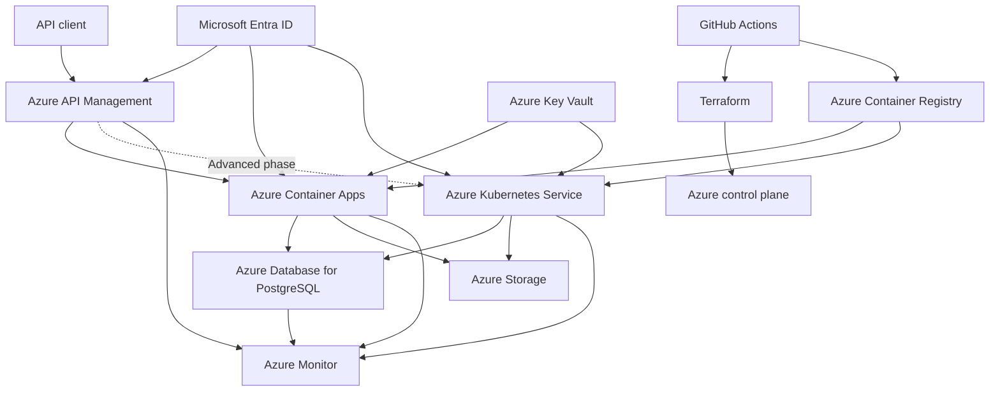
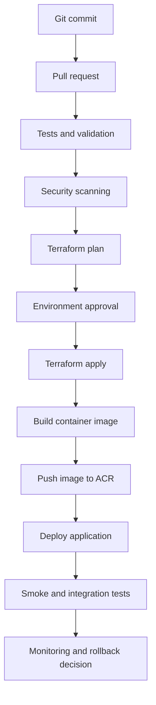

# Azure Enterprise Platform Lab

A production-oriented Azure platform engineering project built incrementally from cloud fundamentals to advanced Azure, DevOps, security, Kubernetes, observability, reliability, and FinOps practices.

The project uses a real Azure for Students subscription with strict cost controls. Infrastructure is deployed primarily through Terraform, application delivery is automated with GitHub Actions, and each implementation phase includes validation, evidence, troubleshooting, and cleanup.

> Status: In development  
> Current phase: Phase 0 - Repository and safety foundation

---

## Table of contents

- [Project overview](#project-overview)
- [Engineering objectives](#engineering-objectives)
- [Architecture](#architecture)
- [Request flow](#request-flow)
- [Deployment flow](#deployment-flow)
- [Technology stack](#technology-stack)
- [Implementation roadmap](#implementation-roadmap)
- [Repository structure](#repository-structure)
- [Infrastructure strategy](#infrastructure-strategy)
- [Environment strategy](#environment-strategy)
- [Networking strategy](#networking-strategy)
- [Identity and security](#identity-and-security)
- [API management](#api-management)
- [Containers and Kubernetes](#containers-and-kubernetes)
- [CI/CD strategy](#cicd-strategy)
- [Observability and SRE](#observability-and-sre)
- [Reliability and disaster recovery](#reliability-and-disaster-recovery)
- [Cost-control strategy](#cost-control-strategy)
- [Testing strategy](#testing-strategy)
- [Troubleshooting scenarios](#troubleshooting-scenarios)
- [Evidence and documentation](#evidence-and-documentation)
- [Provisioning rules](#provisioning-rules)
- [Security rules](#security-rules)
- [Project completion criteria](#project-completion-criteria)

---

## Project overview

Azure Enterprise Platform Lab is a complete cloud engineering environment that demonstrates how an application platform can be designed, provisioned, secured, delivered, monitored, scaled, and recovered on Microsoft Azure.

The project is not a collection of unrelated Azure exercises. All services are introduced as parts of one connected platform.

The implementation starts with a low-cost serverless baseline based on Azure Container Apps and Azure API Management. Advanced phases extend the same platform with Azure Kubernetes Service, private networking, GitOps, progressive delivery, workload identity, distributed tracing, reliability testing, and disaster-recovery procedures.

Because the project uses a limited Azure for Students credit balance, expensive resources are deployed only during controlled laboratory windows. Production-oriented architectures that would require significant permanent cost are represented through validated Terraform plans, diagrams, decision records, cost estimates, and clearly documented limitations.

---

## Engineering objectives

The project is designed to demonstrate the following engineering capabilities:

- Azure resource organization and governance;
- Infrastructure as Code with Terraform;
- reusable Terraform module development;
- remote Terraform state management;
- Azure networking and private connectivity;
- identity-first security;
- Microsoft Entra ID integration;
- managed identities and workload identity;
- Azure Key Vault secret management;
- container image engineering;
- Azure Container Registry;
- Azure Container Apps;
- Azure API Management;
- Azure Database for PostgreSQL;
- Azure Storage;
- GitHub Actions CI/CD;
- OpenID Connect authentication from GitHub to Azure;
- Kubernetes and Azure Kubernetes Service;
- Helm packaging;
- GitOps;
- monitoring and distributed tracing;
- Kusto Query Language;
- SLI, SLO, and error-budget concepts;
- load testing and scaling;
- incident response and troubleshooting;
- backup and restore;
- disaster-recovery planning;
- cloud cost control and FinOps.

---

## Architecture

The final target architecture is implemented in multiple cost-controlled phases.



### Architecture layers

The platform is divided into the following logical layers:

| Layer | Responsibilities |
|---|---|
| Edge and API | API publishing, authentication, throttling, versioning, transformations, and routing |
| Application | FastAPI application, business logic, health endpoints, and telemetry |
| Container platform | Container Apps baseline and AKS advanced runtime |
| Data | PostgreSQL, Blob Storage, backup, and recovery |
| Identity | Entra ID, RBAC, managed identities, and workload identity |
| Security | Key Vault, private access, policies, scanning, and least privilege |
| Delivery | GitHub Actions, Terraform, Docker, ACR, Helm, and GitOps |
| Observability | Azure Monitor, Log Analytics, Application Insights, OpenTelemetry, and KQL |
| Reliability | Health probes, autoscaling, rollback, backup, restore, and disaster recovery |
| Governance | Naming, tags, budgets, policy, locks, ownership, and cleanup |

---

## Request flow

The planned API request flow is:

1. A client sends an HTTPS request to Azure API Management.
2. API Management validates the request.
3. APIM applies authentication, rate limits, quotas, transformations, routing, and logging policies.
4. The request is forwarded to the active application backend.
5. The backend runs initially in Azure Container Apps.
6. During the advanced phase, the same application image is deployed to AKS.
7. The application authenticates to Azure services through managed identity or workload identity.
8. Secrets and certificates are retrieved from Azure Key Vault.
9. Relational data is stored in Azure Database for PostgreSQL.
10. Objects and application files are stored in Azure Blob Storage.
11. Metrics, logs, traces, and dependency information are sent to Azure Monitor and Application Insights.
12. The response returns through APIM to the client with a correlation ID.

---

## Deployment flow

The planned delivery flow is:



A deployment is considered successful only when:

- infrastructure deployment succeeds;
- the expected application version is running;
- health checks pass;
- smoke tests pass;
- authentication works;
- required dependencies are reachable;
- monitoring receives telemetry;
- no unexpected critical security finding is introduced;
- deployment evidence is preserved.

---

## Technology stack

| Category | Technologies |
|---|---|
| Cloud platform | Microsoft Azure |
| Infrastructure as Code | Terraform, AzureRM provider |
| Native Azure IaC comparison | Bicep |
| Application | Python, FastAPI |
| Application testing | Pytest |
| Containers | Docker |
| Container registry | Azure Container Registry |
| Serverless containers | Azure Container Apps |
| Kubernetes | Azure Kubernetes Service |
| Kubernetes packaging | Helm |
| GitOps | Argo CD or Flux |
| API gateway | Azure API Management |
| Identity | Microsoft Entra ID |
| Workload authentication | Managed identity, workload identity, OIDC |
| Secrets | Azure Key Vault |
| Relational database | Azure Database for PostgreSQL |
| Object storage | Azure Blob Storage |
| CI/CD | GitHub Actions |
| Monitoring | Azure Monitor |
| Log platform | Log Analytics |
| Application monitoring | Application Insights |
| Telemetry | OpenTelemetry |
| Query language | Kusto Query Language |
| Security scanning | Trivy and Checkov |
| Load testing | k6 |
| Documentation | Markdown, Mermaid, architecture diagrams, ADRs |

The final tool selection may be refined through Architecture Decision Records.

---

## Implementation roadmap

| Phase | Scope | Status |
|---|---|---|
| 0 | Repository, tooling, Git configuration, documentation, safety, and cost controls | In progress |
| 1 | Local FastAPI application, unit tests, health endpoints, and Docker image | Planned |
| 2 | Terraform fundamentals, provider configuration, modules, and remote state | Planned |
| 3 | Resource groups, naming, tags, policy, budgets, and governance | Planned |
| 4 | Virtual networks, subnets, NSGs, routing, DNS, and private connectivity | Planned |
| 5 | Azure Container Registry and Azure Container Apps baseline | Planned |
| 6 | Managed identity, Key Vault, Storage, and PostgreSQL | Planned |
| 7 | Azure API Management, OpenAPI, policies, security, and throttling | Planned |
| 8 | GitHub Actions, OIDC, Terraform pipelines, and application CI/CD | Planned |
| 9 | Azure Monitor, Log Analytics, Application Insights, OpenTelemetry, and KQL | Planned |
| 10 | AKS, Helm, Kubernetes security, autoscaling, and persistent storage | Planned |
| 11 | GitOps, progressive delivery, rollback, and drift detection | Planned |
| 12 | Load testing, reliability, backup, restore, incident response, and FinOps | Planned |
| 13 | Final validation, architecture review, project defense, and cleanup | Planned |

### Phase status definitions

- `Planned` - the phase has not started.
- `In progress` - implementation or validation is currently active.
- `Completed` - implementation, testing, documentation, evidence, and cleanup are complete.
- `Reference design` - the architecture is documented and validated without permanent deployment because of cost or subscription limitations.

---

## Repository structure

```text
.
├── .github/
│   └── workflows/
│       └── GitHub Actions workflows
├── apim/
│   ├── apis/
│   │   └── OpenAPI specifications
│   └── policies/
│       └── Azure API Management policies
├── application/
│   ├── src/
│   │   └── FastAPI application source code
│   └── tests/
│       └── Application unit tests
├── docs/
│   ├── adr/
│   │   └── Architecture Decision Records
│   ├── architecture/
│   │   └── Architecture diagrams and design documents
│   ├── evidence/
│   │   └── Sanitized deployment and validation evidence
│   └── runbooks/
│       └── Operational and troubleshooting procedures
├── helm/
│   └── Application Helm charts
├── infrastructure/
│   ├── bootstrap/
│   │   └── Terraform state backend bootstrap
│   ├── environments/
│   │   ├── dev/
│   │   ├── staging/
│   │   └── production/
│   └── modules/
│       └── Reusable Terraform modules
├── kubernetes/
│   ├── base/
│   │   └── Common Kubernetes manifests
│   └── overlays/
│       ├── dev/
│       ├── staging/
│       └── production/
├── monitoring/
│   └── kql/
│       └── KQL queries and alert definitions
├── scripts/
│   └── Safe helper and validation scripts
└── tests/
    ├── integration/
    │   └── Integration tests
    └── smoke/
        └── Post-deployment smoke tests
```

Empty directories contain temporary `.gitkeep` files. These files are removed when real files are added.

---

## Infrastructure strategy

Terraform is the primary provisioning tool.

The infrastructure code will be separated into reusable modules and environment-specific root modules.

Planned modules include:

- resource naming;
- governance and tags;
- virtual network;
- network security groups;
- private DNS;
- private endpoints;
- storage accounts;
- container registry;
- container apps;
- managed identities;
- Key Vault;
- PostgreSQL;
- API Management;
- monitoring;
- AKS;
- role assignments.

### Terraform workflow

The standard workflow is:

```text
terraform fmt
terraform init
terraform validate
terraform plan
review
terraform apply
verify
terraform destroy
verify cleanup
```

No infrastructure change is considered complete until the deployed state is validated.

### Terraform state

Terraform state will use a dedicated Azure Storage backend.

The backend will be protected through:

- restricted access;
- encryption;
- versioning and recovery controls;
- dedicated identity permissions;
- separate state per environment;
- state locking;
- no state files committed to Git.

Terraform state may contain sensitive values and must be treated as protected data.

---

## Environment strategy

The project contains three logical environments:

### Development

The development environment is the primary real deployment environment.

It uses:

- low-cost service tiers;
- short retention;
- small scaling limits;
- automatic or manual cleanup;
- active troubleshooting and testing.

### Staging

The staging environment represents production-like validation.

It is deployed only when required for:

- release validation;
- migration testing;
- API compatibility testing;
- progressive delivery;
- rollback testing.

### Production

The production directory represents the intended production architecture.

It may include configurations that are too expensive to operate continuously under an Azure for Students subscription.

Production configurations are validated through:

- Terraform formatting;
- Terraform validation;
- Terraform plans;
- security scanning;
- architecture review;
- cost estimation;
- documented limitations.

Each environment uses separate configuration, state, deployment permissions, and approval controls.

---

## Networking strategy

The networking implementation progresses from basic to advanced.

Planned networking topics include:

- virtual network design;
- CIDR planning;
- subnet segmentation;
- Network Security Groups;
- application security groups;
- user-defined routes;
- public and private IP addressing;
- private endpoints;
- service endpoints;
- private DNS zones;
- VNet peering;
- hub-and-spoke topology;
- controlled ingress and egress;
- NAT concepts;
- Application Gateway and WAF reference design;
- Network Watcher troubleshooting;
- private AKS architecture.

The final network design follows least-access principles.

Application, data, management, ingress, and private-endpoint responsibilities are separated where technically and financially practical.

---

## Identity and security

The project follows an identity-first and Zero Trust approach.

### Human access

Human access is controlled through:

- Microsoft Entra ID;
- Azure RBAC;
- least-privilege assignments;
- separate deployment and approval responsibilities;
- protected GitHub environments;
- documented privileged operations.

### Workload access

Workloads use:

- system-assigned managed identities;
- user-assigned managed identities where reuse is justified;
- AKS workload identity;
- GitHub Actions OIDC federation;
- short-lived tokens;
- narrowly scoped Azure role assignments.

Long-lived Azure client secrets are avoided wherever supported.

### Secret management

Azure Key Vault stores:

- application secrets;
- database credentials where identity-based access is unavailable;
- certificates;
- sensitive application configuration.

Secrets must never be stored in:

- Git;
- Docker images;
- Terraform variable files committed to Git;
- GitHub Actions logs;
- screenshots;
- application source code.

### Security controls

Planned controls include:

- least-privilege RBAC;
- managed identity;
- OIDC federation;
- Key Vault;
- private access;
- Azure Policy;
- secure transport;
- container image scanning;
- Terraform scanning;
- dependency scanning;
- Kubernetes security contexts;
- Kubernetes Network Policies;
- controlled logging;
- documented threat models.

---

## API management

Azure API Management is the central API gateway.

The APIM phase includes:

- OpenAPI import;
- API operations;
- API products;
- subscriptions;
- API versioning;
- JWT validation;
- Microsoft Entra ID integration;
- rate limiting;
- quotas;
- CORS;
- IP filtering;
- request transformation;
- response transformation;
- URL rewriting;
- backend routing;
- caching;
- retries;
- controlled error handling;
- correlation IDs;
- Application Insights integration;
- policy-as-code deployment.

The real laboratory deployment uses a cost-appropriate APIM tier.

Advanced private and enterprise APIM designs are documented separately when their permanent cost or tier requirements are not suitable for the student subscription.

The backend application remains responsible for business authorization and data integrity. APIM does not replace application security.

---

## Containers and Kubernetes

### Container baseline

The application container follows these principles:

- deterministic dependencies;
- multi-stage build where useful;
- small build context;
- non-root runtime user;
- explicit health endpoint;
- graceful shutdown;
- no embedded secrets;
- immutable image version;
- image vulnerability scanning;
- deployment by image digest where practical.

### Azure Container Apps

Azure Container Apps provides the initial low-cost application runtime.

The implementation includes:

- revisions;
- ingress;
- managed identity;
- Key Vault access;
- health probes;
- scale-to-zero;
- autoscaling boundaries;
- traffic splitting;
- rollback;
- monitoring.

### Azure Kubernetes Service

AKS provides the advanced orchestration phase.

The AKS implementation includes:

- cluster and node-pool architecture;
- namespaces;
- Deployments;
- Services;
- Ingress;
- ConfigMaps;
- external secret integration;
- readiness, liveness, and startup probes;
- resource requests and limits;
- Horizontal Pod Autoscaler;
- Cluster Autoscaler concepts;
- Pod Disruption Budgets;
- rolling updates;
- Helm;
- persistent storage;
- workload identity;
- Key Vault CSI integration;
- Kubernetes Network Policies;
- security contexts;
- monitoring;
- upgrade planning;
- GitOps;
- rollback.

AKS is created only for controlled laboratory periods and destroyed after validation.

---

## CI/CD strategy

GitHub Actions provides the delivery platform.

Planned workflows include:

- pull request validation;
- Python linting and testing;
- Docker image build;
- dependency scanning;
- container vulnerability scanning;
- SBOM generation;
- Terraform formatting;
- Terraform validation;
- Terraform security scanning;
- Terraform plan;
- protected Terraform apply;
- APIM policy deployment;
- container image publishing;
- Container Apps deployment;
- AKS deployment;
- smoke tests;
- integration tests;
- scheduled drift detection;
- controlled cleanup.

### Authentication

GitHub Actions will authenticate to Azure through OpenID Connect.

The OIDC design avoids storing a long-lived Azure client secret in GitHub.

Separate identities and permissions will be used for:

- pull request validation;
- development deployment;
- production deployment;
- cleanup operations.

### Deployment strategies

The project demonstrates:

- rolling deployments;
- revision-based rollback;
- canary deployment;
- traffic splitting;
- blue-green concepts;
- Helm rollback;
- GitOps reconciliation.

---

## Observability and SRE

The observability implementation includes four main telemetry types:

- metrics;
- logs;
- distributed traces;
- availability signals.

Planned services and technologies include:

- Azure Monitor;
- Log Analytics;
- Application Insights;
- OpenTelemetry;
- diagnostic settings;
- KQL;
- dashboards;
- alert rules;
- action groups;
- synthetic tests;
- correlation IDs.

### Service-level concepts

The project defines learning examples of:

- Service Level Indicators;
- Service Level Objectives;
- error budgets;
- availability;
- latency percentiles;
- request success rate;
- dependency health;
- saturation;
- incident severity.

Monitoring is designed to answer:

- Which environment is affected?
- Which version is running?
- Which API operation failed?
- Which dependency caused the failure?
- When did the problem begin?
- Was the failure related to a deployment?
- How many users or requests were affected?
- Is the error budget being consumed too quickly?

---

## Reliability and disaster recovery

Reliability work includes:

- readiness and health validation;
- bounded retries;
- timeouts;
- backoff and jitter;
- graceful degradation;
- connection-pool limits;
- dependency failure handling;
- autoscaling boundaries;
- rollout and rollback;
- backup;
- restore;
- failure simulation;
- incident response;
- post-incident review.

### Recovery objectives

The project documents:

- Recovery Time Objective;
- Recovery Point Objective;
- backup retention;
- restore procedure;
- infrastructure reconstruction;
- application redeployment;
- data recovery;
- DNS and traffic recovery;
- failback considerations.

Multi-region architecture is treated as a reference design unless a temporary real deployment is justified by the available budget.

Replication is not treated as a replacement for backup.

---

## Cost-control strategy

The project uses a limited Azure for Students credit balance.

Cost is treated as an engineering requirement.

### Cost-control rules

- Use consumption-based or free tiers where suitable.
- Keep minimum replica counts at zero where supported.
- Use small development SKUs.
- Deploy expensive resources only during active laboratories.
- Destroy AKS after the validation window.
- Avoid permanent Application Gateway, NAT Gateway, or duplicate regional environments unless required.
- Use short log-retention periods in development.
- Limit autoscaling maximums.
- Apply project, environment, owner, and expiration tags.
- Review Cost Management after every deployment phase.
- Check for orphaned disks, public IPs, snapshots, private endpoints, and monitoring resources.
- Verify Terraform destruction.
- Preserve a credit reserve for later advanced phases.

### Important budget limitation

Azure budgets provide alerts but do not automatically stop resources.

A successful `terraform destroy` must be followed by verification that no unexpected chargeable resources remain.

---

## Testing strategy

The project applies multiple testing levels.

### Application tests

- unit tests;
- input validation tests;
- authentication tests;
- authorization tests;
- error-handling tests.

### Infrastructure tests

- `terraform fmt`;
- `terraform validate`;
- Terraform plan review;
- provider version validation;
- static analysis;
- security scanning;
- policy checks;
- deployment verification.

### Container tests

- image build;
- startup test;
- health test;
- non-root validation;
- vulnerability scanning;
- dependency scanning.

### Integration tests

- APIM to application communication;
- application to PostgreSQL communication;
- application to Blob Storage communication;
- managed identity access;
- Key Vault access;
- monitoring telemetry delivery.

### Smoke tests

Smoke tests verify critical behavior immediately after deployment:

- health endpoint;
- API availability;
- valid authentication;
- expected response;
- database connectivity;
- storage connectivity;
- telemetry generation.

### Reliability tests

- backend unavailable;
- database unavailable;
- invalid secret;
- failed readiness probe;
- application restart;
- container image failure;
- scaling under load;
- failed deployment;
- rollback.

---

## Troubleshooting scenarios

The repository documents reproducible troubleshooting scenarios.

Planned scenarios include:

- incorrect Azure RBAC assignment;
- expired or invalid credential;
- OIDC subject mismatch;
- Key Vault access denied;
- public access incorrectly enabled;
- NSG traffic denied;
- incorrect route;
- private DNS resolution failure;
- private endpoint misconfiguration;
- Terraform state lock;
- partial Terraform apply;
- unexpected Terraform replacement;
- Docker build failure;
- container health-check failure;
- Kubernetes `Pending` pod;
- Kubernetes `CrashLoopBackOff`;
- Kubernetes `ImagePullBackOff`;
- readiness-probe failure;
- APIM `401 Unauthorized`;
- APIM `403 Forbidden`;
- APIM `429 Too Many Requests`;
- APIM backend `5xx` failure;
- PostgreSQL connection-pool exhaustion;
- failed GitHub Actions deployment;
- unavailable backend during rollout;
- incomplete cleanup.

Each troubleshooting document contains:

1. Symptom.
2. Expected behavior.
3. Scope and impact.
4. Evidence.
5. Hypotheses.
6. Diagnostic steps.
7. Root cause.
8. Fix.
9. Verification.
10. Prevention.

---

## Evidence and documentation

Each completed phase provides sanitized evidence.

Evidence may include:

- Terraform output;
- Terraform plans without secrets;
- GitHub Actions results;
- application test output;
- Docker image information;
- API responses;
- APIM policy tests;
- Kubernetes object status;
- KQL results;
- monitoring dashboards;
- alert examples;
- load-test results;
- backup and restore results;
- incident timelines;
- cost review;
- cleanup verification.

Evidence must not contain:

- passwords;
- tokens;
- personal email addresses;
- subscription identifiers where unnecessary;
- tenant identifiers where unnecessary;
- private IP information that should not be public;
- private certificates;
- Terraform state;
- sensitive application data.

Documentation is organized as follows:

- `docs/architecture/` - architecture and design;
- `docs/adr/` - architecture decisions;
- `docs/runbooks/` - operational procedures;
- `docs/evidence/` - sanitized verification evidence.

---

## Provisioning rules

The project follows these provisioning rules:

1. Terraform is the primary method for creating, changing, and deleting Azure resources.
2. Azure Portal is used for subscription bootstrap, billing controls, selected identity configuration, and visual verification.
3. Azure CLI is optional and is not the primary provisioning method.
4. Azure CLI may be used for authentication, read-only inspection, or diagnostics when it works reliably.
5. Manual Portal changes must be documented.
6. A manually created resource must either be imported into Terraform or explicitly excluded from Terraform ownership.
7. Infrastructure changes require validation and plan review.
8. Temporary resources must have a cleanup procedure.
9. Destructive actions require explicit target verification.
10. No deployment is complete until functionality and cost state are verified.

This strategy keeps the project reproducible while accounting for local Azure CLI reliability limitations.

---

## Security rules

The following files and values must never be committed:

- `.env`;
- Terraform state;
- real `.tfvars` files;
- Azure client secrets;
- GitHub tokens;
- database passwords;
- private keys;
- certificates containing private keys;
- Kubernetes kubeconfig files;
- Key Vault secret values;
- Storage Account keys;
- SAS tokens;
- container registry passwords.

Before every commit:

```bash
git status
git diff
git diff --cached
```

Before every push:

```bash
git log -1 --stat
git status
```

If a secret is committed, deleting it in a later commit is not sufficient. The secret must be revoked or rotated immediately, and repository history must be reviewed.

---

## Project completion criteria

The project is complete only when:

- every planned phase has a clear final status;
- the deployed architecture matches the documentation;
- all core infrastructure is reproducible;
- Terraform state is protected;
- no secret is committed;
- application tests pass;
- infrastructure validation passes;
- security scans are reviewed;
- CI/CD workflows operate successfully;
- APIM policies are tested;
- Container Apps deployment is verified;
- the AKS advanced phase is demonstrated;
- monitoring receives expected telemetry;
- alerts have documented owners and actions;
- backup and restore procedures are tested;
- troubleshooting scenarios are documented;
- cost controls are verified;
- temporary resources are destroyed;
- architecture decisions are recorded;
- evidence is sanitized;
- the complete platform can be explained and defended.

---

## Current work

The current implementation work is focused on Phase 0:

- local tool verification;
- repository initialization;
- Git identity and email privacy;
- directory structure;
- `.gitignore`;
- `.editorconfig`;
- project documentation;
- cost-control planning;
- Architecture Decision Records;
- initial Git commit;
- publication of the repository to GitHub.

No Azure resources have been deployed by this repository yet.
