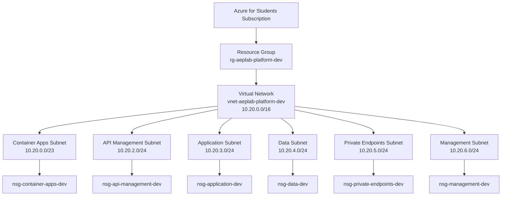

# Development Network Foundation

## 1. Purpose

This document describes the Azure network foundation for the `dev`
environment of the Azure Enterprise Platform Lab.

The network is managed through Terraform and provides separated address spaces
for platform services, application workloads, data services, private
endpoints, and management components.

The main design goals are:

- predictable IP address allocation;
- separation of workloads by purpose;
- reusable Terraform modules;
- support for future private connectivity;
- support for Azure Container Apps;
- preparation for Azure API Management;
- independent Network Security Groups for every subnet;
- compatibility with future hybrid networking;
- controlled Azure cost.

This phase creates only the network foundation. It does not deploy application
or platform workloads.

---

## 2. Architecture Overview



The Virtual Network is divided into six dedicated subnets. Each subnet is
associated with its own Network Security Group.

---

## 3. Azure Resource Scope

The development network is deployed into the following Resource Group:

```text
rg-aeplab-platform-dev
```

The primary Azure region is:

```text
polandcentral
```

The Terraform configuration creates the following resources:

| Resource type | Quantity |
|---|---:|
| Resource Group | 1 |
| Virtual Network | 1 |
| Subnet | 6 |
| Network Security Group | 6 |
| Subnet-to-NSG Association | 6 |
| **Total** | **20** |

The current Terraform plan must therefore report:

```text
Plan: 20 to add, 0 to change, 0 to destroy.
```

---

## 4. IP Address Strategy

### 4.1 Virtual Network Address Space

The development Virtual Network uses:

```text
10.20.0.0/16
```

A `/16` network contains 65,536 total IPv4 addresses and provides sufficient
address capacity for future development services and additional subnets.

The entire address range extends from:

```text
10.20.0.0
```

to:

```text
10.20.255.255
```

Not all of this address space is allocated during the current phase. Keeping
unused address space available allows the platform to grow without replacing
the Virtual Network.

### 4.2 Avoiding Address Overlap

The local Hyper-V laboratory uses:

```text
10.10.10.0/24
```

The Azure development environment uses:

```text
10.20.0.0/16
```

These address spaces do not overlap.

Avoiding address overlap is important for future:

- Site-to-Site VPN connections;
- Point-to-Site VPN connections;
- Virtual Network Peering;
- hub-and-spoke networking;
- hybrid DNS;
- routing between Azure and the local laboratory.

Overlapping networks can prevent correct routing because the same IP address
may appear to belong to more than one network.

---

## 5. Subnet Address Plan

| Logical name | Azure subnet name | Address prefix | Total addresses | Azure-usable addresses | Purpose |
|---|---|---:|---:|---:|---|
| Container Apps | `snet-container-apps-dev` | `10.20.0.0/23` | 512 | 507 | Azure Container Apps managed environment |
| API Management | `snet-api-management-dev` | `10.20.2.0/24` | 256 | 251 | Future Azure API Management integration |
| Application | `snet-application-dev` | `10.20.3.0/24` | 256 | 251 | Application and supporting compute workloads |
| Data | `snet-data-dev` | `10.20.4.0/24` | 256 | 251 | Data services and future database integration |
| Private Endpoints | `snet-private-endpoints-dev` | `10.20.5.0/24` | 256 | 251 | Private Endpoints for Azure PaaS services |
| Management | `snet-management-dev` | `10.20.6.0/24` | 256 | 251 | Administrative and operational components |

Azure reserves five IP addresses in every subnet:

- the first address identifies the network;
- the second and third addresses are used by Azure;
- the fourth address is reserved by Azure;
- the final address is reserved for broadcast compatibility.

For example, in `10.20.3.0/24`, Azure reserves:

```text
10.20.3.0
10.20.3.1
10.20.3.2
10.20.3.3
10.20.3.255
```

The remaining addresses may be assigned to Azure resources.

---

## 6. Subnet Responsibilities

### 6.1 Container Apps Subnet

```text
Name:   snet-container-apps-dev
CIDR:   10.20.0.0/23
NSG:    nsg-container-apps-dev
```

This subnet is reserved for the future Azure Container Apps Managed
Environment.

It uses the following Subnet Delegation:

```text
Microsoft.App/environments
```

The delegation allows the Azure Container Apps platform to use and manage
network resources required by the managed environment.

Terraform configures the following delegation action:

```text
Microsoft.Network/virtualNetworks/subnets/join/action
```

The subnet must not be used for unrelated application resources, virtual
machines, Private Endpoints, or API Management.

No Azure Container Apps Environment is created during this phase.

### 6.2 API Management Subnet

```text
Name:   snet-api-management-dev
CIDR:   10.20.2.0/24
NSG:    nsg-api-management-dev
```

This subnet is reserved for future Azure API Management network integration.

Azure API Management will later provide an API gateway layer in front of the
application.

Possible future responsibilities include:

- API routing;
- request authentication;
- rate limiting;
- request and response transformation;
- API version management;
- centralized API policies;
- integration with private backends;
- monitoring and diagnostics.

No API Management instance is deployed during this phase.

### 6.3 Application Subnet

```text
Name:   snet-application-dev
CIDR:   10.20.3.0/24
NSG:    nsg-application-dev
```

This subnet is reserved for application-related compute components that do not
belong to the delegated Container Apps subnet.

Possible future resources include:

- internal application services;
- self-hosted integration components;
- build or deployment agents;
- internal load balancers;
- application virtual machines, if required.

No compute resources are deployed during this phase.

### 6.4 Data Subnet

```text
Name:   snet-data-dev
CIDR:   10.20.4.0/24
NSG:    nsg-data-dev
```

This subnet represents the data tier of the platform.

Possible future responsibilities include:

- self-hosted database components;
- data processing services;
- internal cache services;
- database integration components.

Azure PaaS databases accessed through Private Endpoints will place their
Private Endpoint network interfaces in the dedicated Private Endpoints subnet,
not directly in this subnet.

No database resources are deployed during this phase.

### 6.5 Private Endpoints Subnet

```text
Name:   snet-private-endpoints-dev
CIDR:   10.20.5.0/24
NSG:    nsg-private-endpoints-dev
```

This subnet is reserved for future Azure Private Endpoints.

A Private Endpoint creates a network interface with a private IP address from
the selected subnet. Supported Azure PaaS services can then be accessed through
the private Azure network instead of through their public endpoint.

Possible future Private Endpoints include:

- Azure Container Registry;
- Azure Key Vault;
- Azure Storage;
- Azure SQL Database;
- Azure Cosmos DB;
- Azure Monitor Private Link Scope.

Terraform configures Private Endpoint network policies as:

```text
Enabled
```

This prepares the subnet for applying supported Network Security Group and
routing policies to Private Endpoint traffic.

No Private Endpoints or Private DNS Zones are created during this phase.

### 6.6 Management Subnet

```text
Name:   snet-management-dev
CIDR:   10.20.6.0/24
NSG:    nsg-management-dev
```

This subnet is reserved for management and operational components.

Possible future resources include:

- self-hosted GitHub Actions runners;
- administrative jump hosts;
- monitoring collectors;
- troubleshooting tools;
- controlled management services.

No management compute resources are deployed during this phase.

---

## 7. Network Security Groups

Every subnet has a dedicated Network Security Group.

| Subnet | Network Security Group |
|---|---|
| `snet-container-apps-dev` | `nsg-container-apps-dev` |
| `snet-api-management-dev` | `nsg-api-management-dev` |
| `snet-application-dev` | `nsg-application-dev` |
| `snet-data-dev` | `nsg-data-dev` |
| `snet-private-endpoints-dev` | `nsg-private-endpoints-dev` |
| `snet-management-dev` | `nsg-management-dev` |

A Network Security Group is a stateful Layer 3 and Layer 4 traffic filtering
resource.

NSG rules can evaluate:

- traffic direction;
- source address;
- destination address;
- protocol;
- source port;
- destination port;
- priority;
- allow or deny action.

Because NSGs are stateful, response traffic for an allowed connection is
automatically permitted.

### 7.1 Current Security Rule Strategy

The current phase creates the NSGs and their subnet associations but does not
create custom security rules.

Only the Azure default NSG rules are present.

Custom rules are intentionally postponed until the actual workloads and
required traffic flows are known.

This prevents speculative rules such as:

```text
Allow Any from Any
```

from becoming part of the platform.

### 7.2 Future Least-Privilege Rules

Future rules must follow the Principle of Least Privilege.

Each rule should define:

- a known source;
- a known destination;
- the required protocol;
- the required port;
- the correct traffic direction;
- a documented business or technical reason.

Example future traffic flows may include:

```text
API Management -> Application API -> TCP 8000
Application -> Database -> TCP 5432
Management -> Internal services -> required administrative ports
```

These examples are not deployed during the current phase.

---

## 8. Terraform Architecture

### 8.1 Root Module

The development Root Module is located at:

```text
infrastructure/environments/dev
```

The Root Module defines the environment-specific configuration:

- Azure subscription;
- Azure region;
- environment name;
- workload name;
- naming conventions;
- tags;
- Virtual Network address space;
- subnet address prefixes;
- Network Module invocation;
- environment outputs.

### 8.2 Child Module

The reusable Network Child Module is located at:

```text
infrastructure/modules/network
```

The Child Module manages:

- Virtual Network creation;
- Subnet creation;
- optional Subnet Delegation;
- Network Security Group creation;
- optional custom NSG rules;
- Subnet-to-NSG associations;
- network outputs.

The development Root Module calls it using:

```hcl
module "network" {
  source = "../../modules/network"
}
```

### 8.3 Module Inputs

The Network Module receives:

| Input | Purpose |
|---|---|
| `resource_group_name` | Resource Group containing network resources |
| `location` | Azure region |
| `virtual_network_name` | Virtual Network name |
| `address_space` | Virtual Network CIDR ranges |
| `subnets` | Subnet, delegation, NSG, and security rule definitions |
| `tags` | Common Azure resource tags |

### 8.4 Module Outputs

The Network Module provides:

| Output | Purpose |
|---|---|
| `virtual_network_id` | Azure Resource ID of the Virtual Network |
| `virtual_network_name` | Virtual Network name |
| `virtual_network_address_space` | Configured VNet address space |
| `subnet_ids` | Subnet Resource IDs keyed by logical name |
| `subnet_details` | Subnet names, prefixes, IDs, and NSG IDs |
| `network_security_group_ids` | NSG Resource IDs keyed by logical name |

These outputs will allow later modules to connect services to the correct
subnets without repeating resource lookup logic.

---

## 9. Terraform Implementation Patterns

### 9.1 `for_each`

The module uses `for_each` to create multiple resources from a map.

This pattern creates stable resource addresses such as:

```text
module.network.azurerm_subnet.this["application"]
module.network.azurerm_subnet.this["data"]
module.network.azurerm_network_security_group.this["management"]
```

Using logical keys is safer and easier to understand than index-based resource
addresses.

### 9.2 Dynamic Blocks

The module uses a `dynamic` block for optional Subnet Delegation.

Only a subnet with a configured delegation receives a Terraform `delegation`
block.

In the current configuration, this applies only to:

```text
container_apps
```

### 9.3 Implicit Dependencies

The Root Module passes the Resource Group attributes directly into the Network
Module:

```hcl
resource_group_name = azurerm_resource_group.platform.name
location            = azurerm_resource_group.platform.location
```

These references create an Implicit Dependency.

Terraform understands that the Resource Group must exist before the network
resources are created.

A manual `depends_on` argument is therefore not required.

### 9.4 Input Validation

Variable validation checks:

- Subscription ID format;
- supported environment names;
- non-empty Azure location;
- workload naming format;
- valid Virtual Network CIDRs;
- valid Subnet CIDRs;
- valid NSG rule directions;
- valid NSG rule actions;
- valid protocols;
- valid NSG priorities.

Validation catches configuration errors before resource deployment.

---

## 10. Naming Convention

The platform uses predictable Azure resource prefixes.

| Prefix | Resource type |
|---|---|
| `rg` | Resource Group |
| `vnet` | Virtual Network |
| `snet` | Subnet |
| `nsg` | Network Security Group |

The environment naming prefix is:

```text
aeplab-platform-dev
```

Resulting resource names include:

```text
rg-aeplab-platform-dev
vnet-aeplab-platform-dev
snet-container-apps-dev
snet-api-management-dev
snet-application-dev
snet-data-dev
snet-private-endpoints-dev
snet-management-dev
```

Predictable naming improves:

- operational visibility;
- troubleshooting;
- resource discovery;
- automation;
- cost analysis;
- policy enforcement.

---

## 11. Resource Tags

The following mandatory tags are applied to supported Azure resources:

| Tag | Value |
|---|---|
| `Environment` | `dev` |
| `ManagedBy` | `Terraform` |
| `Project` | `Azure Enterprise Platform Lab` |
| `Repository` | `azure-enterprise-platform-lab` |
| `Workload` | `platform` |
| `CostProfile` | `StudentLab` |
| `Purpose` | `Learning` |
| `Phase` | `NetworkFoundation` |

Tags help identify:

- resource ownership;
- deployment environment;
- automation source;
- project association;
- cost purpose;
- current implementation phase.

Azure Subnets do not support independent tags. Tags are applied only to
resources that support them, such as the Resource Group, Virtual Network, and
Network Security Groups.

---

## 12. Terraform State Management

The development environment uses an AzureRM Remote Backend.

Terraform State is stored in the previously deployed Azure Storage Account and
private Blob Container.

The backend provides:

- centralized state storage;
- shared state access;
- Azure Blob state locking;
- protection against simultaneous Terraform operations;
- separation of source code and deployment state.

The development state key is:

```text
dev/terraform.tfstate
```

Real backend values are stored in:

```text
infrastructure/environments/dev/backend.hcl
```

The real variable values are stored in:

```text
infrastructure/environments/dev/terraform.tfvars
```

Both files must remain outside version control.

The repository contains only safe examples:

```text
backend.hcl.example
terraform.tfvars.example
```

---

## 13. Deployment Workflow

### 13.1 Format

```bash
terraform fmt -recursive infrastructure
```

This applies standard Terraform formatting.

### 13.2 Formatting Check

```bash
terraform fmt -check -recursive infrastructure
```

A successful check produces no output.

### 13.3 Initialize

```bash
terraform \
  -chdir=infrastructure/environments/dev \
  init \
  -backend-config=backend.hcl \
  -input=false \
  -lockfile=readonly
```

Initialization:

- connects the Remote Backend;
- loads the Network Child Module;
- installs or reuses the required Provider;
- verifies the Dependency Lock File.

Initialization does not create Azure resources.

### 13.4 Validate

```bash
terraform \
  -chdir=infrastructure/environments/dev \
  validate \
  -no-color
```

Expected result:

```text
Success! The configuration is valid.
```

### 13.5 Plan

```bash
terraform \
  -chdir=infrastructure/environments/dev \
  plan \
  -input=false \
  -lock-timeout=5m \
  -var-file=terraform.tfvars \
  -out=/tmp/aeplab-network-foundation.tfplan
```

Expected result:

```text
Plan: 20 to add, 0 to change, 0 to destroy.
```

### 13.6 Review Saved Plan

```bash
terraform \
  -chdir=infrastructure/environments/dev \
  show \
  -no-color \
  /tmp/aeplab-network-foundation.tfplan
```

The saved plan must be reviewed before it is applied.

### 13.7 Apply

The reviewed plan may later be applied using:

```bash
terraform \
  -chdir=infrastructure/environments/dev \
  apply \
  /tmp/aeplab-network-foundation.tfplan
```

The apply step must be executed only after:

- Terraform validation succeeds;
- the saved plan is reviewed;
- CI checks succeed;
- the Pull Request is reviewed and merged;
- a fresh plan is generated from the final `main` branch.

---

## 14. Verification

After deployment, Terraform-managed resources can be listed with:

```bash
terraform \
  -chdir=infrastructure/environments/dev \
  state list
```

Expected state addresses include:

```text
azurerm_resource_group.platform
module.network.azurerm_virtual_network.this
module.network.azurerm_subnet.this["container_apps"]
module.network.azurerm_subnet.this["api_management"]
module.network.azurerm_subnet.this["application"]
module.network.azurerm_subnet.this["data"]
module.network.azurerm_subnet.this["private_endpoints"]
module.network.azurerm_subnet.this["management"]
```

The complete state also contains six Network Security Groups and six
Subnet-to-NSG associations.

Terraform outputs can be displayed with:

```bash
terraform \
  -chdir=infrastructure/environments/dev \
  output
```

The Azure Portal can be used to verify:

- Resource Group location and tags;
- Virtual Network address space;
- all six Subnets;
- Container Apps Subnet Delegation;
- Network Security Group associations;
- absence of unexpected resources.

Because Azure CLI is not required for the implementation workflow, Portal
verification is the preferred secondary validation method.

---

## 15. Cost Control

This phase does not deploy:

- Virtual Machines;
- Azure Container Apps;
- Azure API Management;
- NAT Gateway;
- VPN Gateway;
- ExpressRoute;
- Azure Firewall;
- VNet Peering;
- Load Balancers;
- Public IP addresses;
- Private Endpoints;
- Private DNS Zones;
- databases;
- monitoring workspaces.

The phase creates only the foundational Resource Group, Virtual Network,
Subnets, Network Security Groups, and associations.

Future services must be introduced in separate Pull Requests with:

- an explicit Terraform plan;
- a cost review;
- Azure for Students regional policy validation;
- clear cleanup instructions;
- verification that the service is required.

---

## 16. Security Considerations

The current network foundation follows these security principles:

### Segmentation

Different workload categories use different subnets.

### Dedicated Security Boundaries

Every subnet receives a dedicated Network Security Group.

### Least Privilege

Custom traffic rules will be added only when required traffic flows are known.

### Private Connectivity Readiness

A dedicated subnet is reserved for future Private Endpoints.

### Controlled Platform Delegation

Only the Container Apps subnet is delegated to
`Microsoft.App/environments`.

### Infrastructure as Code

Network resources are created through reviewed and version-controlled
Terraform configuration.

### Protected State

Terraform State is stored in an Azure Remote Backend and excluded from Git.

### No Embedded Credentials

Real Subscription IDs, backend configuration, credentials, and local variable
files are excluded from version control.

---

## 17. Current Limitations

The current phase does not provide:

- Internet egress control;
- centralized firewall inspection;
- custom route tables;
- user-defined routes;
- hybrid connectivity;
- DNS resolution for Private Endpoints;
- application ingress;
- API gateway functionality;
- workload-specific NSG rules;
- network flow logging;
- distributed denial-of-service protection configuration.

These components are intentionally excluded until the related workloads and
requirements are introduced.

---

## 18. Future Extensions

Future platform phases may add:

1. Azure Container Registry.
2. Azure Container Apps Managed Environment.
3. Deployment of the FastAPI application.
4. Azure API Management.
5. Azure Key Vault.
6. Private Endpoints.
7. Private DNS Zones.
8. Centralized logging and monitoring.
9. Workload-specific NSG rules.
10. Route tables and controlled egress.
11. Application Gateway or another ingress component.
12. Staging and production environment overlays.
13. Hub-and-spoke architecture.
14. Hybrid connectivity to the local Hyper-V laboratory.

Each extension must reuse the network outputs instead of hardcoding Azure
Resource IDs.

---

## 19. Acceptance Criteria

The Development Network Foundation is considered complete when:

- Terraform formatting passes;
- Terraform initialization succeeds;
- Terraform validation succeeds;
- the plan reports 20 resources to add;
- the plan reports zero resources to change;
- the plan reports zero resources to destroy;
- CI checks pass;
- the Pull Request is reviewed and merged;
- a fresh plan is created from `main`;
- Terraform apply completes successfully;
- all expected resources appear in Terraform State;
- all six Subnets appear in the Azure Portal;
- every Subnet is associated with the correct NSG;
- Container Apps Subnet Delegation is present;
- Terraform outputs return the expected network information;
- no unexpected paid Azure services are deployed.

---

## 20. Design Summary

The Development Network Foundation establishes a modular and expandable Azure
network using Terraform.

The design separates platform services into dedicated subnets, avoids overlap
with the local Hyper-V network, prepares the environment for private
connectivity, and creates independent security boundaries.

The reusable Network Child Module keeps resource creation logic separate from
environment-specific configuration. This makes the implementation suitable for
future staging and production environments while keeping the development
environment understandable and controlled.
