# Azure Container Platform Foundation — Deployment Evidence

> **Project:** Azure Enterprise Platform Lab  
> **Environment:** Development (`dev`)  
> **Region:** Poland Central  
> **Implementation:** Terraform  
> **Application Runtime:** Azure Container Apps  
> **Container Registry:** Azure Container Registry  
> **Status:** Completed and validated  
> **Evidence date:** 2026-07-18  
> **Author:** Artur Hyrenko

---

## 1. Executive Summary

This document provides deployment and validation evidence for the Azure Container Platform Foundation implemented as part of the Azure Enterprise Platform Lab.

The platform deploys a containerized FastAPI application to Azure Container Apps and uses Azure Container Registry as the private image repository.

The implementation includes:

- Azure Container Registry using the Basic SKU;
- immutable container image deployment by SHA-256 digest;
- Azure Container Apps Environment integrated with the development Virtual Network;
- Azure Container App using the Consumption workload profile;
- User Assigned Managed Identity;
- least-privilege `AcrPull` role assignment;
- external HTTPS ingress;
- liveness and readiness health probes;
- HTTP-based autoscaling;
- scale-to-zero configuration;
- stable application-level FQDN;
- Terraform Remote State;
- infrastructure drift detection;
- live API smoke testing.

All Azure resources in this phase were created and managed through Terraform. The Azure Portal was used for read-only verification, evidence collection, and the required Microsoft resource provider registration.

---

## 2. Objectives

The objectives of this implementation phase were to:

1. Create a cost-conscious Azure container runtime.
2. Store application images in a private Azure Container Registry.
3. avoid static registry credentials.
4. Authenticate image pulls using Managed Identity.
5. Apply least-privilege Azure RBAC.
6. Deploy an immutable application image.
7. Integrate Azure Container Apps with the existing development network.
8. Expose the API through a stable HTTPS endpoint.
9. Configure health probes and autoscaling.
10. Validate that the deployed infrastructure matches the Terraform configuration.
11. Produce reproducible deployment evidence suitable for a technical portfolio.

---

## 3. Architecture Overview

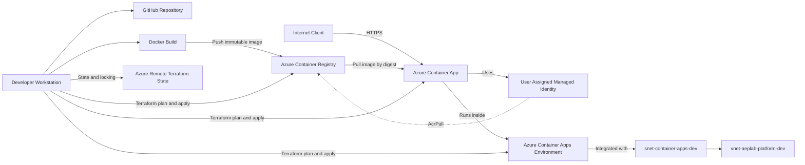

### Request Flow

```text
Internet client
    |
    | HTTPS
    v
Stable Container App FQDN
    |
    v
Azure Container Apps ingress
    |
    v
Active application revision
    |
    v
FastAPI container on target port 8000
```

### Image Pull Authentication Flow

```text
Azure Container App
    |
    | User Assigned Managed Identity
    v
id-azure-platform-api-dev
    |
    | AcrPull RBAC role
    v
Azure Container Registry
    |
    v
Immutable image identified by SHA-256 digest
```

---

## 4. Azure Resource Inventory

| Resource | Name | Purpose |
|---|---|---|
| Resource Group | `rg-aeplab-platform-dev` | Development platform resource boundary |
| Virtual Network | `vnet-aeplab-platform-dev` | Development network foundation |
| Container Apps Subnet | `snet-container-apps-dev` | Delegated subnet for the Container Apps Environment |
| Container Registry | `acraeplabexampledev` | Private OCI image repository |
| Registry Repository | `azure-platform-api` | FastAPI application images |
| Container Apps Environment | `cae-aeplab-platform-dev` | Managed runtime environment |
| Container App | `ca-azure-platform-api-dev` | Deployed FastAPI application |
| Managed Identity | `id-azure-platform-api-dev` | Passwordless ACR authentication |
| Active Revision | `ca-azure-platform-api-dev--0000001` | Immutable application revision |
| Terraform State Container | `tfstate` | Azure Remote State storage |

---

## 5. Container Image

### Image Repository

```text
acraeplabexampledev.azurecr.io/azure-platform-api
```

### Published Tags

```text
0.1.0
sha-4ed89157b020
```

### Image Digest

```text
sha256:6d6162aff96a51ad5d51390d8d8acba8042c15fb9c38f971b0edb7db59837b86
```

### Deployment Reference

The Azure Container App uses the immutable image digest instead of relying only on a mutable tag.

```text
acraeplabexampledev.azurecr.io/azure-platform-api@sha256:6d6162aff96a51ad5d51390d8d8acba8042c15fb9c38f971b0edb7db59837b86
```

Deploying by digest guarantees that the application revision uses the exact image artifact that was tested and published.

Tags such as `0.1.0` remain useful for human-readable versioning, while the digest provides immutable artifact identity.

---

## 6. Azure Container Registry Configuration

The Azure Container Registry was configured with the following security and cost controls:

| Setting | Value |
|---|---|
| SKU | `Basic` |
| Region | `Poland Central` |
| Admin user | Disabled |
| Anonymous pull | Disabled |
| Registry authentication | Microsoft Entra Managed Identity |
| Image pull permission | `AcrPull` |
| Role assignment scope | Container Registry resource |
| Public network access | Enabled for the current development phase |

The ACR administrator account is intentionally disabled. No registry username or password is stored in Terraform, GitHub, the application configuration, or the Container App.

---

## 7. Managed Identity and RBAC

The application uses a User Assigned Managed Identity:

```text
id-azure-platform-api-dev
```

The identity is assigned to the Azure Container App and receives the built-in Azure role:

```text
AcrPull
```

The role is scoped to:

```text
acraeplabexampledev
```

This implements the principle of least privilege.

The identity can pull container images from the registry but does not receive permissions to:

- push images;
- delete images;
- modify the registry;
- manage access control;
- retrieve administrator credentials.

No static registry credentials are required.

---

## 8. Azure Container Apps Environment

The managed environment is deployed as:

```text
cae-aeplab-platform-dev
```

It is integrated with:

```text
Virtual Network: vnet-aeplab-platform-dev
Infrastructure subnet: snet-container-apps-dev
Subnet CIDR: 10.20.0.0/23
```

The subnet is delegated to:

```text
Microsoft.App/environments
```

The environment uses the Consumption workload profile to minimize costs during the development phase.

---

## 9. Container App Runtime Configuration

| Setting | Value |
|---|---|
| Container App | `ca-azure-platform-api-dev` |
| Container name | `azure-platform-api` |
| Revision mode | `Single` |
| Workload profile | `Consumption` |
| CPU | `0.25` vCPU |
| Memory | `0.5 GiB` |
| Minimum replicas | `0` |
| Maximum replicas | `1` |
| Application environment | `APP_ENV=dev` |
| Target port | `8000` |
| Ingress | External HTTPS |
| Insecure HTTP | Disabled |
| Traffic allocation | `100%` to the active revision |

### Scale-to-Zero

The minimum replica count is configured as:

```text
0
```

When the application is idle, Azure Container Apps can reduce the active replica count to zero.

When a new HTTP request arrives, the platform activates a replica automatically.

### Maximum Replica Limit

The maximum replica count is configured as:

```text
1
```

This protects the Azure for Students credit balance from unexpected horizontal scaling during the current development phase.

---

## 10. Stable Application Endpoint

The application is available through the following stable FQDN:

```text
ca-azure-platform-api-dev.greenmeadow-ba55ee97.polandcentral.azurecontainerapps.io
```

This is an application-level FQDN and does not contain a revision-specific suffix.

The stable FQDN remains valid when a new Container App revision is deployed.

Terraform exposes it using:

```hcl
azurerm_container_app.this.ingress[0].fqdn
```

The previous implementation used:

```hcl
azurerm_container_app.this.latest_revision_fqdn
```

That value referred to a specific revision. When the referenced revision became inactive, requests to its hostname returned an Azure 404 response.

The output was corrected to expose the stable application-level ingress FQDN.

---

## 11. Health Probes

The FastAPI application provides two health endpoints.

### Liveness Endpoint

```http
GET /health/live
```

Purpose:

- confirms that the application process is running;
- allows the platform to detect an unhealthy container;
- supports automatic container restart behavior.

Expected response:

```json
{
  "status": "healthy",
  "service": "Azure Enterprise Platform API",
  "version": "0.1.0"
}
```

### Readiness Endpoint

```http
GET /health/ready
```

Purpose:

- confirms that the application is ready to receive traffic;
- prevents traffic from being sent before startup is complete;
- supports controlled revision activation.

Expected response:

```json
{
  "status": "ready",
  "service": "Azure Enterprise Platform API",
  "version": "0.1.0"
}
```

### Application Information Endpoint

```http
GET /api/v1/info
```

Expected response:

```json
{
  "service": "Azure Enterprise Platform API",
  "version": "0.1.0",
  "environment": "dev"
}
```

The `environment` value confirms that `APP_ENV=dev` is correctly injected into the running application.

---

## 12. Terraform State Validation

Terraform manages 25 Azure resources in the development environment.

The Container Platform resources include:

```text
module.container_registry.azurerm_container_registry.this
module.container_apps.azurerm_user_assigned_identity.this
module.container_apps.azurerm_role_assignment.registry_pull
module.container_apps.azurerm_container_app_environment.this
module.container_apps.azurerm_container_app.this
```

Terraform State is stored remotely in Azure Storage and uses state locking during Terraform operations.

---

## 13. Drift Detection

A final Terraform drift check was executed with:

```bash
terraform \
  -chdir=infrastructure/environments/dev \
  plan \
  -detailed-exitcode \
  -input=false \
  -var-file=terraform.tfvars
```

Result:

```text
No changes. Your infrastructure matches the configuration.
Terraform detailed exit code: 0
```

The detailed exit code meanings are:

| Exit code | Meaning |
|---:|---|
| `0` | No infrastructure changes detected |
| `1` | Terraform execution error |
| `2` | Infrastructure changes or drift detected |

Exit code `0` confirms that:

- Terraform configuration;
- Terraform Remote State;
- deployed Azure infrastructure

are synchronized.

---

## 14. Deployment Validation

The following validation activities were completed:

- Terraform formatting;
- Terraform configuration validation;
- Pull Request CI checks;
- reviewed Terraform execution plan;
- Azure deployment through Terraform;
- Terraform Remote State verification;
- Azure resource inspection;
- registry tag and digest verification;
- Managed Identity verification;
- RBAC role verification;
- active revision verification;
- traffic allocation verification;
- scale configuration verification;
- stable FQDN verification;
- liveness smoke test;
- readiness smoke test;
- application information smoke test;
- final Terraform drift check.

---

## 15. Evidence

### 15.1 Terraform-Managed Resources

The Terraform State contains 25 managed resources and includes the ACR and Container Apps resources created during this phase.

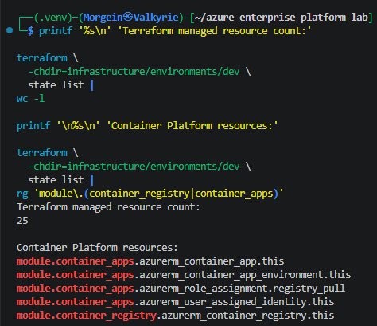

---

### 15.2 Terraform No-Drift Result

Terraform reports that the deployed Azure infrastructure matches the configuration.

The detailed exit code is `0`.

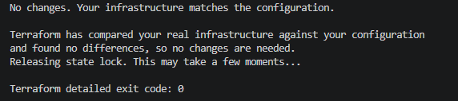

---

### 15.3 Safe Terraform Outputs

The Terraform outputs expose the ACR name, registry login server, Basic SKU, Container Apps Environment, Container App name, stable FQDN, and active revision.

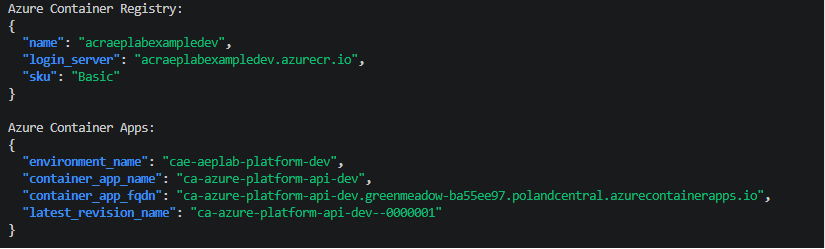

---

### 15.4 Live API Smoke Tests

The liveness, readiness, and application information endpoints respond successfully through the stable application-level FQDN.

The application reports:

```text
environment: dev
version: 0.1.0
```

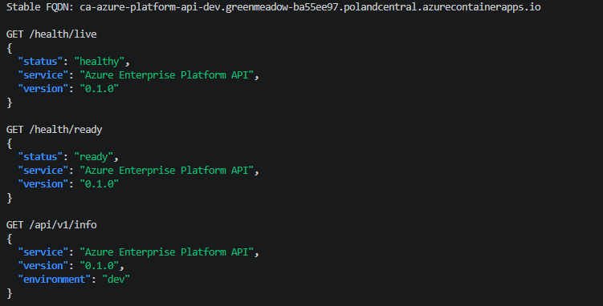

---

### 15.5 Azure Container Registry Overview

The registry was successfully provisioned in Poland Central using the cost-conscious Basic SKU.

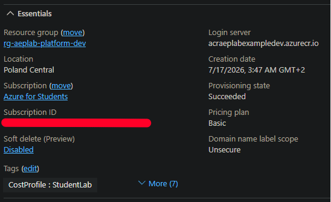

---

### 15.6 Repository Tags and Digest

The `azure-platform-api` repository contains both the semantic version tag and the commit-derived tag.

Both tags resolve to the same image manifest digest.

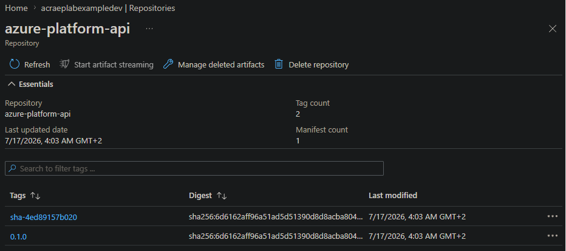

---

### 15.7 ACR Administrator Disabled

The ACR administrator account is disabled.

Container image authentication does not depend on static registry credentials.

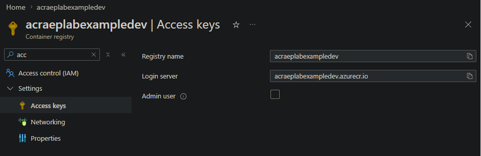

---

### 15.8 AcrPull Role Assignment

The User Assigned Managed Identity receives the least-privilege `AcrPull` role at the registry scope.

Cloud identifiers were redacted from the public evidence.

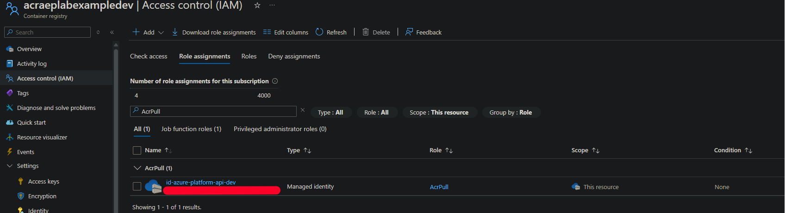

---

### 15.9 Container Apps Environment Overview

The Container Apps Environment was successfully provisioned in the development Resource Group and connected to the development network.

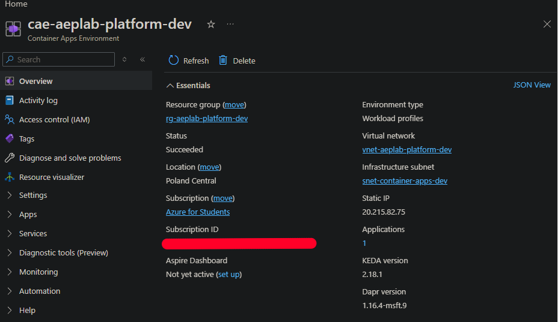

---

### 15.10 Environment Network Integration

The Container Apps Environment is integrated with `vnet-aeplab-platform-dev` through the delegated `snet-container-apps-dev` subnet.

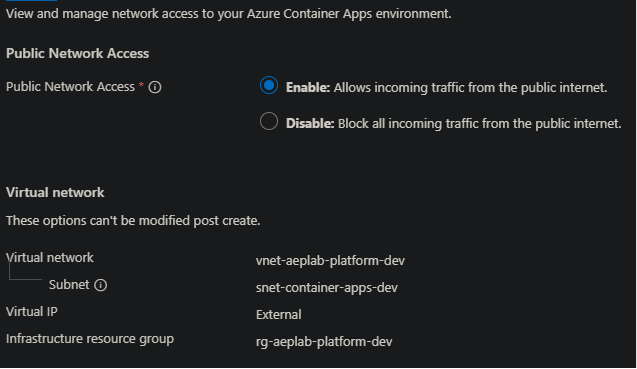

---

### 15.11 Container App Overview

The FastAPI application is running in Azure Container Apps and exposes a stable application URL.

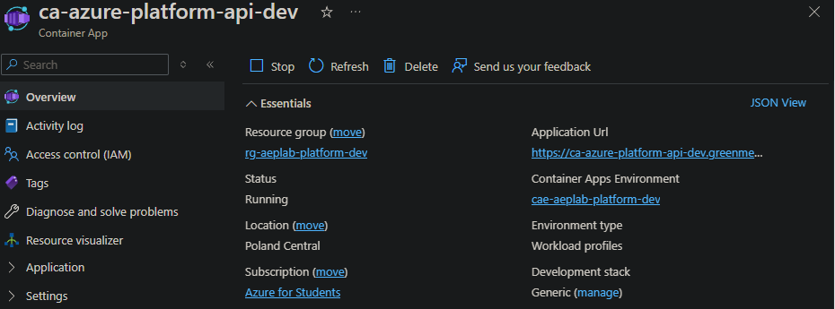

---

### 15.12 Active Revision and Traffic

The active revision receives 100% of application traffic.

The revision is currently scaled to zero while idle and can activate automatically when a request arrives.

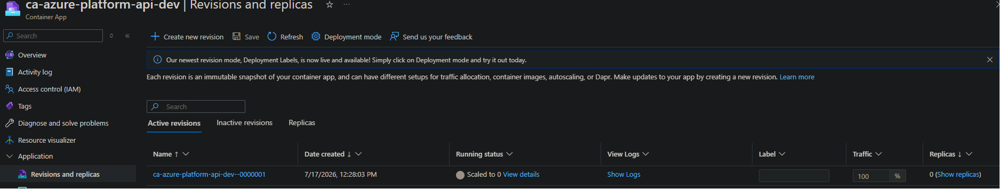

---

### 15.13 Runtime Configuration

The sanitized Terraform State output verifies:

- Single revision mode;
- Consumption workload profile;
- immutable image digest;
- CPU and memory allocation;
- `APP_ENV=dev`;
- minimum replica count of zero;
- maximum replica count of one.

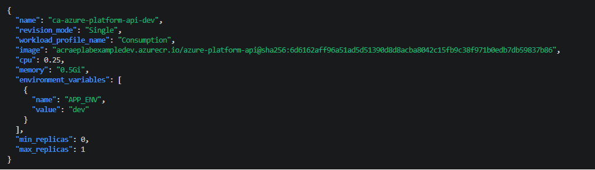

---

### 15.14 Ingress Configuration

External HTTP ingress is enabled with secure HTTPS access and target port `8000`.

Insecure HTTP connections are disabled.

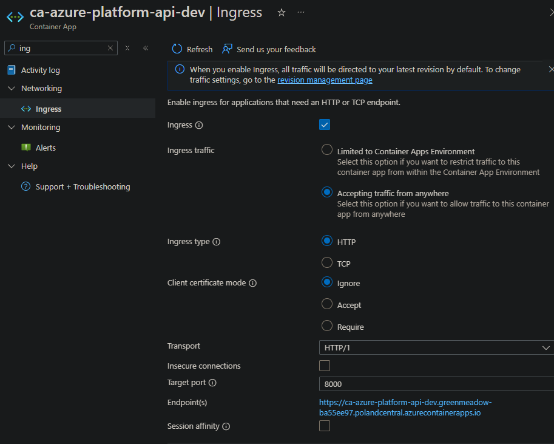

---

### 15.15 Autoscaling Configuration

The application uses HTTP-based autoscaling.

The replica range is limited to:

```text
Minimum: 0
Maximum: 1
```

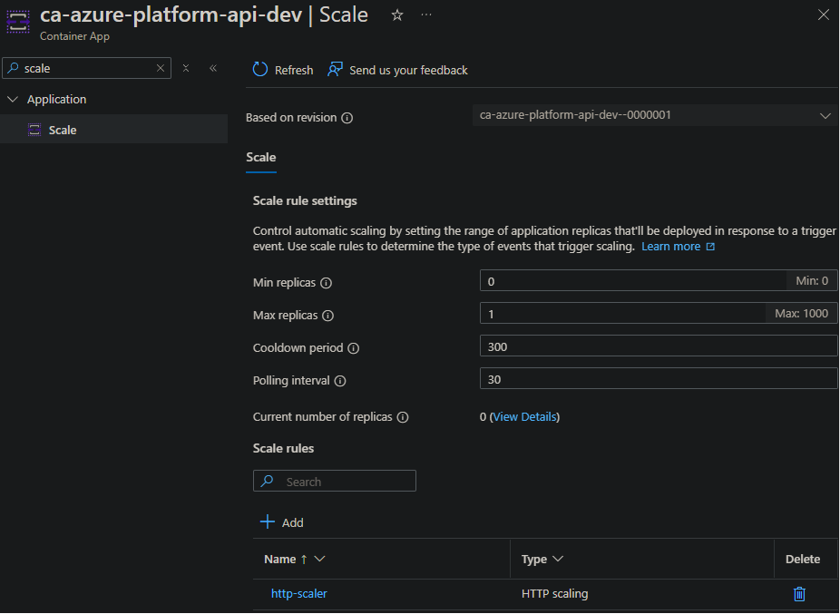

---

### 15.16 User Assigned Managed Identity

The Container App is assigned the dedicated `id-azure-platform-api-dev` Managed Identity.

No client or principal identifiers are exposed in the public evidence.

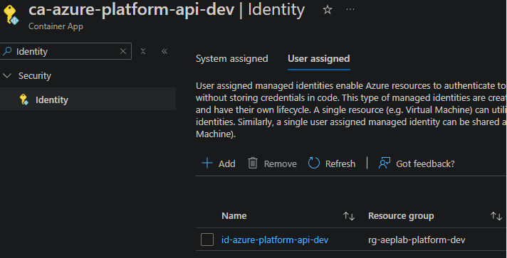

---

## 16. Acceptance Criteria

| Requirement | Result |
|---|---|
| ACR created using Terraform | Passed |
| Cost-conscious Basic ACR SKU | Passed |
| ACR administrator account disabled | Passed |
| Application image published | Passed |
| Semantic and commit-derived tags available | Passed |
| Immutable digest verified | Passed |
| Container Apps Environment created | Passed |
| Development VNet integration | Passed |
| Delegated subnet integration | Passed |
| Consumption workload profile | Passed |
| User Assigned Managed Identity | Passed |
| Least-privilege `AcrPull` role | Passed |
| Container App deployed by digest | Passed |
| Stable application FQDN | Passed |
| External HTTPS ingress | Passed |
| Target port 8000 | Passed |
| Liveness endpoint | Passed |
| Readiness endpoint | Passed |
| Application information endpoint | Passed |
| Development environment injection | Passed |
| Scale-to-zero | Passed |
| Maximum replica limit | Passed |
| Terraform Remote State | Passed |
| Terraform state locking | Passed |
| CI validation | Passed |
| Terraform drift check | Passed |

---

## 17. Cost-Control Decisions

The development platform uses several controls to protect the Azure for Students credit balance:

1. ACR uses the Basic SKU.
2. Azure Container Apps uses the Consumption workload profile.
3. Minimum replicas are set to zero.
4. Maximum replicas are limited to one.
5. Container allocation is limited to `0.25` vCPU and `0.5 GiB`.
6. Only one development environment is currently deployed.
7. No dedicated workload profile is provisioned.
8. No Log Analytics workspace was introduced during this phase.
9. Terraform plans are reviewed before every apply.
10. Immutable images prevent unnecessary rebuild ambiguity.

The ACR Basic tier has a recurring cost, while Azure Container Apps Consumption charges depend on actual resource usage and requests.

Azure Cost Management and budget alerts should continue to be monitored throughout the project.

---

## 18. Troubleshooting Record

### 18.1 Missing Microsoft.App Resource Provider

#### Symptom

The first Container Apps Environment deployment failed with:

```text
MissingSubscriptionRegistration
The subscription is not registered to use namespace Microsoft.App
```

#### Root Cause

The Azure subscription had not registered the `Microsoft.App` Resource Provider required by Azure Container Apps.

#### Resolution

The `Microsoft.App` provider was registered through the Azure Portal.

A new Terraform plan was generated after the registration completed.

The recovery plan reported only the remaining resources, and the deployment completed successfully.

---

### 18.2 Consumption Workload Profile Drift

#### Symptom

Terraform repeatedly proposed:

```text
workload_profile_name = "Consumption" -> null
```

#### Root Cause

Azure assigned the Container App to the Consumption profile, but the assignment was not explicitly represented in the Terraform resource configuration.

#### Resolution

The Container App resource was updated with:

```hcl
workload_profile_name = "Consumption"
```

A subsequent Terraform plan reported no infrastructure changes.

---

### 18.3 Revision-Specific FQDN Returned 404

#### Symptom

The API initially worked, but requests later returned:

```text
Error 404 - This Container App is stopped or does not exist.
```

#### Root Cause

Terraform exposed `latest_revision_fqdn`, which pointed to a specific Container App revision.

After that revision became inactive, its revision-specific hostname was no longer a reliable application endpoint.

#### Resolution

The module output was changed to:

```hcl
azurerm_container_app.this.ingress[0].fqdn
```

This exposes the stable application-level FQDN.

The stable endpoint was verified using all three application endpoints.

---

### 18.4 ACR Push Timeout

#### Symptom

One Docker push attempt returned a client timeout while waiting for the registry response.

#### Resolution

The registry repository was inspected after the timeout.

Both expected tags were present and resolved to the same image digest, confirming that the image upload had completed successfully.

---

### 18.5 Azure Portal Container Editor Did Not Load Image Data

#### Symptom

The Azure Portal revision editor displayed:

```text
Failed to fetch data
```

and did not populate the image and Managed Identity fields.

#### Resolution

No Portal changes were saved.

The deployed runtime configuration was verified through sanitized Terraform State output, Azure resource status, active revision information, and live API tests.

Terraform remained the source of truth.

---

## 19. Operational Verification Commands

### Terraform Validation

```bash
terraform fmt -check -recursive

terraform \
  -chdir=infrastructure/environments/dev \
  validate
```

### Terraform Drift Check

```bash
terraform \
  -chdir=infrastructure/environments/dev \
  plan \
  -detailed-exitcode \
  -input=false \
  -var-file=terraform.tfvars
```

### Safe Container Platform Outputs

```bash
terraform \
  -chdir=infrastructure/environments/dev \
  output \
  -json container_apps |
jq
```

### Stable FQDN Export

```bash
export CONTAINER_APP_FQDN="$(
  terraform \
    -chdir=infrastructure/environments/dev \
    output \
    -json container_apps |
  jq -r '.container_app_fqdn'
)"
```

### Liveness Test

```bash
curl \
  --fail \
  --show-error \
  --silent \
  "https://${CONTAINER_APP_FQDN}/health/live" |
jq
```

### Readiness Test

```bash
curl \
  --fail \
  --show-error \
  --silent \
  "https://${CONTAINER_APP_FQDN}/health/ready" |
jq
```

### Application Information Test

```bash
curl \
  --fail \
  --show-error \
  --silent \
  "https://${CONTAINER_APP_FQDN}/api/v1/info" |
jq
```

---

## 20. Security Considerations

### Implemented

- ACR administrator credentials disabled;
- anonymous image pull disabled;
- Managed Identity authentication;
- least-privilege `AcrPull`;
- registry-scoped role assignment;
- immutable image deployment;
- HTTPS ingress;
- insecure HTTP disabled;
- no secrets stored in the repository;
- Terraform Remote State;
- remote state locking;
- Pull Request review workflow;
- CI validation;
- public evidence redaction.

### Planned Improvements

The following security controls are intentionally deferred to later project phases:

- Azure Key Vault;
- GitHub Actions OIDC federation;
- private ACR endpoint;
- private DNS zones;
- internal Container Apps ingress;
- Azure API Management;
- API authentication and authorization;
- Web Application Firewall;
- centralized logging;
- Azure Monitor alerts;
- Microsoft Defender for Cloud;
- Azure Policy;
- image vulnerability scanning;
- signed container images;
- Software Bill of Materials;
- staging and production isolation.

---

## 21. Current Limitations

This phase implements a development foundation and is not yet a complete production architecture.

Current limitations include:

- ACR public network access remains enabled;
- Container App ingress is publicly accessible;
- application authentication is not yet implemented;
- deployment is not yet automated through Continuous Deployment;
- no private endpoints are currently used;
- no Azure Key Vault integration;
- no centralized application telemetry;
- only the development environment is deployed;
- the application currently uses one active revision;
- no custom domain or TLS certificate is configured;
- no API Gateway is currently deployed.

These limitations are documented intentionally and will be addressed through later project phases.

---

## 22. Next Implementation Phases

The planned next phases are:

1. **Continuous Deployment**
   - GitHub Actions;
   - Azure OIDC federation;
   - automated ACR build and push;
   - immutable digest deployment;
   - deployment verification.

2. **Secrets Management**
   - Azure Key Vault;
   - Managed Identity access;
   - Key Vault references;
   - secret rotation workflow.

3. **API Gateway**
   - Azure API Management;
   - API import;
   - policies;
   - rate limiting;
   - authentication;
   - versioning;
   - request correlation.

4. **Observability**
   - Azure Monitor;
   - Application Insights;
   - structured logs;
   - dashboards;
   - alerts;
   - operational runbooks.

5. **Private Connectivity**
   - Private Endpoints;
   - Private DNS;
   - internal ingress;
   - controlled egress.

6. **Environment Promotion**
   - staging environment;
   - production environment;
   - environment-specific configuration;
   - approval gates;
   - rollback strategy.

---

## 23. Skills Demonstrated

This phase demonstrates practical experience with:

- Microsoft Azure;
- Azure Container Registry;
- Azure Container Apps;
- Azure Virtual Network integration;
- Terraform modules;
- Terraform Remote State;
- Terraform drift detection;
- Docker image lifecycle;
- OCI image repositories;
- immutable image deployment;
- Managed Identities;
- Azure RBAC;
- least-privilege access;
- container health probes;
- autoscaling;
- scale-to-zero;
- HTTPS ingress;
- REST API validation;
- Git branches;
- Pull Requests;
- GitHub Actions CI;
- troubleshooting cloud deployments;
- documenting operational evidence;
- cost-conscious cloud engineering.

---

## 24. References

- [Azure Container Apps documentation](https://learn.microsoft.com/azure/container-apps/)
- [Azure Container Apps revisions](https://learn.microsoft.com/azure/container-apps/revisions)
- [Azure Container Apps ingress](https://learn.microsoft.com/azure/container-apps/ingress-how-to)
- [Azure Container Apps scaling](https://learn.microsoft.com/azure/container-apps/scale-app)
- [Azure Container Apps image pull with Managed Identity](https://learn.microsoft.com/azure/container-apps/managed-identity-image-pull)
- [Azure Container Registry documentation](https://learn.microsoft.com/azure/container-registry/)
- [Azure Container Registry RBAC roles](https://learn.microsoft.com/azure/container-registry/container-registry-rbac-built-in-roles-overview)
- [Terraform AzureRM provider](https://registry.terraform.io/providers/hashicorp/azurerm/latest/docs)
- [Terraform Azure backend](https://developer.hashicorp.com/terraform/language/backend/azurerm)

---

## 25. Conclusion

The Azure Container Platform Foundation was successfully deployed and validated.

The implementation provides a reproducible and cost-conscious development platform for running the Azure Enterprise Platform API.

The final architecture includes:

- a private Azure Container Registry;
- immutable application images;
- Managed Identity authentication;
- least-privilege RBAC;
- a VNet-integrated Container Apps Environment;
- a scale-to-zero Container App;
- secure external HTTPS ingress;
- stable application-level addressing;
- operational health endpoints;
- Terraform Remote State;
- zero-drift infrastructure validation;
- complete deployment evidence.

The platform is ready for the next phase: automated Continuous Deployment using GitHub Actions and Azure OIDC federation.
