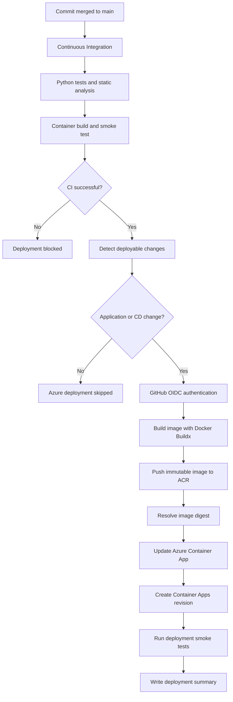
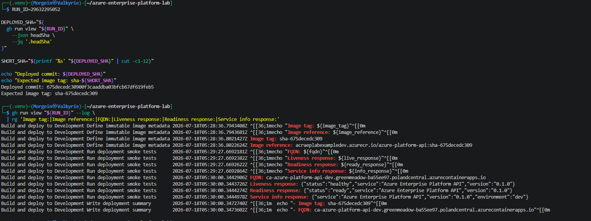
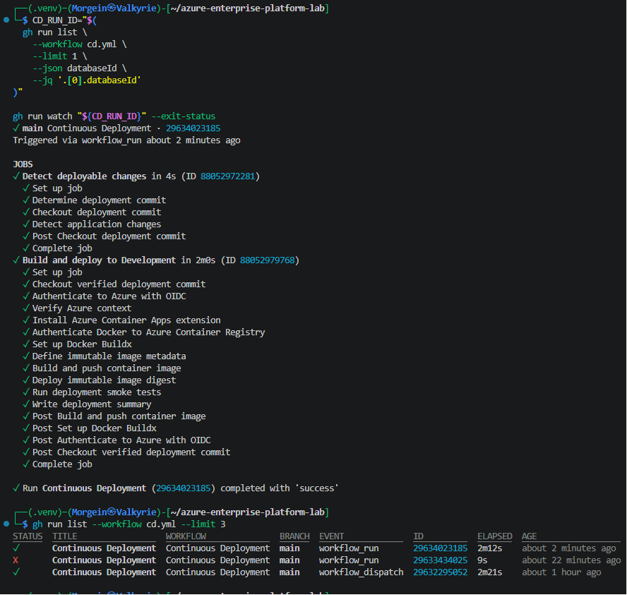

# Continuous Deployment Foundation

## Document status

| Field | Value |
|---|---|
| Project | Azure Enterprise Platform Lab |
| Environment | Development |
| Cloud platform | Microsoft Azure |
| Delivery platform | GitHub Actions |
| Authentication | GitHub OpenID Connect |
| Runtime | Azure Container Apps |
| Container registry | Azure Container Registry |
| Infrastructure management | Terraform |
| Implementation date | 2026-07-18 |
| Status | Implemented and validated |

---

## Purpose

This document provides implementation and deployment evidence for the Continuous Deployment foundation of Azure Enterprise Platform Lab.

The implementation demonstrates how a validated application commit is:

1. tested through Continuous Integration;
2. authenticated to Azure without a client secret;
3. built as a container image;
4. published to Azure Container Registry;
5. identified through an immutable digest;
6. deployed to Azure Container Apps;
7. validated through post-deployment smoke tests.

The pipeline is designed as a cost-controlled development baseline while preserving production-oriented security and delivery practices.

---

## Implemented delivery flow



---

## GitHub Actions workflows

### Continuous Integration

Workflow:

```text
.github/workflows/ci.yml
```

The Continuous Integration workflow performs:

- Python dependency installation;
- Ruff formatting validation;
- Ruff static analysis;
- Pytest execution;
- coverage enforcement;
- coverage artifact publication;
- Docker image build;
- non-root runtime verification;
- hardened container startup;
- container health verification;
- local API smoke testing;
- correlation ID verification.

### Continuous Deployment

Workflow:

```text
.github/workflows/cd.yml
```

The Continuous Deployment workflow supports two trigger modes:

| Trigger | Purpose |
|---|---|
| `workflow_dispatch` | Controlled manual deployment |
| `workflow_run` | Automatic deployment after successful Continuous Integration |

The automatic workflow accepts only successful `push` executions of:

```text
Continuous Integration
```

The pipeline deploys the exact commit referenced by:

```text
github.event.workflow_run.head_sha
```

This prevents the deployment job from accidentally checking out an unrelated or newer repository state.

---

## CI-gated deployment

The automatic deployment workflow is gated by the result of Continuous Integration.

The deployment job runs only when:

```text
workflow_run.conclusion == success
workflow_run.event == push
workflow_run branch == main
```

If Continuous Integration fails, the Azure deployment job is not authorized or executed.

This provides the following control:

```text
Failed tests → No image push → No Container App update
```

Pull Requests cannot directly use the development deployment identity because the Federated Identity Credential trusts the protected GitHub Environment context.

---

## Deployable change detection

Before Azure authentication, the workflow evaluates the files changed by the verified commit.

Azure deployment is required when the commit changes:

```text
application/**
.github/workflows/cd.yml
```

Documentation-only and Terraform-only commits do not require a new application revision.

The change-detection job uses:

```bash
git diff-tree \
  --no-commit-id \
  --name-only \
  -r \
  -m \
  "${DEPLOY_SHA}"
```

The result is exposed as the job output:

```text
deploy=true
```

or:

```text
deploy=false
```

This design prevents unnecessary image builds, ACR pushes, Container Apps revisions, and Azure resource usage.

---

## GitHub Environment

The deployment workflow uses the protected GitHub Environment:

```text
development
```

### Environment secrets

The following secrets are configured:

| Secret | Purpose |
|---|---|
| `AZURE_CLIENT_ID` | Client ID of the GitHub Actions deployment identity |
| `AZURE_TENANT_ID` | Microsoft Entra tenant identifier |
| `AZURE_SUBSCRIPTION_ID` | Target Azure subscription identifier |

No Azure client secret is stored in GitHub.

### Environment variables

| Variable | Value |
|---|---|
| `AZURE_CONTAINER_APP` | `ca-azure-platform-api-dev` |
| `AZURE_CONTAINER_REGISTRY` | `acraeplabexampledev` |
| `AZURE_RESOURCE_GROUP` | `rg-aeplab-platform-dev` |
| `CONTAINER_REPOSITORY` | `azure-platform-api` |

Environment variables contain non-secret deployment configuration.

---

## OpenID Connect authentication

The deployment pipeline authenticates through GitHub OpenID Connect.

The workflow requests the GitHub OIDC token by using:

```yaml
permissions:
  contents: read
  id-token: write
```

The Azure login step exchanges the GitHub token for a short-lived Microsoft Entra access token.

No long-lived Azure password or client secret is required.

### Federated subject

The GitHub repository uses an immutable OIDC subject containing permanent owner and repository identifiers:

```text
repo:Morgein@104425675/azure-enterprise-platform-lab@1302301100:environment:development
```

The immutable subject protects the trust relationship from repository rename and transfer ambiguity.

### Federated Identity Credential

| Property | Value |
|---|---|
| Managed Identity | `id-github-actions-deploy-dev` |
| Federated Credential | `fic-github-actions-dev` |
| Issuer | `https://token.actions.githubusercontent.com` |
| Audience | `api://AzureADTokenExchange` |
| Environment | `development` |

The Federated Identity Credential is managed through Terraform.

---

## Deployment identity

The GitHub Actions deployment identity is separate from the Container App runtime identity.

### Deployment identity

```text
id-github-actions-deploy-dev
```

Azure permissions:

| Scope | Role | Purpose |
|---|---|---|
| Development ACR | `AcrPush` | Push application images |
| Development Container App | `Contributor` | Update the application revision |

The identity does not receive a subscription-wide `Owner` or `Contributor` role.

### Runtime identity

```text
id-azure-platform-api-dev
```

Azure permission:

| Scope | Role | Purpose |
|---|---|---|
| Development ACR | `AcrPull` | Pull the application image |

Separating deployment and runtime identities limits the effect of credential or workload compromise.

---

## Container image build

The pipeline uses Docker Buildx.

Build context:

```text
application/
```

Dockerfile:

```text
application/Dockerfile
```

Target platform:

```text
linux/amd64
```

The build includes:

- GitHub Actions build cache;
- BuildKit provenance;
- Software Bill of Materials generation;
- immutable commit-based image tags;
- image digest output.

---

## Immutable image identification

Each image is tagged with the first twelve characters of the verified Git commit:

```text
sha-<12-character-commit-sha>
```

Example format:

```text
acraeplabexampledev.azurecr.io/azure-platform-api:sha-4ed89157b020
```

The tag provides human-readable traceability.

The deployment itself uses the immutable digest:

```text
acraeplabexampledev.azurecr.io/azure-platform-api@sha256:<digest>
```

A digest identifies the exact image content and cannot be silently redirected to different content.

The relationship is:

```text
Git commit → Image tag → Image digest → Container Apps revision
```

---

## Terraform and deployment ownership

Terraform owns the Azure infrastructure configuration.

GitHub Actions owns the currently deployed application image.

The Container App Terraform resource uses:

```hcl
lifecycle {
  ignore_changes = [
    template[0].container[0].image,
  ]
}
```

This prevents Terraform from reverting an image deployed by the Continuous Deployment pipeline.

Terraform continues managing:

- the Container Apps environment;
- the Container App;
- ingress;
- CPU and memory limits;
- scaling configuration;
- managed identity;
- registry authentication;
- environment variables;
- resource tags.

GitHub Actions changes only the deployed image.

---

## Azure Container Registry security

The development registry is:

```text
acraeplabexampledev.azurecr.io
```

Security configuration includes:

- Admin user disabled;
- anonymous pull disabled;
- Microsoft Entra authentication;
- `AcrPush` granted only to the deployment identity;
- `AcrPull` granted only to the runtime identity;
- immutable commit-based image tags;
- deployment by image digest.

No registry password is stored in GitHub Actions.

---

## Azure Container Apps deployment

The target application is:

```text
ca-azure-platform-api-dev
```

Resource Group:

```text
rg-aeplab-platform-dev
```

The deployment command updates the application with the generated image digest.

A successful update creates a new immutable Container Apps revision.

The application retains:

- public HTTPS ingress;
- target port `8000`;
- managed identity registry authentication;
- VNet-integrated Container Apps Environment;
- bounded CPU and memory;
- scale-to-zero;
- maximum replica limit;
- liveness and readiness endpoints.

---

## Post-deployment smoke tests

The pipeline retrieves the stable Container App FQDN and validates three endpoints.

### Liveness

```text
GET /health/live
```

Expected properties:

```json
{
  "status": "healthy",
  "service": "Azure Enterprise Platform API"
}
```

### Readiness

```text
GET /health/ready
```

Expected properties:

```json
{
  "status": "ready",
  "service": "Azure Enterprise Platform API"
}
```

### Service information

```text
GET /api/v1/info
```

Expected properties:

```json
{
  "service": "Azure Enterprise Platform API",
  "environment": "dev"
}
```

The workflow retries requests while a scale-to-zero application starts or a new revision becomes ready.

A failed smoke test fails the deployment workflow.

---

## Deployment evidence

### Manual Continuous Deployment

The first successful deployment was started through `workflow_dispatch`.

The run validated:

- GitHub Environment access;
- OIDC authentication;
- ACR authentication;
- Buildx image creation;
- image push;
- digest deployment;
- Container Apps revision creation;
- endpoint smoke tests;
- deployment summary generation.



### Automatic CI-gated Continuous Deployment

The successful automatic deployment was triggered through `workflow_run` after Continuous Integration completed successfully.

Both jobs completed successfully:

```text
Detect deployable changes
Build and deploy to Development
```

The successful automatic run demonstrated:

- CI-to-CD workflow orchestration;
- deployment of the verified CI commit;
- deployable path detection;
- secretless Azure authentication;
- immutable image build and push;
- deployment by digest;
- post-deployment verification.



---

## Validation summary

| Validation | Result |
|---|---|
| Manual deployment | Passed |
| Automatic deployment after CI | Passed |
| OIDC authentication | Passed |
| No Azure client secret | Passed |
| ACR push through deployment identity | Passed |
| Immutable commit tag | Passed |
| Digest-based deployment | Passed |
| Container Apps revision update | Passed |
| Liveness smoke test | Passed |
| Readiness smoke test | Passed |
| Service information smoke test | Passed |
| Deployment summary | Passed |
| Application change detection | Passed |
| Documentation-only deployment skip | Pending final evidence PR |
| Terraform ownership separation | Passed |
| Scale-to-zero compatibility | Passed |

---

## Troubleshooting evidence

### Immutable OIDC subject mismatch

Initial Azure authentication failed with:

```text
AADSTS700213: No matching federated identity record found
```

The GitHub token contained an immutable repository subject:

```text
repo:Morgein@104425675/azure-enterprise-platform-lab@1302301100:environment:development
```

The original Azure Federated Identity Credential trusted the legacy name-based subject.

Resolution:

- updated the Terraform-managed subject;
- added immutable repository identity validation;
- applied one in-place Federated Identity Credential update;
- repeated the workflow successfully.

No broad Azure permissions or client secret were added.

### Unsupported change-detection argument

The first automatic workflow failed with:

```text
git diff-tree
Process completed with exit code 129
```

The workflow used the unsupported argument:

```text
--recursive
```

Resolution:

```text
--recursive → -r
```

The corrected automatic workflow completed successfully.

These failures demonstrate controlled troubleshooting without bypassing security controls.

---

## Cost controls

The Continuous Deployment implementation uses the following cost controls:

- deployment only after successful CI;
- deployable path detection;
- no deployment for unrelated documentation or infrastructure changes;
- Docker build caching;
- ACR Basic tier;
- Container Apps Consumption workload profile;
- minimum replicas set to zero;
- maximum replicas set to one;
- small CPU and memory allocation;
- one controlled development environment;
- no permanent self-hosted runner;
- no client-secret rotation infrastructure;
- manual deployment remains available for controlled tests.

GitHub OIDC and Federated Identity Credentials do not create an additional Azure service charge.

---

## Security assertions

The completed implementation demonstrates that:

- GitHub contains no Azure client secret;
- OIDC tokens are short-lived;
- the repository trust uses immutable identifiers;
- deployment access is restricted to the `development` environment;
- GitHub token permissions are explicitly limited;
- deployment and runtime identities are separated;
- Azure roles are scoped to specific resources;
- ACR Admin credentials remain disabled;
- container images are linked to Git commits;
- deployment uses immutable digests;
- post-deployment validation is mandatory;
- Terraform does not overwrite CD-managed image versions;
- failed CI prevents deployment.

---

## Known limitations

The current implementation is a development baseline.

The following controls remain future work:

- required deployment reviewers for production;
- separate staging and production identities;
- production GitHub Environment;
- Terraform plan artifact publication;
- protected Terraform apply workflow;
- Trivy image scanning;
- Checkov Terraform scanning;
- signed container images;
- admission policy enforcement;
- scheduled drift detection;
- automatic rollback after failed smoke tests;
- revision traffic splitting;
- formal deployment SLO;
- deployment telemetry in Application Insights.

These items are planned in later security, observability, reliability, and production-environment phases.

---

## Exit criteria

| Criterion | Status |
|---|---|
| GitHub contains no Azure client secret | Met |
| OIDC federation is Terraform-managed | Met |
| Deployment identity is least privilege | Met |
| Runtime identity is separate | Met |
| Successful CI is required | Met |
| Exact CI commit is deployed | Met |
| Image is pushed to ACR | Met |
| Image digest is recorded | Met |
| Container App is updated automatically | Met |
| Smoke tests validate the deployment | Met |
| Manual deployment remains available | Met |
| Deployment evidence is sanitized | Met |
| Cost controls are documented | Met |

The Continuous Deployment foundation is considered implemented and operational.

---

## Next implementation targets

The next platform phases are:

1. finalize project status documentation;
2. complete governance and budget evidence;
3. introduce security scanning;
4. create Key Vault and workload secret access;
5. add Azure Storage identity-based access;
6. evaluate a controlled PostgreSQL laboratory window;
7. introduce Azure API Management;
8. implement Application Insights and OpenTelemetry;
9. create staging and production delivery controls.
