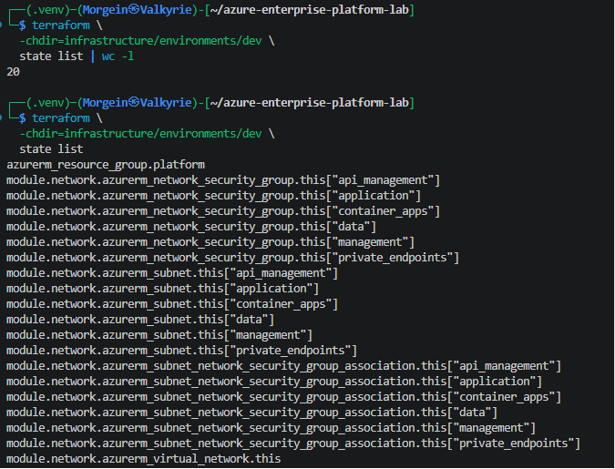
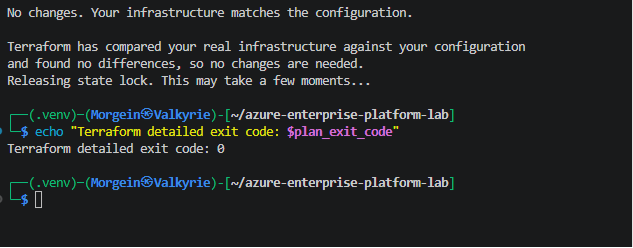
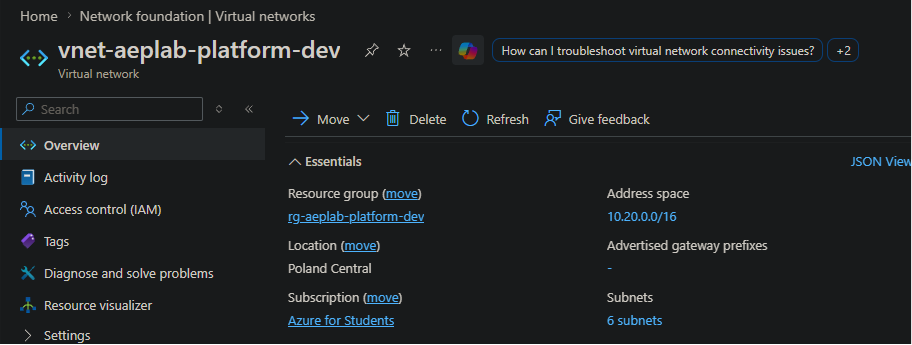
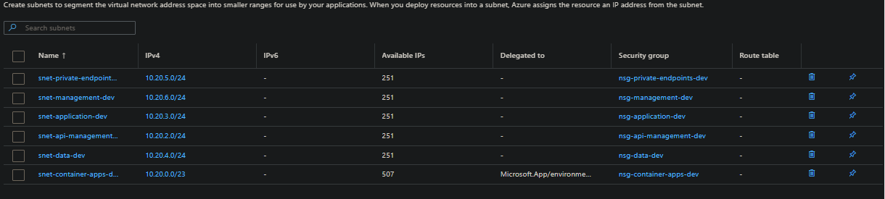
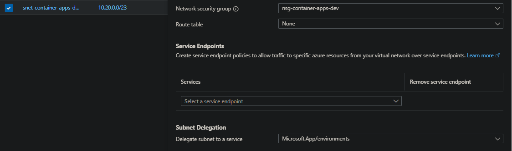
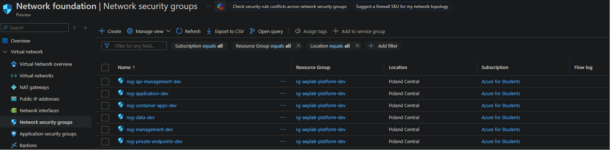
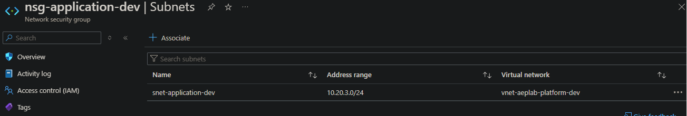

# Development Network Foundation — Deployment Evidence

## Status

**Deployment status:** Completed  
**Environment:** Development  
**Azure region:** Poland Central  
**Managed by:** Terraform  
**Terraform resources:** 20  
**Configuration drift:** None  

This document provides evidence that the Development Network Foundation was
successfully deployed to Azure and that the deployed infrastructure matches
the Terraform configuration.

---

## 1. Deployment Scope

The deployed network foundation contains:

| Resource type | Quantity |
|---|---:|
| Resource Group | 1 |
| Virtual Network | 1 |
| Subnet | 6 |
| Network Security Group | 6 |
| Subnet-to-NSG Association | 6 |
| **Total Terraform resources** | **20** |

The deployment does not include compute resources, gateways, firewalls, API
Management, Container Apps, databases, or Private Endpoints.

---

## 2. Terraform State Verification

The Terraform State contains exactly 20 managed resources.



The state includes:

- the development Resource Group;
- the development Virtual Network;
- six Network Security Groups;
- six Subnets;
- six Subnet-to-NSG Associations.

The Terraform State is stored in the AzureRM Remote Backend created during the
previous bootstrap phase.

### Result

```text
Terraform-managed resources: 20
```

This confirms that all expected resources are managed by Terraform.

---

## 3. Idempotency and Drift Detection

A post-deployment Terraform Plan was executed with `-detailed-exitcode`.



### Result

```text
No changes. Your infrastructure matches the configuration.
Terraform detailed exit code: 0
```

Terraform detailed exit codes have the following meaning:

| Exit code | Meaning |
|---:|---|
| `0` | The infrastructure matches the configuration |
| `1` | Terraform encountered an error |
| `2` | Terraform detected infrastructure changes |

Exit Code `0` confirms:

- the deployment is idempotent;
- no configuration drift was detected;
- the Terraform State matches the Azure infrastructure;
- no additional changes are required.

---

## 4. Virtual Network Verification

The Azure Portal confirms the deployed Virtual Network.



### Verified configuration

```text
Virtual Network: vnet-aeplab-platform-dev
Resource Group:  rg-aeplab-platform-dev
Region:          Poland Central
Address Space:   10.20.0.0/16
Subnets:         6
```

The Azure address space does not overlap with the local Hyper-V laboratory
network `10.10.10.0/24`.

This keeps future hybrid connectivity scenarios possible.

---

## 5. Subnet Verification

The Azure Portal confirms that all six planned Subnets were deployed.



### Verified address plan

| Subnet | Address prefix | Available IP addresses | Network Security Group |
|---|---:|---:|---|
| `snet-container-apps-dev` | `10.20.0.0/23` | 507 | `nsg-container-apps-dev` |
| `snet-api-management-dev` | `10.20.2.0/24` | 251 | `nsg-api-management-dev` |
| `snet-application-dev` | `10.20.3.0/24` | 251 | `nsg-application-dev` |
| `snet-data-dev` | `10.20.4.0/24` | 251 | `nsg-data-dev` |
| `snet-private-endpoints-dev` | `10.20.5.0/24` | 251 | `nsg-private-endpoints-dev` |
| `snet-management-dev` | `10.20.6.0/24` | 251 | `nsg-management-dev` |

Every Subnet is contained inside the `10.20.0.0/16` Virtual Network address
space.

The Subnets do not overlap with each other.

---

## 6. Container Apps Subnet Delegation

The Container Apps Subnet is delegated to the Azure Container Apps platform.



### Verified configuration

```text
Subnet:                    snet-container-apps-dev
Address Prefix:            10.20.0.0/23
Network Security Group:    nsg-container-apps-dev
Route Table:               None
Subnet Delegation:         Microsoft.App/environments
```

The delegation allows a future Azure Container Apps Managed Environment to
join and manage the dedicated Subnet.

The Subnet remains reserved for Container Apps and does not contain unrelated
workloads.

No Container Apps Environment is deployed during this phase.

---

## 7. Network Security Group Verification

The Azure Portal confirms the deployment of six Network Security Groups.



### Verified Network Security Groups

```text
nsg-api-management-dev
nsg-application-dev
nsg-container-apps-dev
nsg-data-dev
nsg-management-dev
nsg-private-endpoints-dev
```

All Network Security Groups are deployed in:

```text
Resource Group: rg-aeplab-platform-dev
Region:         Poland Central
```

Each Subnet has a dedicated Network Security Group.

Custom workload-specific rules are intentionally not included in the current
phase. They will be added when the required traffic flows, ports, protocols,
sources, and destinations are known.

---

## 8. Subnet-to-NSG Association Verification

The Azure Portal confirms that the Application Network Security Group is
associated with the correct Subnet.



### Verified association

```text
Network Security Group: nsg-application-dev
Virtual Network:        vnet-aeplab-platform-dev
Subnet:                 snet-application-dev
Address Range:          10.20.3.0/24
```

Terraform manages equivalent associations for all six Subnets.

The complete association set is also confirmed by the Terraform State and the
Azure Subnet list.

---

## 9. Security Verification

The following security controls were verified:

- every Subnet has a dedicated Network Security Group;
- the Container Apps Subnet has the required service delegation;
- no Public IP addresses were created;
- no NAT Gateway was created;
- no VPN Gateway was created;
- no Azure Firewall was created;
- no custom allow-any NSG rules were added;
- no credentials were committed to the repository;
- Terraform State remains stored in the Remote Backend;
- real backend and variable files remain excluded from version control.

---

## 10. Cost-Control Verification

The Development Network Foundation does not deploy:

- Virtual Machines;
- Azure Container Apps;
- Azure API Management;
- Application Gateway;
- Load Balancers;
- NAT Gateway;
- VPN Gateway;
- Azure Firewall;
- Public IP addresses;
- Private Endpoints;
- databases;
- monitoring workspaces.

Future platform services will be deployed through separate Terraform plans and
Pull Requests.

---

## 11. Acceptance Criteria

| Requirement | Result |
|---|---|
| Terraform formatting passed | ✅ |
| Terraform initialization passed | ✅ |
| Terraform validation passed | ✅ |
| Terraform plan reviewed | ✅ |
| Plan contained 20 resources to add | ✅ |
| Plan contained zero changes | ✅ |
| Plan contained zero destroys | ✅ |
| GitHub Actions checks passed | ✅ |
| Pull Request reviewed and merged | ✅ |
| Deployment completed | ✅ |
| Terraform State contains 20 resources | ✅ |
| Drift Check reports no changes | ✅ |
| Drift Check Exit Code is `0` | ✅ |
| Virtual Network verified in Azure Portal | ✅ |
| Six Subnets verified | ✅ |
| Six Network Security Groups verified | ✅ |
| Container Apps Delegation verified | ✅ |
| Subnet-to-NSG Association verified | ✅ |

---

## 12. Final Result

The Development Network Foundation was successfully deployed and verified.

The environment now provides:

- a dedicated Azure development Resource Group;
- a non-overlapping Virtual Network address space;
- six purpose-specific Subnets;
- dedicated Network Security Groups;
- Terraform-managed NSG Associations;
- Azure Container Apps network preparation;
- Azure API Management network preparation;
- Private Endpoint network preparation;
- Remote Terraform State;
- repeatable and idempotent Infrastructure as Code.

The deployed Azure infrastructure matches the version-controlled Terraform
configuration.
