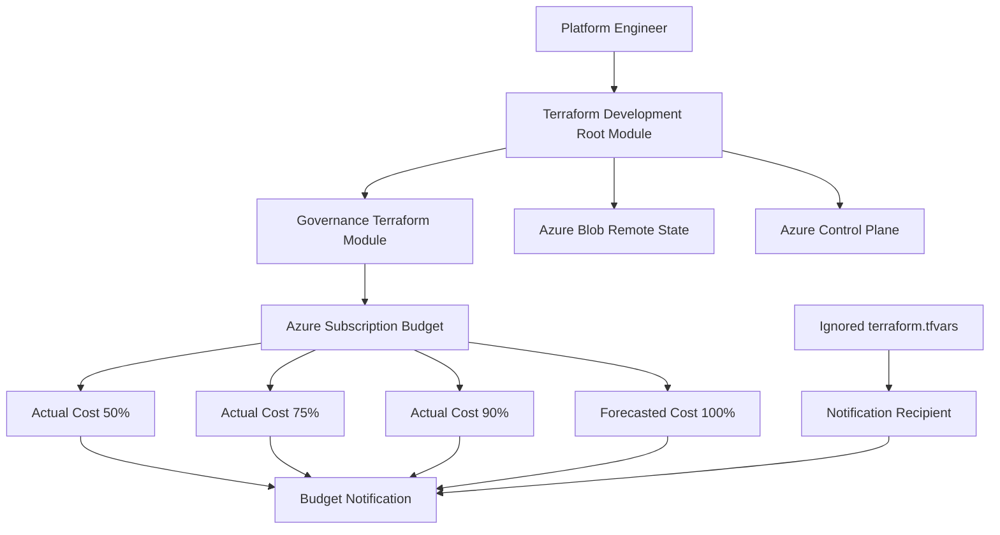
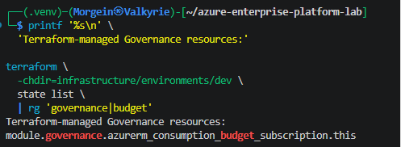
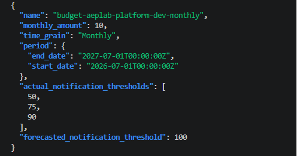
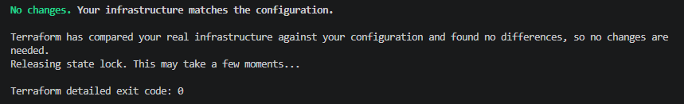
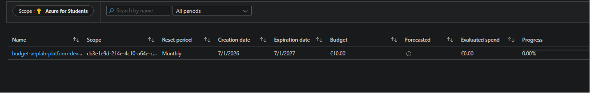
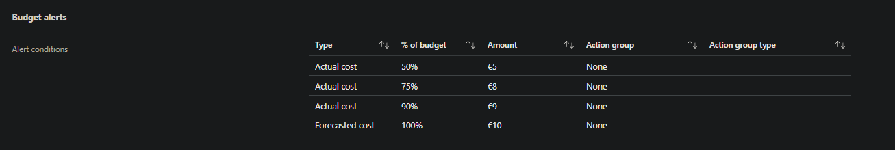

# Governance and Cost Controls Foundation

## Overview

This document provides implementation and validation evidence for the Governance and Cost Controls Foundation of Azure Enterprise Platform Lab.

The foundation introduces a reusable Terraform governance module and an Azure Cost Management Budget at the subscription scope.

The implementation is designed for an Azure for Students subscription with limited credits. Its purpose is to provide early cost visibility without deploying an additional paid monitoring platform.

The implemented controls include:

- a subscription-level Azure Budget;
- a monthly budget amount of EUR 10;
- Actual Cost notification thresholds at 50%, 75%, and 90%;
- a Forecasted Cost notification threshold at 100%;
- notification recipients stored outside the Git repository;
- Terraform remote-state management;
- non-sensitive Terraform outputs;
- Azure Portal verification;
- post-deployment drift verification.

---

## Implementation status

| Component | Status |
|---|---|
| Reusable Terraform Governance module | Implemented |
| Subscription-level Azure Budget | Implemented |
| Monthly EUR 10 budget | Implemented |
| Actual Cost alert at 50% | Implemented |
| Actual Cost alert at 75% | Implemented |
| Actual Cost alert at 90% | Implemented |
| Forecasted Cost alert at 100% | Implemented |
| Notification email protection | Implemented |
| Terraform remote state | Implemented |
| Terraform no-drift validation | Verified |
| Azure Portal validation | Verified |
| Azure Policy baseline | Planned |
| Scheduled cost review | Planned |
| Automated orphan-resource detection | Planned |

---

## Architecture



---

## Governance scope

The Budget is created at the Azure subscription scope.

This scope was selected because:

- all current laboratory resources belong to one Azure for Students subscription;
- subscription-level monitoring provides visibility across all Resource Groups;
- future services such as Key Vault, PostgreSQL, API Management, and AKS will also be included;
- a Resource Group budget could miss charges created outside the development Resource Group;
- the project currently has only one active Azure environment.

The Budget does not stop or delete resources automatically.

It provides notifications when configured Actual or Forecasted Cost thresholds are reached.

---

## Terraform module

The reusable Governance module is located at:

```text
infrastructure/modules/governance/
```

Module files:

```text
infrastructure/modules/governance/main.tf
infrastructure/modules/governance/variables.tf
infrastructure/modules/governance/outputs.tf
infrastructure/modules/governance/versions.tf
```

The development environment consumes the module from:

```text
infrastructure/environments/dev/
```

The module manages:

```hcl
azurerm_consumption_budget_subscription
```

The module receives:

- Azure subscription ID;
- budget name;
- monthly budget amount;
- Budget start date;
- Actual Cost notification thresholds;
- Forecasted Cost notification threshold;
- notification contact email addresses;
- common resource tags where supported.

---

## Budget configuration

| Setting | Value |
|---|---|
| Scope | Azure Subscription |
| Subscription | Azure for Students |
| Budget type | Consumption Budget |
| Time grain | Monthly |
| Amount | EUR 10 |
| Actual Cost thresholds | 50%, 75%, 90% |
| Forecasted Cost threshold | 100% |
| Management | Terraform |
| State storage | Azure Blob Storage |

The configured Actual Cost thresholds correspond to:

| Threshold | Approximate amount |
|---:|---:|
| 50% | EUR 5.00 |
| 75% | EUR 7.50 |
| 90% | EUR 9.00 |

The configured Forecasted Cost threshold corresponds to:

| Threshold | Meaning |
|---:|---|
| 100% | Azure predicts that monthly spending will reach EUR 10 |

---

## Actual Cost

**Actual Cost** represents charges already accumulated during the current Budget period.

The project uses Actual Cost alerts at:

- 50%;
- 75%;
- 90%.

These thresholds provide progressively stronger warnings:

| Threshold | Operational meaning |
|---:|---|
| 50% | Review current resource usage |
| 75% | Investigate the main cost contributors |
| 90% | Stop or remove non-essential resources |

---

## Forecasted Cost

**Forecasted Cost** is Azure's estimate of total spending by the end of the current Budget period.

The project uses a Forecasted Cost alert at 100%.

This alert can provide an earlier warning than an Actual Cost alert when Azure predicts that current resource usage will exceed or reach the monthly Budget.

Forecasting depends on sufficient usage data. A new subscription or newly deployed resources may not immediately produce an accurate forecast.

---

## Security of notification recipients

Budget contact email addresses are treated as private configuration.

The real email address is stored in:

```text
infrastructure/environments/dev/terraform.tfvars
```

This file is ignored by Git and must never be committed.

The repository contains only:

```text
terraform.tfvars.example
```

The example file must use a placeholder value and must not expose a real personal email address.

Example:

```hcl
budget_contact_emails = [
  "platform-owner@example.com",
]
```

The Terraform variable is marked as sensitive where appropriate.

Sensitive values are not exposed through normal Terraform outputs.

---

## Cost-control strategy

The Budget works together with the existing cost controls.

Implemented cost controls include:

- Azure for Students subscription;
- Poland Central as the primary region;
- allowed-region validation;
- Azure Container Registry Basic;
- Azure Container Apps Consumption;
- minimum Container Apps replicas set to zero;
- maximum Container Apps replicas set to one;
- CPU limited to 0.25;
- memory limited to 0.5 Gi;
- documentation-only changes do not trigger deployment;
- failed CI blocks deployment;
- PostgreSQL is deferred to a controlled laboratory window;
- API Management requires a cost review before deployment;
- AKS will use a temporary controlled laboratory deployment;
- common `CostProfile=StudentLab` tags;
- remote Terraform state prevents accidental duplicate infrastructure;
- monthly Azure Budget notifications.

---

## Terraform deployment workflow

### Initialization

```bash
terraform \
  -chdir=infrastructure/environments/dev \
  init \
  -backend-config=backend.hcl \
  -input=false \
  -lockfile=readonly
```

### Formatting

```bash
terraform \
  -chdir=infrastructure/environments/dev \
  fmt \
  -check \
  -recursive
```

### Validation

```bash
terraform \
  -chdir=infrastructure/environments/dev \
  validate
```

### Plan

```bash
terraform \
  -chdir=infrastructure/environments/dev \
  plan \
  -input=false \
  -var-file=terraform.tfvars \
  -out=/tmp/aeplab-governance.tfplan
```

Expected result before the initial deployment:

```text
Plan: 1 to add, 0 to change, 0 to destroy.
```

The single resource is the subscription-level Azure Budget.

### Apply

```bash
terraform \
  -chdir=infrastructure/environments/dev \
  apply \
  -input=false \
  /tmp/aeplab-governance.tfplan
```

### Drift validation

```bash
terraform \
  -chdir=infrastructure/environments/dev \
  plan \
  -detailed-exitcode \
  -input=false \
  -var-file=terraform.tfvars
```

Expected result:

```text
No changes. Your infrastructure matches the configuration.
```

Expected detailed exit code:

```text
0
```

---

## Terraform state verification

Terraform state was inspected to verify that the Governance resource is managed through the remote Azure backend.

The expected resource is:

```text
module.governance.azurerm_consumption_budget_subscription.monthly
```

The exact local Terraform resource label may differ if the module uses another internal resource name, but the resource must remain owned by the Governance module.

Terraform state provides evidence that:

- the Budget is managed by Terraform;
- the resource is stored in remote state;
- future configuration changes are detectable;
- Terraform can reconcile the deployed Budget;
- manual configuration drift can be identified.

### Evidence



---

## Terraform output verification

The Governance module exposes non-sensitive information required for validation.

Expected output properties include:

- Budget resource ID;
- Budget name;
- monthly amount;
- time grain;
- Actual Cost thresholds;
- Forecasted Cost threshold;
- Budget period.

Sensitive notification recipient addresses must not be exposed.

Example output structure:

```text
governance = {
  actual_notification_thresholds    = [50, 75, 90]
  forecasted_notification_threshold = 100
  monthly_amount                    = 10
  name                              = "budget-aeplab-platform-dev-monthly"
  time_grain                        = "Monthly"
}
```

### Evidence



---

## No-drift verification

A post-deployment Terraform plan was executed after the Budget was created.

The plan reported:

```text
No changes. Your infrastructure matches the configuration.
```

This validates that:

- the deployed Budget matches the Terraform configuration;
- the AzureRM provider can read the resource;
- remote Terraform state is synchronized;
- no unplanned configuration difference exists;
- another apply is unnecessary.

### Evidence



---

## Azure Portal verification

The Budget was verified through Azure Portal at the subscription scope.

Portal path:

```text
Azure Portal
→ Subscriptions
→ Azure for Students
→ Cost Management
→ Budgets
```

The Budget must be opened from the subscription scope.

Opening the Budgets page from the Billing Account scope may show:

```text
You do not have any budgets.
```

That does not mean the Terraform resource is missing. It means the Portal is displaying a different scope.

The correct scope must show:

- the Azure for Students subscription;
- the Terraform-managed Budget;
- the configured monthly amount;
- the active Budget period;
- the configured alerts.

### Evidence



---

## Alert-condition verification

The Azure Portal alert configuration was inspected to confirm the notification thresholds.

Expected conditions:

| Cost type | Threshold |
|---|---:|
| Actual | 50% |
| Actual | 75% |
| Actual | 90% |
| Forecasted | 100% |

The notification destination must not be visible in repository screenshots unless it has been redacted.

### Evidence



---

## Evidence inventory

| Number | File | Validation purpose |
|---:|---|---|
| 01 | `01-terraform-governance-state.png` | Confirms Terraform state ownership |
| 02 | `02-terraform-governance-output.png` | Confirms non-sensitive Budget configuration |
| 03 | `03-terraform-governance-no-drift.png` | Confirms infrastructure matches configuration |
| 04 | `04-azure-budget-overview.png` | Confirms Budget exists in Azure Portal |
| 05 | `05-azure-budget-alert-conditions.png` | Confirms Actual and Forecasted Cost alerts |

Screenshot directory:

```text
docs/evidence/screenshots/governance-cost-controls/
```

---

## Validation matrix

| Requirement | Validation method | Result |
|---|---|---|
| Terraform module is reusable | Module structure review | Passed |
| Budget is subscription-scoped | Terraform state and Azure Portal | Passed |
| Monthly amount is EUR 10 | Terraform output and Azure Portal | Passed |
| Actual Cost 50% alert exists | Azure Portal alert conditions | Passed |
| Actual Cost 75% alert exists | Azure Portal alert conditions | Passed |
| Actual Cost 90% alert exists | Azure Portal alert conditions | Passed |
| Forecasted Cost 100% alert exists | Azure Portal alert conditions | Passed |
| Recipient is outside Git | Git status and `.gitignore` review | Passed |
| Terraform uses remote state | State inspection | Passed |
| Infrastructure has no drift | Detailed Terraform plan | Passed |
| Evidence contains no real email | Screenshot review | Passed |
| Evidence contains no credentials | Screenshot review | Passed |

---

## Troubleshooting scenarios

### Budget not visible in Azure Portal

#### Symptom

The Azure Portal Budgets page displays:

```text
You do not have any budgets.
```

#### Cause

The Portal is displaying the Billing Account scope rather than the Azure for Students subscription scope.

Azure Budgets are scope-specific.

A Budget created at subscription scope does not automatically appear under the Billing Account scope.

#### Resolution

Navigate to:

```text
Azure Portal
→ Subscriptions
→ Azure for Students
→ Cost Management
→ Budgets
```

Verify the selected scope before investigating Terraform.

---

### Terraform plans unrelated tag changes

#### Symptom

The Terraform plan proposes multiple updates to existing Azure resources in addition to the new Budget.

#### Cause

A shared tag such as:

```text
Phase
```

was changed in `locals.tf`.

Because the common tag map is used by many resources, Terraform correctly proposes updating every resource using that map.

#### Resolution

Restore the existing shared tag value unless the project intentionally requires a platform-wide tag migration.

Re-run the plan and confirm:

```text
Plan: 1 to add, 0 to change, 0 to destroy.
```

This protects the deployment from unnecessary revision and resource updates.

---

### Notification email appears in Git status

#### Symptom

A file containing a real notification email appears as untracked or staged.

#### Cause

The real variable file is not ignored correctly or was created under an unsafe filename.

#### Resolution

Confirm that the real value is stored only in:

```text
infrastructure/environments/dev/terraform.tfvars
```

Confirm that `.gitignore` excludes:

```gitignore
*.tfvars
!*.tfvars.example
```

Remove the sensitive file from the Git staging area if necessary.

Do not delete the local file unless it is no longer required.

---

### Budget alerts do not send immediately

#### Symptom

The Budget exists, but no notification has been received.

#### Explanation

Budget notifications are evaluated according to Azure Cost Management data availability.

Cost information and forecasts are not necessarily real time.

A new Budget does not send a notification merely because it was created.

The configured threshold must be reached, and Azure Cost Management must process the relevant usage data.

---

## Security considerations

The Governance foundation follows these security rules:

- real notification addresses are not committed;
- Terraform state is stored remotely;
- state files are not included in Git;
- backend configuration is excluded from Git;
- sensitive variables are not exposed through outputs;
- screenshots are sanitized;
- subscription identifiers are redacted where appropriate;
- no Azure client secret is used;
- Azure access continues to use interactive authentication locally and OIDC in GitHub Actions;
- changes are reviewed through feature branches and Pull Requests;
- Terraform plans are reviewed before apply.

---

## Cost considerations

Azure Cost Management Budgets do not function as a hard spending limit.

A Budget:

- monitors cost;
- evaluates configured thresholds;
- generates notifications;
- does not automatically stop services;
- does not automatically destroy resources;
- does not guarantee that spending cannot exceed the configured amount.

Operational response is still required.

At 90% Actual Cost or 100% Forecasted Cost, the recommended response is:

1. open Azure Cost Analysis;
2. identify the primary cost contributor;
3. stop non-essential Container Apps revisions;
4. verify that minimum replicas remain zero;
5. remove unused images if required;
6. avoid deploying PostgreSQL, APIM, or AKS;
7. destroy temporary laboratory resources;
8. verify Terraform state before deleting managed resources;
9. run a new cost review after Azure processes the changes.

---

## Remaining governance work

The Governance and Cost Controls Foundation is operational, but the complete Governance phase remains in progress.

Remaining work includes:

- selected Azure Policy definitions;
- Azure Policy Assignment through Terraform;
- Policy Exception documentation;
- resource ownership matrix;
- resource expiration rules;
- automated orphan-resource detection;
- scheduled cost review;
- cleanup verification reporting.

These items will increase Phase 3 from its current 70% completion toward 100%.

---

## Definition of done

The current Budget foundation is considered complete when:

- [x] the Terraform Governance module validates;
- [x] the Terraform security workflow passes;
- [x] the plan contains only the intended Budget creation;
- [x] the Budget is applied successfully;
- [x] the Budget is present in remote Terraform state;
- [x] the Budget is visible at the correct Azure Portal scope;
- [x] the monthly amount is EUR 10;
- [x] Actual Cost alerts exist at 50%, 75%, and 90%;
- [x] a Forecasted Cost alert exists at 100%;
- [x] notification recipients remain outside Git;
- [x] Terraform outputs contain no sensitive recipient data;
- [x] a post-deployment plan reports no changes;
- [x] screenshots are sanitized;
- [x] evidence is documented in the repository.

---

## Outcome

Azure Enterprise Platform Lab now has an operational subscription-level cost-control baseline.

The project can:

- track the development subscription through a monthly Budget;
- warn when Actual Cost reaches defined thresholds;
- warn when Forecasted Cost is expected to reach the monthly Budget;
- manage the Budget reproducibly through Terraform;
- keep notification recipients outside Git;
- verify the deployed resource through Terraform state and Azure Portal;
- detect future configuration drift.

This provides a practical FinOps and Governance foundation for the next Azure platform phases:

- Azure Key Vault;
- identity-based Blob Storage;
- PostgreSQL controlled deployment;
- Azure API Management;
- observability;
- AKS controlled deployment.
