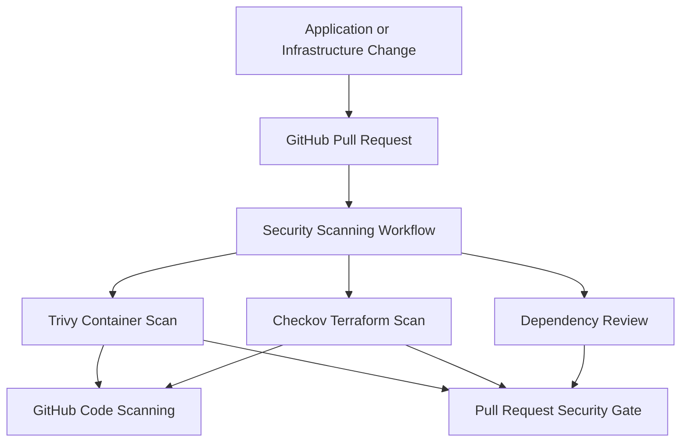
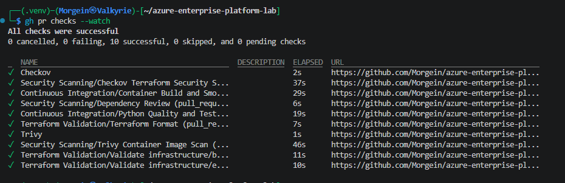
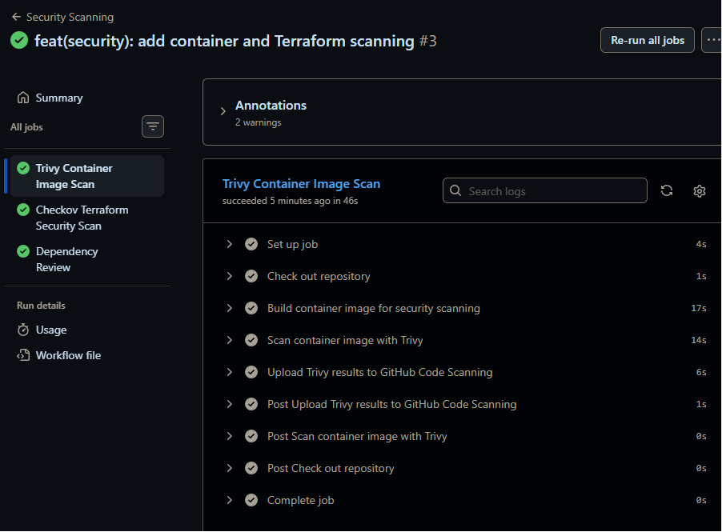
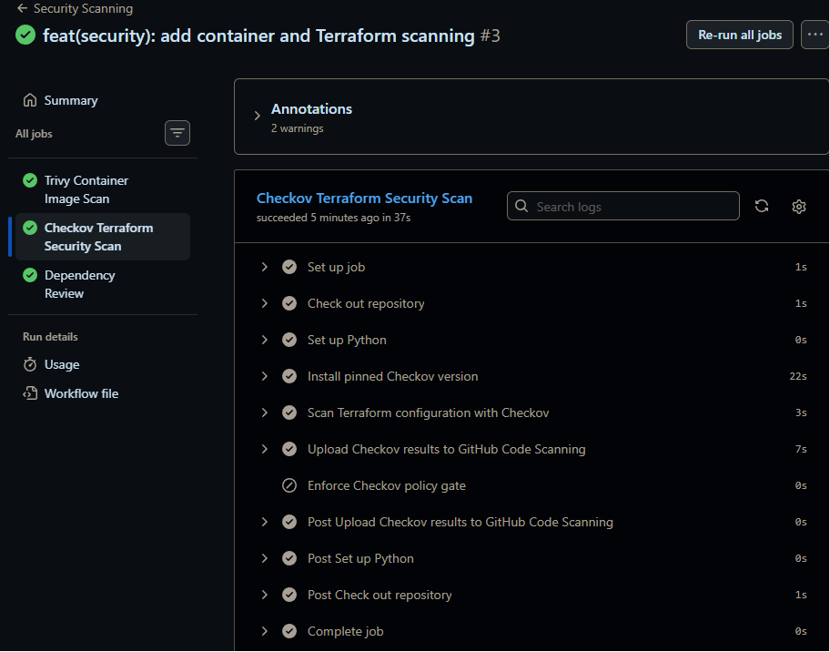
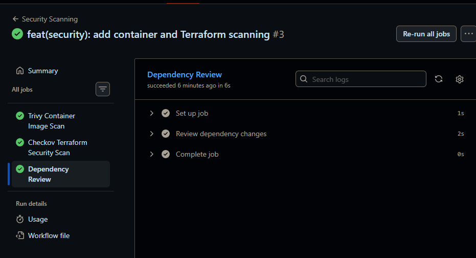

# Security Scanning Foundation — Validation Evidence

> **Project:** Azure Enterprise Platform Lab  
> **Environment:** Development (`dev`)  
> **Implementation:** GitHub Actions, Trivy, Checkov, and Dependency Review  
> **Pull Request:** `#23`  
> **Status:** Completed and validated  
> **Evidence date:** 2026-07-19  
> **Author:** Artur Hyrenko

---

## 1. Executive Summary

This document provides implementation and validation evidence for the Security Scanning Foundation of the Azure Enterprise Platform Lab.

The security workflow introduces automated controls for:

- container image vulnerabilities;
- secrets embedded in container images;
- Terraform Infrastructure as Code;
- Pull Request dependency changes;
- GitHub Code Scanning integration;
- scheduled security re-evaluation;
- explicit security policy enforcement;
- documented risk acceptance.

The implementation uses:

- Trivy for container vulnerability and secret scanning;
- Checkov for Terraform security policy scanning;
- GitHub Dependency Review for dependency-change validation;
- SARIF for GitHub Code Scanning integration;
- immutable GitHub Action references;
- least-privilege GitHub Actions permissions;
- blocking Pull Request security gates.

The completed workflow passed all required checks without creating or modifying any Azure resources.

---

## 2. Objectives

The objectives of this phase were to:

1. Scan the application container image before merge.
2. Detect fixable HIGH and CRITICAL vulnerabilities.
3. Detect secrets accidentally included in the container image.
4. Scan Terraform configuration for security policy violations.
5. Review dependency changes introduced through Pull Requests.
6. Upload supported scanner results to GitHub Code Scanning.
7. Block Pull Requests when security policies fail.
8. Run security scans automatically on relevant changes.
9. Re-evaluate the repository on a weekly schedule.
10. Pin third-party GitHub Actions to immutable commit SHAs.
11. Apply least-privilege workflow permissions.
12. Document justified policy exceptions.
13. Avoid introducing additional Azure service costs.

---

## 3. Security Pipeline Architecture



### Security Decision Flow

```text
Pull Request
    |
    v
Build container image
    |
    +--> Trivy vulnerability and secret scan
    |
    +--> Checkov Terraform policy scan
    |
    +--> Dependency Review
    |
    v
Upload SARIF results
    |
    v
Enforce security policy gates
    |
    +--> Passed: Pull Request may continue
    |
    +--> Failed: Merge is blocked
```

---

## 4. Workflow Location

The security workflow is stored at:

```text
.github/workflows/security.yml
```

Workflow name:

```text
Security Scanning
```

The workflow contains three security jobs:

| Job | Purpose |
|---|---|
| `Trivy Container Image Scan` | Builds and scans the application container image |
| `Checkov Terraform Security Scan` | Scans Terraform configuration and enforces policy |
| `Dependency Review` | Reviews dependency changes introduced by a Pull Request |

---

## 5. Workflow Triggers

The Security Scanning workflow runs on:

- pushes to `main`;
- Pull Requests targeting `main`;
- relevant application changes;
- relevant infrastructure changes;
- GitHub Actions workflow changes;
- manual execution through `workflow_dispatch`;
- a weekly scheduled scan.

### Relevant Paths

```text
application/**
infrastructure/**
.github/workflows/**
```

Documentation-only changes do not trigger unnecessary container and Terraform security scans.

### Scheduled Execution

The weekly schedule is:

```cron
23 3 * * 1
```

This executes the workflow every Monday at `03:23 UTC`.

Scheduled execution allows the project to detect newly disclosed vulnerabilities even when the application source code has not changed.

---

## 6. Concurrency Control

The workflow uses a concurrency group:

```text
security-${{ github.workflow }}-${{ github.ref }}
```

Configuration:

```yaml
cancel-in-progress: true
```

When a newer security run starts for the same Git reference, the older in-progress run is cancelled.

This prevents outdated results from consuming unnecessary GitHub Actions runner time.

---

## 7. Least-Privilege Workflow Permissions

The workflow-level permission is:

```yaml
permissions:
  contents: read
```

This is the default permission for all security jobs.

The Trivy and Checkov jobs receive the additional permission:

```yaml
security-events: write
```

This permission is required to upload SARIF results to GitHub Code Scanning.

The workflow does not receive:

- `contents: write`;
- `packages: write`;
- `pull-requests: write`;
- `actions: write`;
- `id-token: write`;
- repository administration permissions;
- Azure credentials.

The Security Scanning workflow cannot deploy Azure infrastructure or modify the application runtime.

---

## 8. Supply-Chain Protection

Third-party GitHub Actions are pinned to immutable commit SHAs.

The implementation does not rely only on mutable references such as:

```text
@main
@master
@v3
@v4
```

Pinned actions include:

| Action | Purpose |
|---|---|
| `actions/checkout` | Repository checkout |
| `actions/setup-python` | Python runtime for Checkov |
| `aquasecurity/trivy-action` | Container vulnerability and secret scanning |
| `github/codeql-action/upload-sarif` | SARIF upload |
| `actions/dependency-review-action` | Pull Request dependency review |

Immutable action references reduce the risk that a mutable action tag could later resolve to unexpected code.

Human-readable version comments remain next to the pinned SHAs for maintainability.

---

## 9. Trivy Container Image Scan

### Image Build

The Trivy job first builds the real application image using:

```bash
docker build \
  --pull \
  --tag azure-platform-api:security-scan \
  application
```

Using the production Dockerfile means the scanner evaluates the same image structure used by the delivery pipeline.

The `--pull` option checks for the latest available base image matching the configured base-image reference.

### Scanner Configuration

Trivy runs with:

```text
Scan type: image
Scanners: vulnerability and secret
Vulnerability types: operating system and application libraries
Severity gate: HIGH and CRITICAL
Ignore unfixed vulnerabilities: enabled
Output format: SARIF
Failure exit code: 1
```

### Enforced Policy

The Trivy job fails when the image contains a policy-blocking finding.

The current policy focuses on:

- fixable HIGH vulnerabilities;
- fixable CRITICAL vulnerabilities;
- policy-blocking secrets detected in the image.

Lower-severity and currently unfixable vulnerabilities remain outside the current blocking threshold.

### Result

```text
Trivy Container Image Scan: Passed
```

The successful result confirms that the tested container image did not contain findings that violated the configured Trivy security policy.

---

## 10. Checkov Terraform Security Scan

### Scanner Version

The workflow installs an explicitly pinned Checkov version:

```text
Checkov 3.3.8
```

The workflow verifies that the installed version exactly matches the expected version before scanning.

### Scan Scope

Checkov scans:

```text
infrastructure/
```

Framework:

```text
Terraform
```

Outputs:

```text
CLI
SARIF
```

### Policy Gate

The Checkov scan step captures the scanner outcome while allowing SARIF upload to complete.

A separate enforcement step fails the job when the original Checkov scan reports policy violations.

This workflow structure ensures that:

1. scanner findings are generated;
2. SARIF is uploaded even when findings exist;
3. the Pull Request still fails when policy violations remain.

### Final Result

```text
Passed checks: 23
Failed checks: 0
Skipped checks: 20
```

The final Checkov security gate passed.

---

## 11. Checkov Policy Exceptions

Checkov initially reported 20 findings.

Each finding was reviewed before the security gate was allowed to pass.

The workflow was not configured with a global `soft-fail` option.

Instead, narrowly scoped inline exceptions were added to the exact Terraform resources affected by each policy.

### Exception Summary

| Scope | Unique policies | Skipped findings | Reason |
|---|---:|---:|---|
| Terraform State Storage | 6 | 6 | Cost-controlled non-production backend design |
| Azure Container Registry | 8 | 8 | Basic SKU, single-region lab, and compensating controls |
| Development Subnets | 1 | 6 | Static analysis false positive for separately managed NSG associations |
| **Total** | **15** | **20** | Reviewed and documented |

---

## 12. Terraform State Storage Exceptions

The Terraform State backend received the following scoped exceptions:

| Checkov ID | Decision |
|---|---|
| `CKV_AZURE_206` | LRS is accepted for the non-production student lab |
| `CKV_AZURE_33` | Azure Queue service is not used by the Terraform backend |
| `CKV_AZURE_59` | Public endpoint is required for the current student workstation |
| `CKV2_AZURE_33` | Private Endpoint requires private runner or VPN connectivity |
| `CKV2_AZURE_1` | Microsoft-managed encryption is accepted for non-production state |
| `CKV2_AZURE_21` | Additional Blob read logging is outside the current cost-controlled scope |

### Existing Compensating Controls

The Terraform State Storage Account already uses:

- HTTPS-only access;
- TLS 1.2 minimum;
- private Blob Container access;
- Blob versioning;
- Blob soft delete;
- Container soft delete;
- infrastructure encryption;
- nested public item access disabled;
- Shared Key authorization disabled;
- Microsoft Entra authentication by default;
- cross-tenant replication disabled;
- Azure RBAC;
- `prevent_destroy`;
- Terraform State locking.

These controls reduce the risk associated with the accepted development limitations.

---

## 13. Azure Container Registry Exceptions

The development Azure Container Registry uses the Basic SKU to control student-lab costs.

The following policies received scoped exceptions:

| Checkov ID | Decision |
|---|---|
| `CKV_AZURE_165` | Multi-region geo-replication is not required for development |
| `CKV_AZURE_163` | Trivy provides the current vulnerability-scanning control |
| `CKV_AZURE_164` | Docker Content Trust is deprecated; future signing will use Notation |
| `CKV_AZURE_139` | Public access is required by GitHub-hosted runners |
| `CKV_AZURE_237` | Dedicated data endpoints require a higher-cost architecture |
| `CKV_AZURE_166` | Trivy provides the current image-scanning control |
| `CKV_AZURE_233` | Zone redundancy is not required for the development registry |
| `CKV_AZURE_167` | Automated retention is deferred for the low-volume registry |

### Existing Compensating Controls

The registry already uses:

- Admin user disabled;
- anonymous pull disabled;
- Microsoft Entra authentication;
- GitHub Actions OIDC authentication;
- User Assigned Managed Identities;
- least-privilege `AcrPush`;
- least-privilege `AcrPull`;
- immutable commit-derived image tags;
- deployment by image digest;
- Trivy image scanning;
- secret scanning;
- bounded development usage.

The accepted exceptions are specific to the cost-controlled development environment.

They do not define the expected production security posture.

---

## 14. NSG Association False Positive

Checkov reported `CKV2_AZURE_31` for all six development Subnets.

The policy requires each Subnet to have a Network Security Group.

Terraform already manages the associations through:

```hcl
azurerm_subnet_network_security_group_association
```

The association resource uses the same `for_each` keys as the Subnet and Network Security Group resources.

The deployed associations were previously verified through:

- Terraform State;
- Terraform no-drift validation;
- Azure Portal Subnet inspection;
- Azure Portal NSG inspection;
- Development Network deployment evidence.

The finding was classified as a:

```text
Static Analysis False Positive
```

A scoped inline exception was added to the `azurerm_subnet` resource with a reference to the separately managed association resource.

The exception covers six generated Subnet instances, which explains why one unique policy creates six skipped findings.

---

## 15. Dependency Review

The Dependency Review job runs only for Pull Request events.

Policy:

```text
Fail on severity: HIGH
```

The job reviews dependency changes between the Pull Request base and head commits.

The security gate blocks newly introduced dependencies containing vulnerabilities at or above the configured threshold.

### Result

```text
Dependency Review: Passed
```

The successful result confirms that the Pull Request did not introduce dependency changes that violated the configured severity policy.

GitHub Dependency Graph is enabled for the repository.

---

## 16. SARIF and GitHub Code Scanning

Trivy and Checkov produce SARIF output.

The workflow uploads the files using GitHub CodeQL SARIF upload support.

Categories:

```text
trivy-container-image
checkov-terraform
```

SARIF integration provides:

- standardized finding representation;
- repository-level security visibility;
- file and line references;
- historical analysis records;
- deduplication through result fingerprints;
- integration with GitHub Code Scanning.

SARIF upload is attempted even when the scanner detects policy violations.

This preserves the scanner results while the Pull Request remains blocked.

---

## 17. Pull Request Security Gate

The Security Scanning workflow is integrated into Pull Request `#23`.

Required validation included:

- Continuous Integration;
- Trivy container scanning;
- Checkov Terraform scanning;
- Dependency Review;
- SARIF upload;
- Terraform validation;
- container build and smoke testing.

The final Pull Request state showed all checks passing.

No security job was disabled or converted to a global soft-fail configuration.

---

## 18. Validation Evidence

### 18.1 Pull Request Checks

All required Continuous Integration and Security Scanning checks completed successfully.



---

### 18.2 Trivy Container Image Scan

The Trivy job successfully:

- checked out the repository;
- built the application container image;
- scanned operating-system packages;
- scanned application dependencies;
- scanned for secrets;
- generated SARIF;
- uploaded results to GitHub Code Scanning.



---

### 18.3 Checkov Terraform Security Scan

The Checkov security gate completed with:

```text
Passed checks: 23
Failed checks: 0
Skipped checks: 20
```

All skipped findings are connected to reviewed, resource-level policy exceptions.



---

### 18.4 Dependency Review

The Dependency Review job completed successfully and did not detect newly introduced dependencies violating the configured HIGH severity threshold.



---

## 19. Troubleshooting Record

### 19.1 Outdated Checkov Action Interface

#### Symptom

The first workflow implementation used an older container-based Checkov action.

The action did not support the configured multi-format output arguments and did not produce the expected SARIF file.

#### Root Cause

The action reference executed an outdated Checkov container version with an incompatible input interface.

#### Resolution

The workflow was changed to:

1. configure Python 3.12;
2. install a pinned Checkov version;
3. verify the installed version;
4. invoke the Checkov CLI directly;
5. generate CLI and SARIF output;
6. upload SARIF separately;
7. enforce the original Checkov exit result through a dedicated policy gate.

This removed ambiguity between the GitHub Action wrapper and the scanner CLI.

---

### 19.2 Dependency Graph Disabled

#### Symptom

The Dependency Review job failed with:

```text
Dependency review is not supported on this repository.
Please ensure that Dependency graph is enabled.
```

#### Root Cause

GitHub Dependency Graph was not enabled for the repository.

#### Resolution

Dependency Graph was enabled through:

```text
Repository
→ Settings
→ Code security and analysis
→ Dependency graph
```

The Dependency Review job then completed successfully.

No Azure resources or paid Azure services were required.

---

### 19.3 Initial Terraform Policy Findings

#### Symptom

After the Checkov CLI was corrected, the scanner reported:

```text
Passed checks: 23
Failed checks: 20
Skipped checks: 0
```

#### Root Cause

The scanner identified:

- production-oriented Storage Account controls;
- Premium Azure Container Registry controls;
- deprecated container-signing expectations;
- development network association false positives.

#### Resolution

Every finding was reviewed.

The project added narrow inline exceptions with English risk-acceptance reasons.

The workflow remained a blocking security gate.

Final result:

```text
Passed checks: 23
Failed checks: 0
Skipped checks: 20
```

---

## 20. Acceptance Criteria

| Requirement | Result |
|---|---|
| Dedicated Security Scanning workflow | Passed |
| Container image built before scanning | Passed |
| Operating-system vulnerability scanning | Passed |
| Application dependency vulnerability scanning | Passed |
| Container secret scanning | Passed |
| HIGH and CRITICAL Trivy policy gate | Passed |
| Terraform security scanning | Passed |
| Pinned Checkov version | Passed |
| Checkov version verification | Passed |
| Checkov blocking policy gate | Passed |
| No global Checkov soft fail | Passed |
| Resource-level Policy Exceptions | Passed |
| Dependency Review enabled | Passed |
| HIGH severity dependency gate | Passed |
| Trivy SARIF generation | Passed |
| Checkov SARIF generation | Passed |
| GitHub Code Scanning upload | Passed |
| Weekly scheduled scanning | Passed |
| Relevant path filtering | Passed |
| Concurrency control | Passed |
| Least-privilege workflow permissions | Passed |
| Third-party actions pinned by SHA | Passed |
| Continuous Integration remained successful | Passed |
| No Azure resources created | Passed |
| No Azure resources changed | Passed |
| No additional Azure service cost | Passed |
| Security evidence collected | Passed |

---

## 21. Cost Controls

This phase introduced no additional Azure resources.

Security scanning runs on GitHub-hosted runners and does not require:

- Microsoft Defender for Containers;
- Azure Container Registry Premium;
- Private Endpoints;
- Azure Firewall;
- Azure Virtual Machines;
- self-hosted runners;
- Log Analytics Workspace;
- additional Azure storage;
- permanent scanning infrastructure.

The project continues using:

- ACR Basic;
- Container Apps Consumption;
- scale-to-zero;
- one maximum application replica;
- bounded CPU and memory;
- one development environment.

---

## 22. Security Assertions

The completed implementation demonstrates that:

- container images are scanned before merge;
- Terraform configuration is scanned before merge;
- dependency changes are reviewed before merge;
- policy-blocking findings fail the Pull Request;
- scanner results are uploaded using SARIF;
- third-party actions use immutable references;
- GitHub Actions permissions follow least privilege;
- security exceptions are explicit and resource-specific;
- accepted risks include documented compensating controls;
- security gates are not globally disabled;
- scheduled scans can detect newly disclosed vulnerabilities;
- the workflow cannot deploy or modify Azure resources.

---

## 23. Known Limitations

The current implementation is a development security baseline.

Future security work includes:

- Notation-based OCI image signing;
- signature verification before deployment;
- provenance attestation verification;
- Python source-code security analysis;
- CodeQL or another SAST implementation;
- Dependabot configuration;
- secret scanning and push-protection validation;
- production-specific Checkov policy configuration;
- Premium ACR evaluation for production;
- Private Endpoints for production services;
- Customer-Managed Keys where required;
- centralized logging and alerting;
- formal exception expiration dates;
- automated Policy Exception review;
- staging and production security gates.

---

## 24. Exit Criteria

| Criterion | Status |
|---|---|
| Trivy scan passes | Met |
| Checkov scan passes | Met |
| Dependency Review passes | Met |
| Continuous Integration passes | Met |
| SARIF results are uploaded | Met |
| Policy gate remains blocking | Met |
| Exceptions are documented | Met |
| Compensating controls are identified | Met |
| No additional Azure costs introduced | Met |
| Evidence is stored in the repository | Met |

The Security Scanning Foundation is considered implemented and operational.

---

## 25. Next Implementation Targets

The next planned platform phases are:

1. finalize Security Scanning project documentation;
2. complete governance and budget evidence;
3. introduce Key Vault and workload secret access;
4. add workload identity-based Azure Storage access;
5. evaluate Notation-based image signing;
6. add Python Static Application Security Testing;
7. introduce Azure API Management;
8. implement Application Insights and OpenTelemetry;
9. introduce staging delivery controls;
10. introduce production security and approval controls.